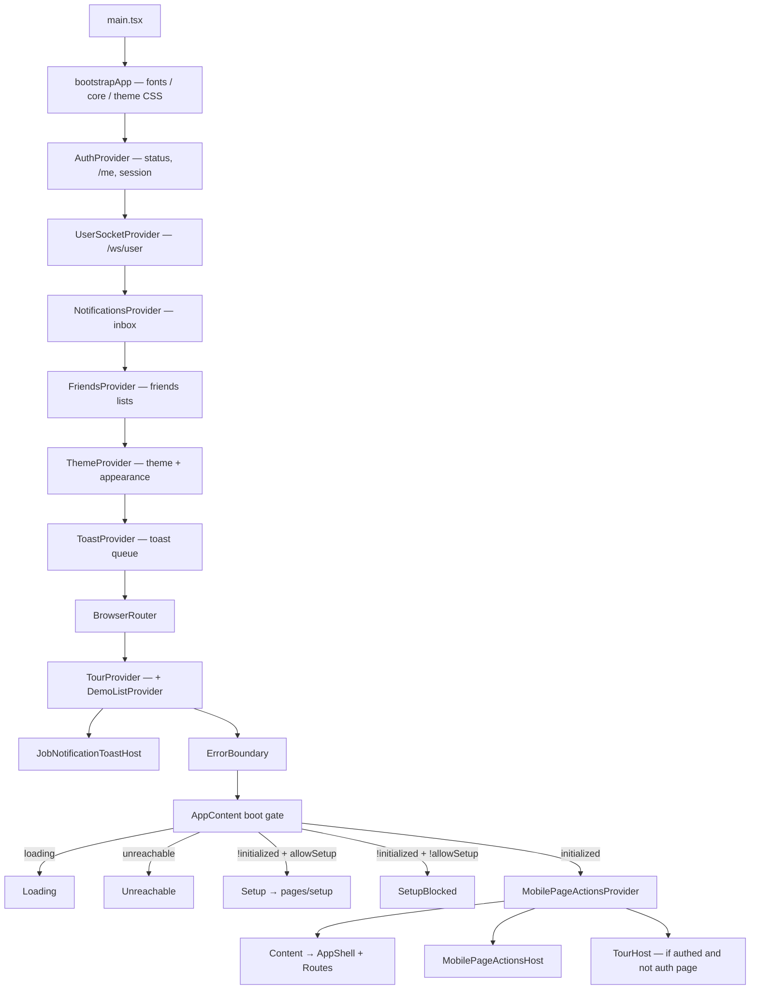
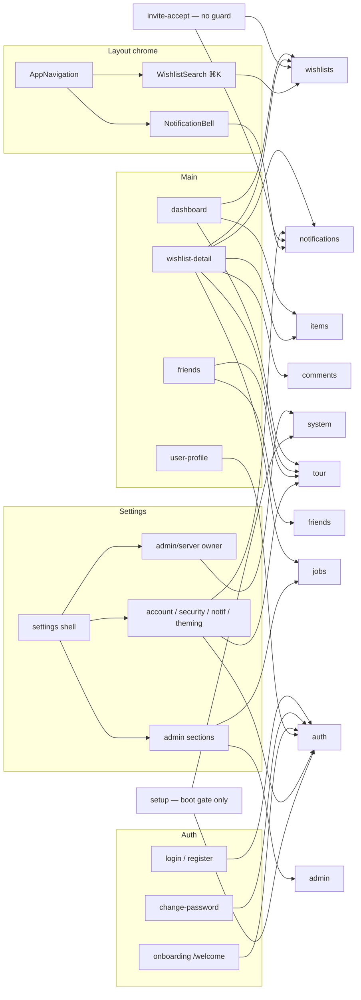
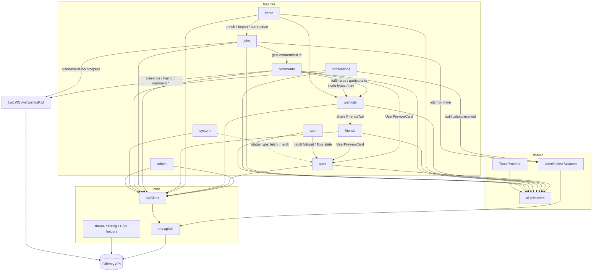

# `src/`

Source map for the Giftistry React client. Nested READMEs get more local as you descend — start here, then open a layer, then a domain or page folder.

This repo is the **web SPA**. Pair it with the Giftistry API for a full stack. How to run and audit: [docs/development.md](../docs/development.md).

## Layers

| Folder | Role | May import | Must not |
|--------|------|------------|----------|
| [app/](app/README.md) | Bootstrap, routing, layout, pages, app providers | `core`, `shared`, `features` | — |
| [features/](features/README.md) | Domain UI + hooks (barrels) | `core`, `shared`, other **feature barrels** | `app/` |
| [shared/](shared/README.md) | Primitives, utils, shared providers | `core`, `shared` | `features/`, `app/` |
| [core/](core/README.md) | API client, env, theme helpers (no UI) | packages; other `core/` | `app/`, `features/`, `shared/` |
| `assets/` | Global styles and static assets | — | — |

```
src/
  main.tsx          ← Vite entry
  index.css
  app/              ← shell + pages
  features/         ← domain packages
  shared/           ← ui / utils / providers
  core/             ← transport / env / theme
  assets/
  README.md
```

Lower layers never reach up. If a shared primitive needs a domain type or feature hook, **move the unit** into that feature (or inject from `app` / the feature).

## Application map

Three diagrams: **shell stack**, **routes → features**, **domain + realtime**. Provider order matches [`app.component.tsx`](app/app.component.tsx) (prefer code if a nested README disagrees).

### 1 — Bootstrap, providers, boot gate



| Mount | Owns |
|-------|------|
| `AuthProvider` | System status (`GET /api/system/status`), session, `postAuthPath` funnel |
| `UserSocketProvider` | Authenticated `/ws/user` fan-out |
| `NotificationsProvider` / `FriendsProvider` | Multi-surface inbox / friends state |
| `ThemeProvider` | Active theme, appearance, unlocks, custom themes (needs auth) |
| `ToastProvider` | Toast queue; presentation in `shared/ui` |
| `TourProvider` | Chapter/step machine + demo fixtures |
| `JobNotificationToastHost` | Socket job toasts (auth-gated listener) |
| Page-scoped mirrors | Dashboard: `ItemsSession` + `WishlistSession`. Detail / invite: `ItemsSession` + `CommentsSession` |

Auth pages (`/login`, `/register`, `/welcome`, `/change-password`): no nav; `TourHost` suppressed.

### 2 — Routes → pages → features



Layout chrome (bell, search, theme, profile) mounts from `AppNavigation` whenever the shell is not an auth page.

| Route(s) | Guard | Primary features |
|----------|-------|------------------|
| `/dashboard` | Protected | wishlists, items (import), tour |
| `/wishlists/:listId` | Protected, full-width | wishlists, items, comments, jobs, notifications (dedupe), tour |
| `/friends/:tab` | Protected | friends, tour |
| `/users/:userId` | Protected | auth preview, theme try |
| `/settings/*` | Protected (+ Admin / Owner nested) | auth, notifications prefs, tour, admin, system, jobs rail |
| `/login`, `/register` | Public | auth |
| `/welcome` | Protected + onboarding | auth, theme |
| `/change-password` | Protected + password-change | auth |
| `/invite/list/:token` | None | notifications invite HTTP, wishlists guest utils |
| Setup | Boot gate only | system `runSetup`, auth status refresh |

Auth funnel: `ForcePasswordChange` → `/change-password` → not onboarded → `/welcome` → else `/dashboard`.

### 3 — Domain edges, HTTP, realtime



| Channel | Who listens |
|---------|-------------|
| **User socket** `notification.received` | NotificationsProvider (inbox); JobNotificationToastHost (`job_completed` / `job_failed`) |
| **User socket** `job.progress` / `completed` / `failed` | `useBackgroundJobs('mine')`; import flow while active |
| **Admin jobs** | Poll every 10s — no WS |
| **List socket** comment events | `useCommentRealtime` |
| **List socket** `job.*` + `list.changed` | `useWishlistJob` on wishlist-detail |

Job toast dedupe: notifications claim set (socket) **and** jobs claim set (ImportStrip ↔ detail page). Enrich/summarize: page `markJobNotificationHandled` before its own toast so the socket toast is skipped. Packages do **not** import each other for that bridge.

| State pattern | Examples |
|---------------|----------|
| **Provider** (multi-surface) | Auth, Friends, Notifications |
| **Local controller / page** | Wishlist collection (dashboard), items (`useItemController`), comments (section + WS), jobs (hooks) |
| **Session mirror only** | Items / Wishlist / Comments session providers |

## Entry & shell

- [`main.tsx`](main.tsx) → `bootstrapApp` → `<App />`
- Provider + boot details: [app/](app/README.md), [app/providers](app/providers/README.md), [shared/providers](shared/providers/README.md)
- Route table: [app/components](app/components/README.md) (`Content`); guards: [app/routes](app/routes/README.md)
- Pages compose feature barrels — they do not own domain APIs

## UI unit (SoC)

Every component folder is a trio — logic / markup / styles — plus `interfaces/`. Full rules: [docs/architecture.md](../docs/architecture.md) and [docs/ui-conventions.md](../docs/ui-conventions.md).

| Kind of UI | Lives in |
|------------|----------|
| Button, drawer shell, badge, input | `shared/ui` |
| User preview card, item mini-drawer, wishlist card | `features/<domain>/` |
| Route screens, page chrome | `app/pages/`, `app/layout/` |

Features expose a stable public API via `features/<domain>/index.ts`. Prefer barrel imports from outside that package.

## Where to put new code

| If it is… | Put it in… |
|-----------|------------|
| A new route screen or page-only chrome | `app/pages/…` |
| Domain API / hooks / domain UI | `features/<domain>/` |
| Reusable, domain-agnostic control | `shared/ui` |
| Pure helper / shared contract | `shared/utils` or `interfaces` / `constants` |
| Transport, env, theme engine (no React) | `core/` |

When unsure: [architecture.md](../docs/architecture.md) placement tables, then the layer README.

## Start here

1. [docs/architecture.md](../docs/architecture.md) — import rules + SoC  
2. [docs/development.md](../docs/development.md) — scripts, env, audits, tests  
3. [docs/ui-conventions.md](../docs/ui-conventions.md) — CSS Modules + interface files  
4. Pick a layer README above, then a domain under `features/` or a page under `app/pages/`

## Related

- [↑ Root README](../README.md)
- [↑ Contributing](../CONTRIBUTING.md)
- [app/](app/README.md) · [features/](features/README.md) · [shared/](shared/README.md) · [core/](core/README.md)
