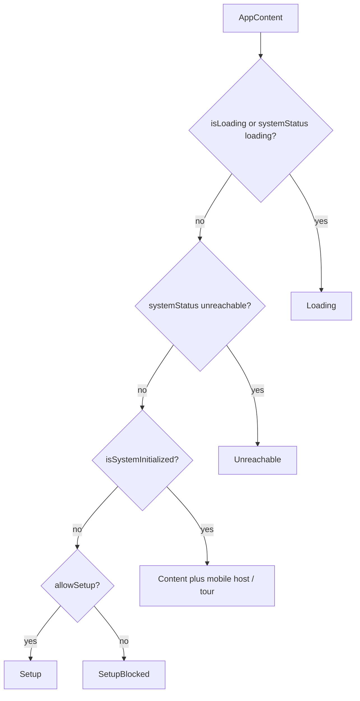

# `app/components`

App-level chrome for **boot gating** and the **authenticated shell**. These are not domain widgets (`features/`) or reusable primitives (`shared/ui`); they sit between `app.component.tsx` and pages/layout.

Each unit follows the SoC trio: `*.component.tsx` (logic) → `*.html.tsx` (markup) → `*.module.css` (styles) → `interfaces/` when props/state are shared.

## Boot gate (who renders when)

[`app.component.tsx`](../app.component.tsx) `AppContent` picks one of these before the main shell:

`ErrorBoundary` wraps `AppContent` at the router level so uncaught render errors show a full-page retry UI instead of a blank tree.

## Units

| Folder | Export | Role |
|--------|--------|------|
| [content/](#content) | `Content` | Main app: `AppShell` + lazy routes |
| [loading/](#loading) | `Loading` | Full-viewport spinner |
| [error-boundary/](#error-boundary) | `ErrorBoundary` | Class boundary + retry panel |
| [setup/](#setup) | `Setup` | First-run wizard route shell |
| [setup-blocked/](#setup-blocked) | `SetupBlocked` | Setup disabled, server not initialized |
| [unreachable/](#unreachable) | `Unreachable` | API unreachable + retry |

### `content/`

Owns the **initialized** app surface:

- Wraps children in [`AppShell`](../layout/README.md) / `AppNavigation`
- Lazy-loads every page under `Suspense` (fallback: `Loading`)
- Declares routes (`/dashboard`, `/wishlists/:listId`, `/settings/*`, auth pages, etc.) with `ProtectedRoute` / `PublicRoute` / `LegacyProfileRedirect`

**Props** (`isSettingsPage`, `isFullWidth?`, `isAuthPage?`) are derived from `useLocation()` in `AppContent` and forwarded into `AppShell` for layout chrome.

Do not put domain logic here — only route composition and shell flags.

### `loading/`

Centered full-viewport spinner (`--bg` / `--primary` tokens). Used as:

- Boot gate while auth/system status loads
- `Suspense` fallback inside `Content` and `Setup`

Respects `prefers-reduced-motion` (spinner animation off).

### `error-boundary/`

React **class** component (required for `getDerivedStateFromError` / `componentDidCatch`):

- On error: logs to console, sets `hasError`, renders “Something went wrong” + **Retry**
- Retry clears local state so children remount; does not auto-reload the browser

Wraps only `AppContent` (not providers above the boundary). Provider failures outside it are not caught here.

### `setup/`

Shown when the system is **not** initialized and `allowSetup` is true.

Lazy-loads [`pages/setup`](../pages/setup/README.md) and forces all paths to `/setup` (anything else redirects there). Uses `Loading` as the Suspense fallback. No `AppShell` / navigation — install-only chrome.

### `setup-blocked/`

Shown when the system is **not** initialized and first-run setup is **disabled** (`allowSetup` false).

Static copy: “Setup unavailable” / contact administrator. No retry control — operator must enable setup on the server.

### `unreachable/`

Shown when `systemStatus === 'unreachable'` (API health/status check failed).

**Props:** `onRetry` — wired to `checkSystemStatus` from auth. Explains that Giftistry could not reach the API and offers **Retry**.

## Allowed / forbidden

- **May import:** `app/layout`, `app/routes`, `app/pages` (lazy), `shared/ui`, feature barrels only if a gate truly needs them (prefer keeping this folder thin)
- **Must not:** grow into domain UI, duplicate page screens, or replace `shared/ui` loading/error primitives used inside pages

## Related

- [↑ app](../README.md)
- [layout/](../layout/README.md) — shell used by `Content`
- [pages/](../pages/README.md) — screens lazy-loaded by `Content` / `Setup`
- [docs/architecture.md](../../../docs/architecture.md)
