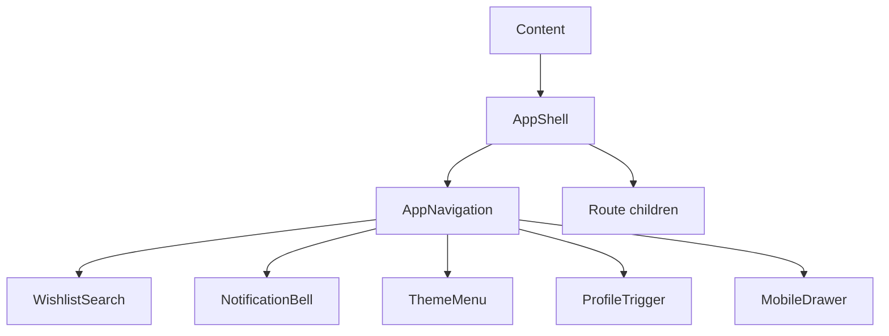

# `app/layout`

App chrome: **viewport shell** and **top navigation** (desktop + mobile). Composed by [`Content`](../components/README.md#content); hidden on auth pages via `isAuthPage`.

Public barrel: [`index.ts`](index.ts) exports `AppShell` and `AppNavigation`.

Compose feature widgets here (`NotificationBell`, tour targets); keep domain APIs in features. Each unit is an SoC trio (`*.component.tsx` / `*.html.tsx` / `*.module.css` + `interfaces/` when needed).

## Structure

```
layout/
  index.ts                 ← AppShell, AppNavigation
  app-shell/               ← page frame (scroll, insets, layout flags)
  app-navigation/          ← fixed top nav + nested chrome
    components/
      mobile-drawer/       ← hamburger sheet (portal)
      theme-menu/          ← palette / appearance dropdown
      wishlist-search/     ← ⌘K wishlist finder
      profile/
        trigger/           ← desktop avatar button
        menu/              ← desktop dropdown actions
        sheet/             ← mobile drawer profile card
        theming/           ← swatches + appearance in drawer
        constants/         ← PROFILE_MENU_ACTIONS
```

## How it fits



`AppContent` derives shell flags from the path (`isSettingsPage`, `isFullWidth`, `isAuthPage`) and passes them into `AppShell`. When `isAuthPage` is true, navigation and banner are omitted and main uses full-bleed auth styles.

## Units

| Folder | Export | Role |
|--------|--------|------|
| [app-shell/](#app-shell) | `AppShell` | Column layout: optional nav/banner + scrollable `main` |
| [app-navigation/](#app-navigation) | `AppNavigation` | Fixed top bar; wires auth, theme, mobile menu state |

### Nested under `app-navigation/`

| Folder | Export | Role |
|--------|--------|------|
| [mobile-drawer/](#mobile-drawer) | `MobileDrawer` | Left sheet portal; swipe-to-close; Escape |
| [theme-menu/](#theme-menu) | `ThemeMenu` | Desktop theme + appearance dropdown |
| [wishlist-search/](#wishlist-search) | `WishlistSearch` | Authenticated wishlist search (⌘/Ctrl+K) |
| [profile/trigger/](#profile) | `ProfileTrigger` | Desktop avatar → menu |
| [profile/menu/](#profile) | `ProfileMenu` | Settings / Friends / Sign Out |
| [profile/sheet/](#profile) | `ProfileSheet` | Mobile drawer profile expand + actions |
| [profile/theming/](#profile) | `ProfileTheming` | Appearance segments + theme swatches |

---

### `app-shell`

Full-viewport column (`100dvh`, `--bg-gradient`). Renders:

1. `navigation` (skipped when `isAuthPage`)
2. optional `banner`
3. `<main>` via `EnterPanel` (fade)

**Layout flags**

| Prop | Effect |
|------|--------|
| `isSettingsPage` | Uses `.settings-main` (flex, no inner max-width wrapper) |
| `isFullWidth` | Inner content `max-width: 100%` (wishlist detail, invite) |
| `isAuthPage` | No nav/banner; zero padding; overflow hidden |
| `hasBanner` | Extra top padding so content clears a banner |

Scroll lives on `main`; horizontal inset / `75rem` max-width live on `.mainInner` so the scrollbar stays flush to the viewport edge.

### `app-navigation`

Logic component: auth (`user`, `logout`, `registrationMode`), theme provider, mobile menu open state, click-outside / media-query close, logout → `/login`.

Template chrome (left → right):

- **Hamburger** (≤48rem) + **BrandMark** + Dashboard link (desktop, authenticated)
- **WishlistSearch** (authenticated)
- **NotificationBell** (authenticated) · **ThemeMenu** · **ProfileTrigger** or Sign In / Get Started

`showRegisterCta` follows `registrationMode === 'open'`. Tour hooks: `TOUR_TARGETS.hamburger`, `themeMenu`, `profileMenu`.

Navbar is `position: fixed`; when `body[data-drawer-sheet-open]` is set (page drawer sheets), nav z-index drops so sheet headers stay clickable.

### `mobile-drawer`

Portaled to `document.body`. `useMobileDrawer` owns mount/unmount delay (`CLOSE_MS`), open animation (`isActive`), body scroll lock, Escape, and left-swipe close (`SWIPE_CLOSE_*`, `DRAWER_WIDTH`).

Content: brand + Dashboard link; footer is either `ProfileSheet` (signed in) or auth CTAs. Overlay click closes.

### `theme-menu`

Desktop palette control. Builds selectable lists from theme catalog + unlock checks: standard (locked themes shown disabled), holiday (unlocked only), custom, temporary “tried” theme, then appearance (light / dark / system). Click-outside closes.

### `wishlist-search`

Authenticated only. On open: fetches `wishlistsApi.listWishlists({ bucket: 'all' })`, filters by title client-side. Keyboard: ⌘/Ctrl+K focus, arrows + Enter select, Escape close. Navigates to `/wishlists/:id`.

### `profile`

Shared actions: [`PROFILE_MENU_ACTIONS`](app-navigation/components/profile/constants/profile-menu-actions.constant.ts) — Settings → `/settings/account`, Friends → `/friends/current`, Sign Out (danger).

| Unit | Surface |
|------|---------|
| `ProfileTrigger` | Desktop avatar button; opens `ProfileMenu` downward |
| `ProfileMenu` | Dropdown with user header + actions; `placement` up/down |
| `ProfileSheet` | Mobile drawer footer card; expands to actions + `ProfileTheming` |
| `ProfileTheming` | Segmented appearance + paginated color swatches (`VISIBLE_SWATCHES`); loads preview colors via `loadThemePreviews` |

Tour: `TOUR_TARGETS.profileTheming` on the theming block.

## Allowed / forbidden

- **May import:** `app/providers/theme`, `core/theme`, `shared/ui`, feature barrels for chrome widgets (`auth`, `notifications`, `wishlists`, `tour` targets)
- **Must not:** own page routes, wishlist/item business rules, or duplicate settings screens — navigate to pages instead
- Keep swipe/timing constants next to the drawer; keep menu action definitions in `profile/constants/`

## Related

- [↑ app](../README.md)
- [components/](../components/README.md) — `Content` mounts shell + navigation
- [providers/](../providers/README.md) — theme used by nav menus
- [docs/architecture.md](../../../docs/architecture.md)
