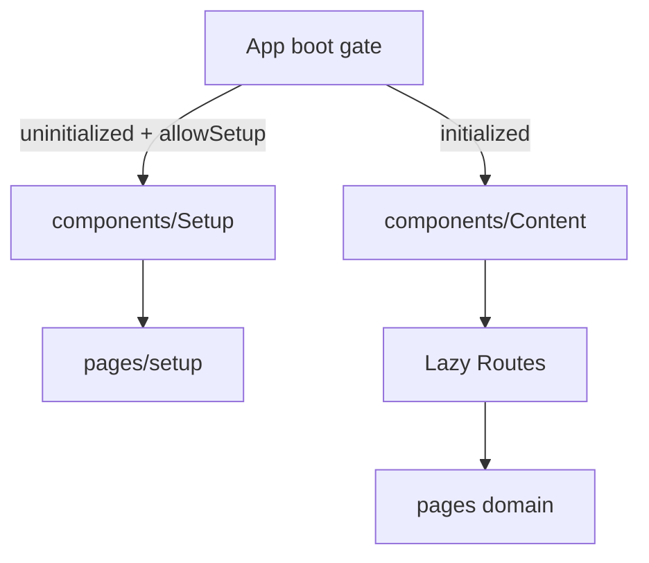

# `app/pages`

Route-level screens. Each domain folder owns one page entry and nested SoC units. Pages **compose** features and layout chrome; they do not own domain APIs (those live under `features/`).

Routes for the initialized app are declared in [`components/content`](../components/README.md#content) (lazy-loaded). **Setup** is mounted earlier by the boot gate when the system is uninitialized — see [`components/setup`](../components/README.md#setup).

[`index.ts`](index.ts) re-exports page components for **tests / direct imports only**. Do not import that barrel from the app shell or every page lands in the main chunk.

## Naming

Inside a page folder, **do not repeat the parent name** on nested files or CSS blocks (folder already scopes them):

| Role | Name | Example under `friends/` |
|------|------|--------------------------|
| Entry only | `<domain>.component.tsx` | `friends.component.tsx` |
| Shell markup / styles | `page.html.tsx`, `page.module.css` | not `friends-page.*` |
| Nested SoC units | short local names | `header/`, `controls/`, `content/` |
| Hooks / utils / constants | short local names | `hooks/use-page.tsx`, `constants/tabs.constant.ts` |

Canonical shape:

```
app/pages/<domain>/
  <domain>.component.tsx     ← only file with the domain in the name
  page.html.tsx              ← optional shell template
  page.module.css
  hooks/use-page.tsx         ← common pattern
  interfaces/
  components/
    header/
    …
```

Thin auth wrappers (`login`, `register`, `change-password`) may be just entry + `*.html.tsx` + CSS with no nested `components/`.

## How pages mount



## Domains

| Page | Entry | Route(s) | Guard | README |
|------|-------|----------|-------|--------|
| [dashboard](dashboard/README.md) | `Dashboard` | `/`, `/dashboard` | Protected | Home wishlist grid, tabs, create modal |
| [wishlist-detail](wishlist-detail/README.md) | `WishlistDetail` | `/wishlists/:listId` | Protected (full-width shell) | Single list workspace |
| [friends](friends/README.md) | `FriendsPage` | `/friends` → `/friends/current`, `/friends/:tab` | Protected | Current / requests / search |
| [user-profile](user-profile/README.md) | `UserProfile` | `/users/:userId`; legacy `/profile/*` | Protected | Other user’s profile |
| [settings](settings/README.md) | `Settings` | `/settings/*` | Protected | Account + admin sections |
| [login](login/README.md) | `Login` | `/login` | Public | Sign-in (`features/auth` form) |
| [register](register/README.md) | `Register` | `/register` | Public | Registration form |
| [onboarding](onboarding/README.md) | `Onboarding` | `/welcome` | Protected + `allowOnboarding` | Post-setup owner wizard |
| [change-password](change-password/README.md) | `ChangePassword` | `/change-password` | Protected + `allowPasswordChange` | Forced/optional password change |
| [invite-accept](invite-accept/README.md) | `InviteAcceptPage` | `/invite/list/:token` | None (token link) | Accept list invite / guest preview |
| [setup](setup/README.md) | `Setup` | `/setup` | Boot gate only | First-boot install wizard |

### `dashboard`

Wishlist home: header, controls/tabs, grid, create-list modal. Hooks: `use-dashboard`, grid column helpers. Composes `features/wishlists` cards/create form.

### `wishlist-detail`

Largest page. Header, controls, items, workspace, drawers (add-item, comments), settings panel, share, mobile actions, overlays, inspector, add-widget, apply-bar, confirm/archived chrome. Hooks include `use-page`, `use-list-data`, settings/lifecycle/item-session/associations, comment-tag peek. Composes wishlists, items, comments, jobs/notifications.

### `friends`

Tabs via `:tab` (`current` | `requests` | `search`). Nested: `header`, `controls`, `content`, `remove-modal`; `hooks/use-page`. Composes `features/friends`.

### `user-profile`

Thin profile view for `/users/:userId` (avatar, status, join date, try-theme). `hooks/use-page` + utils; little/no nested `components/`.

### `settings`

Shell with sidebar + processes rail; nested **Routes** under `/settings/*`:

- **Account:** `account`, `security`, `notifications`, `theming`
- **Admin:** `admin` (overview), `admin/users`, `admin/users/:userId`, `admin/site`, `admin/moderation`, `admin/audit`
- **Owner:** `admin/server` (Public App URL, DB, OAuth, SMTP, push, scrape, AI, danger zone); `/settings/server` redirects here

Composes `features/admin`, `features/system`, `features/auth`, `features/jobs`.

### `login` / `register` / `change-password`

Thin layout wrappers around `features/auth` forms. No heavy page-local domain logic.

### `onboarding`

Multi-step owner wizard on `/welcome`: hello → profile / theme / mail / AI / registration / public-url → done. Timeline, header/footer, step panels; `hooks/use-page` persists patches.

### `invite-accept`

Token invite flow: password gate, guest wishlist preview, success/error. Full-width shell like wishlist detail. Not wrapped in Public/Protected — anyone with the link can open it.

### `setup`

Install wizard (database → admin → install → success). Rendered only through `app/components/setup` when the instance has no users and setup is allowed — **not** registered on the main Content route table.

## Allowed / forbidden

- **May import:** `core`, `shared`, `features/*` barrels, `app/layout` / providers only when needed for chrome
- **Must not:** implement reusable domain widgets that belong in `features/`; deep-import other features’ internals when a barrel export exists
- Prefer page hooks for route orchestration; leave API clients in features

## Related

- [↑ app](../README.md)
- [components/](../components/README.md) — boot gate + Content route table
- [layout/](../layout/README.md) — shell wrapping most pages
- [features/](../../features/README.md) — domain packages pages compose
- [docs/architecture.md](../../../docs/architecture.md)
