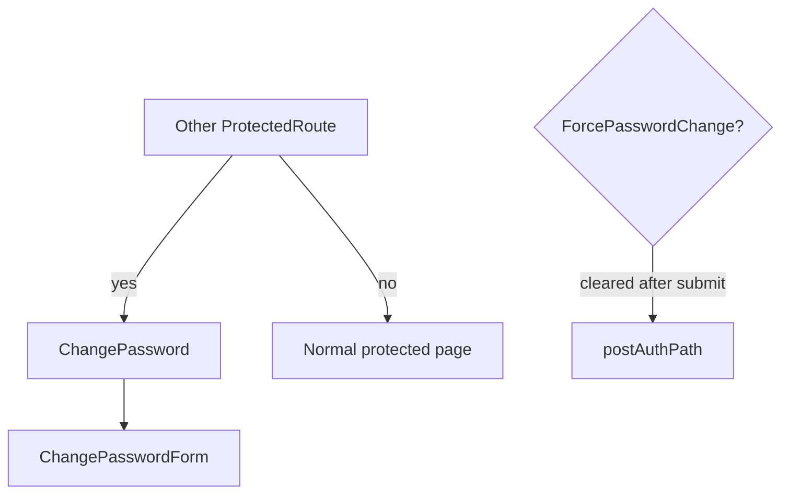

# `pages/change-password`

Forced password-change screen. Thin layout wrapper: the page centers a padded viewport-height container; current/new password fields and submit live in [`ChangePasswordForm`](../../../features/auth/README.md) from `features/auth`.

Shown when the signed-in user has `ForcePasswordChange`. Other protected routes redirect **to** this path until the flag clears; this route’s guard only allows the page while that flag is set.

## Route / guard

| Path | Guard | Shell |
|------|-------|-------|
| `/change-password` | [`ProtectedRoute`](../../routes/) with `allowPasswordChange` | `isAuthPage` — no nav/banner; full-bleed auth main |

Declared in [`content.html.tsx`](../../components/content/content.html.tsx) (lazy):

```tsx
<ProtectedRoute allowPasswordChange>
  <ChangePassword />
</ProtectedRoute>
```

**`allowPasswordChange` behavior** (see `protected.component.tsx`):

| Condition | Result |
|-----------|--------|
| Not authenticated | Redirect → `/login` |
| Authenticated + `ForcePasswordChange` | Render page |
| Authenticated + no force flag | Redirect → `postAuthPath(user)` |

Default `ProtectedRoute` (other pages) sends users with `ForcePasswordChange` **to** `/change-password`, so this page is the only authenticated surface available until they change the password.

`AppContent` treats `/change-password` as `isAuthPage` (same chrome as login/register/welcome).

## Structure

```
change-password/
  change-password.component.tsx    ← default export `ChangePassword`
  change-password.html.tsx         ← `ChangePasswordTemplate`
  change-password.module.css
  README.md
```

No nested `components/`, hooks, or interfaces — auth thin-wrapper pattern from [pages README](../README.md).

## Units

| File | Export | Role |
|------|--------|------|
| `change-password.component.tsx` | `ChangePassword` (default) | Entry; renders template only |
| `change-password.html.tsx` | `ChangePasswordTemplate` | Markup: `.container` + `ChangePasswordForm` |
| `change-password.module.css` | — | Full-viewport flex center + `--spacing-md` padding |

## Composition



- **Imports:** `ChangePasswordForm` (currently a deep path under `features/auth/components/...`; barrel also exports it — prefer `features/auth`)
- **Owns:** centered padded auth layout
- **Does not own:** password rules, API submit, clearing `ForcePasswordChange`, post-success navigation — those are inside the form / auth provider

## Allowed / forbidden

- **May import:** `features/auth` form exports (prefer barrel), `shared/ui` if the shell needs chrome
- **Must not:** reimplement password-change API or force-flag policy here; weaken or bypass `allowPasswordChange`; add nav chrome that contradicts `isAuthPage`
- Keep this folder thin — extend `features/auth` forms, not the page

## Related

- [↑ pages](../README.md)
- [features/auth](../../../features/auth/README.md) — `ChangePasswordForm`, `useAuth`, `ForcePasswordChange`, `postAuthPath`
- [components/content](../../components/README.md#content) — lazy route + `allowPasswordChange`
- [layout](../../layout/README.md) — `isAuthPage` shell behavior
- [login](../login/README.md) / [onboarding](../onboarding/README.md) — adjacent auth/onboarding funnel
