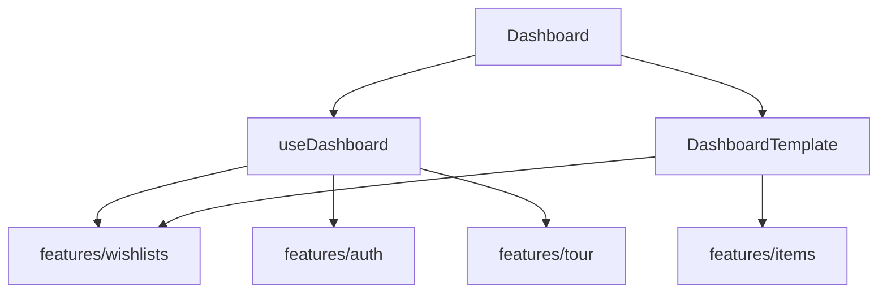

# `pages/dashboard`

Authenticated **home screen**: browse wishlists by bucket (my / shared / archive), search, create a list, and import into a new list. The page orchestrates route UI, mobile FABs, and tour targets; domain list/create/import live in features.

Entry is [`dashboard.component.tsx`](dashboard.component.tsx) → `useDashboard()` → [`dashboard.html.tsx`](dashboard.html.tsx) (`DashboardTemplate`). Nested units still use a `dashboard-*` basename on this page (legacy naming); prefer short local names on new pages.

## Route(s) + guard

| Path | Element | Guard |
|------|---------|-------|
| `/` | Redirect → `/dashboard` | — |
| `/dashboard` | `Dashboard` (lazy) | `ProtectedRoute` (default) |

Declared in [`components/content`](../../components/README.md#content). Default `ProtectedRoute` behavior: loading → force password change → onboard to `/welcome` → unauthenticated to `/login` → else render. Post-auth landing is `/dashboard` when onboarded.

**Shell:** default `AppShell` — not full-width, not settings layout, not auth layout (`isAuthPage` false). Navigation and banner stay visible.

## Structure

```
dashboard/
  dashboard.component.tsx      ← entry (default export Dashboard)
  dashboard.html.tsx           ← DashboardTemplate shell
  dashboard.module.css
  hooks/
    use-dashboard.tsx          ← page orchestration
    use-dashboard-grid-columns.ts
  constants/
    dashboard-tabs.constant.ts
    dashboard-empty-copy.constant.tsx
    search-debounce-ms.constant.ts
  interfaces/
  utils/
    get-dashboard-greeting.util.ts
    is-dashboard-tab-id.util.ts
    tab-to-bucket.util.ts
  components/
    header/                    ← greeting + Import / New Wishlist
    controls/                  ← tabs + search
    wishlist-grid/             ← cards / empty / loading
    create-modal/              ← CreateListForm host
```

## Units

| Folder / file | Export | Role |
|---------------|--------|------|
| [`dashboard.component.tsx`](#entry) | `Dashboard` | Providers + hook + mobile FABs → template |
| [`hooks/use-dashboard.tsx`](#usedashboard) | `useDashboard` | Fetch, tabs, search, create/import, tour cards |
| [`hooks/use-dashboard-grid-columns.ts`](#grid-columns) | `useDashboardGridColumns` | ResizeObserver → CSS column count |
| [header/](#header) | `DashboardHeader` | Greeting + desktop Import / New Wishlist |
| [controls/](#controls) | `DashboardControls` | `TabBar` + wishlist search |
| [wishlist-grid/](#wishlist-grid) | `DashboardWishlistGrid` | Loading / grid / empty |
| [create-modal/](#create-modal) | `DashboardCreateModal` | Modal + `CreateListForm` |

### Entry

Wraps the template in `ItemsSessionProvider` and `WishlistSessionProvider` (required by `ImportStrip` / `WishlistCard` / `CreateListForm`). Registers `pageActions` with `useRegisterActions` for the mobile FAB host.

### `useDashboard`

Owns:

- Auth (`user`, `canShowAi`), wishlist controller (`wishlists`, `counts`, `isLoading`, `error`, `fetchWishlists`)
- UI: `activeTab` (default `'my-lists'`), `searchQuery` → debounced `q` (`SEARCH_DEBOUNCE_MS = 250`), create/import open flags
- Cards: maps wishlists → `DashboardCard`; injects tour demo card on My Lists when demo/tour chapter is active; stamps `tourTarget` on created/demo lists
- Reload: `fetchWishlists({ bucket: tabToBucket(activeTab), q })`

**Tab → API bucket:** `my-lists` → `my`, `shared` → `shared`, `archive` → `archive`.

**Tabs** (`DASHBOARD_TABS`): My Wishlists / Shared / Archived — badges from `counts.My | Shared | Archive`.

**Empty copy** (`DASHBOARD_EMPTY_COPY`): per-tab title, description, icon; “Create Registry” only on `my-lists`.

### Grid columns

`useDashboardGridColumns` observes the grid node and sets `columns` from computed `grid-template-columns` token count (`data-columns` on the grid).

### Header

Greeting via `getDashboardGreeting(name)` (morning / afternoon / evening). Desktop: Import toggle (`aria-pressed`, rainbow when `canShowAi`) + primary “New Wishlist”. Tour: `TOUR_TARGETS.importWishlist`, `createWishlist`.

### Controls

`TabBar` + `SearchInput` (“Search wishlists…”). Tab change validated with `isDashboardTabId`.

### Wishlist grid

Tristate: `LoadingState` → CSS grid of `WishlistCard` → `EmptyState` (optional create CTA).

### Create modal

`Modal` titled “Create new wishlist” hosting `CreateListForm`. Success closes modal and reloads the list.

## Composition with features



| Feature | Used for |
|---------|----------|
| [`wishlists`](../../../features/wishlists/README.md) | `useWishlistController`, `WishlistCard`, `CreateListForm`, archive helper, session provider |
| [`items`](../../../features/items/README.md) | `ImportStrip` (`mode="create-list"`), `ImportMenuPanel` (mobile FAB), session provider |
| [`auth`](../../../features/auth/README.md) | `useAuth` — greeting name, `canShowAi` |
| [`tour`](../../../features/tour/README.md) | Targets on Import/Create (desktop + FAB) and list card; demo card injection |

**Mobile FABs:** create opens the same modal; import opens `ImportMenuPanel` (`allowAi={canShowAi}`).

## Allowed / forbidden

- **May import:** `features/wishlists`, `features/items`, `features/auth`, `features/tour`, `shared/ui`, `app/providers/mobile-page-actions`
- **Must not:** own wishlist CRUD APIs or card UI — those stay in features; do not duplicate settings or wishlist-detail workspace here
- Keep tab/bucket mapping and empty-copy tables in page `constants/` / `utils/`

## Related

- [↑ pages](../README.md)
- [components/content](../../components/README.md#content) — lazy route table
- [layout/](../../layout/README.md) — default shell chrome
- [features/wishlists](../../../features/wishlists/README.md)
- [features/items](../../../features/items/README.md)
- [features/tour](../../../features/tour/README.md)
