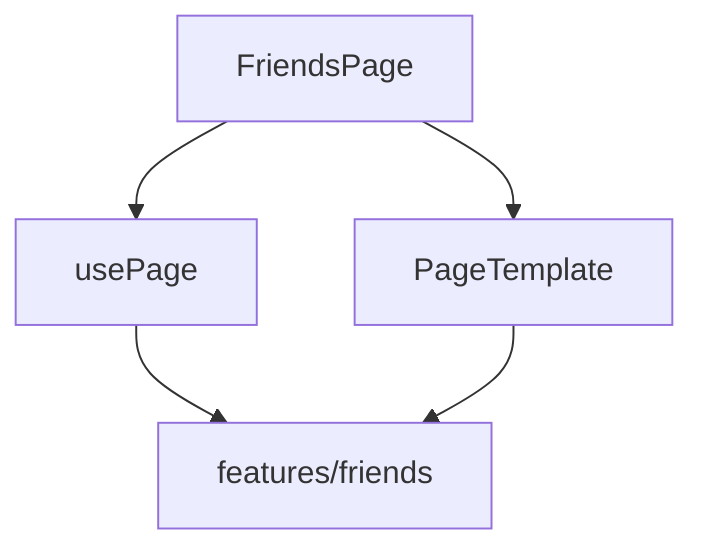

# `pages/friends`

Authenticated **friends hub**: current friends (filter/sort/remove), pending requests (accept/reject), and Discover search. The page owns route tabs, highlight query params, remove confirmation, and client-side filter/sort; list/search widgets and API live in `features/friends`.

Entry is [`friends.component.tsx`](friends.component.tsx) (`FriendsPage`) → `usePage()` → [`page.html.tsx`](page.html.tsx) (`PageTemplate`). Nested units use short local names (`header/`, `controls/`, `content/`, `remove-modal/`).

## Route(s) + guard

| Path | Element | Guard |
|------|---------|-------|
| `/friends` | Redirect → `/friends/current` | — |
| `/friends/:tab` | `FriendsPage` (lazy) | `ProtectedRoute` (default) |

`:tab` must be `current` | `requests` | `search`. Invalid tab → page-level redirect to `/friends/current` (`DEFAULT_PATH`).

Default `ProtectedRoute`: loading → force password change → `/welcome` if not onboarded → `/login` if unauthenticated.

**Shell:** default `AppShell` (nav visible). Profile menu and notifications deep-link here (`/friends/current`, `/friends/requests?highlightRequest=…`, `/friends/current?highlightUser=…`).

## Structure

```
friends/
  friends.component.tsx        ← entry (FriendsPage)
  page.html.tsx                ← PageTemplate shell
  page.module.css
  hooks/
    use-page.tsx
  constants/
    tabs.constant.ts
    default-tab.constant.ts
    sort-options.constant.ts
    highlight-ms.constant.ts
  interfaces/
  utils/
    parse-tab.util.ts
    is-tab-id.util.ts
    filter-by-query.util.ts
    sort.util.ts
    enrich-with-birthday.util.ts
    get-days-until-birthday.util.ts
  components/
    header/                    ← title + friend / pending stats
    controls/                  ← tabs + filter/sort (current only)
    content/                   ← FriendList / FriendRequestList / UserSearch
    remove-modal/              ← confirm unfriend
```

## Units

| Folder / file | Export | Role |
|---------------|--------|------|
| [`friends.component.tsx`](#entry) | `FriendsPage` | Hook → Navigate or `PageTemplate` |
| [`hooks/use-page.tsx`](#usepage) | `usePage` | Tab routing, controller, filter/sort, highlight, remove |
| [header/](#header) | `Header` | Title + total friends / pending counts |
| [controls/](#controls) | `Controls` | Tabs + filter + sort dropdown |
| [content/](#content) | `Content` | Tab panels via feature lists |
| [remove-modal/](#remove-modal) | `RemoveModal` | Confirm bidirectional unfriend |

### Entry

If `usePage().redirectTo` is set (invalid `:tab`), renders `<Navigate replace />`; otherwise spreads template props into `PageTemplate` (`EnterPanel` → Header → error → Controls → Content → RemoveModal).

### `usePage`

| Concern | Behavior |
|---------|----------|
| Route | `useParams` + `parseTab`; invalid → `redirectTo` |
| Data | `useFriendsController()` — mount `fetchFriends()`; pass lists / search / mutations |
| Current tab | `enrichWithBirthday` → `filterByQuery` → `sortByMethod` |
| Concurrency | `processingId` wraps send / accept / reject / remove |
| Highlight | Reads `highlightUser` / `highlightRequest`; clears both after `HIGHLIGHT_MS` (5000) and on tab change |
| Remove | `friendToRemove` → modal; confirm calls `removeFriend` |

**Tabs** (`TABS`): `current` → My Friends, `requests` → Requests, `search` → Discover.

**Sort** (`SORT_OPTIONS`, current tab only): `name` (A–Z), `recent` (`FriendsSince` desc), `birthday` (`DaysUntilBirthday` asc).

### Header

Presentational: “Friends & Connections” plus stat cards for `totalFriendsCount` and `pendingCount` (incoming).

### Controls

Tab buttons with `data-tour` targets. Requests tab shows a dot when `pendingCount > 0`. Filter input and sort dropdown render **only** when `activeTab === 'current'`. Local `isSortOpen` + outside-click close.

### Content

While `isLoading`: `LoadingState`. Else switches:

| Tab | Feature UI |
|-----|------------|
| `current` | `FriendList` |
| `requests` | `FriendRequestList` |
| `search` | `UserSearch` |

Passes highlight IDs, `existingFriendIds`, `pendingUserIds`, and action handlers. Remove stops at `onRequestRemoveFriend` (modal owned by shell).

### Remove modal

Opens when `target` is set. Copy warns that removal is bidirectional. Confirm disabled / “Removing…” while `processingId === target.id`.

## Composition with features



| Feature | Used for |
|---------|----------|
| [`friends`](../../../features/friends/README.md) | `useFriendsController`, `FriendList`, `FriendRequestList`, `UserSearch`, types |
| [`tour`](../../../features/tour/README.md) | `TOUR_TARGETS.friendsTabCurrent` / `friendsTabRequests` / `friendsTabDiscover` |

`FriendsProvider` is mounted at app level (not on this page). Discover uses feature-debounced `searchUsers` (~300ms); page filter/sort are client-only on the current tab.

## Tab flows

- **Current** — filter by name/username; sort; hover remove → modal → `DELETE` friend; `?highlightUser=` scrolls/highlights then clears
- **Requests** — accept / reject incoming; outgoing show Pending only; `?highlightRequest=` same highlight lifecycle; tab badge from incoming count
- **Discover** — feature search UI; excludes existing friends; Pending vs send-request; no page-level sort controls

## Allowed / forbidden

- **May import:** `features/friends`, `features/tour` (targets), `shared/ui`, `react-router-dom`
- **Must not:** reimplement friend API or list cards; do not put Discover debounce / request list chrome in the page when the feature already owns them
- Keep tab parse, birthday enrich, filter/sort, and highlight timing in page `utils/` / `constants/`

## Related

- [↑ pages](../README.md)
- [components/content](../../components/README.md#content) — lazy routes
- [layout/](../../layout/README.md) — profile menu → `/friends/current`
- [features/friends](../../../features/friends/README.md)
- [features/tour](../../../features/tour/README.md)
