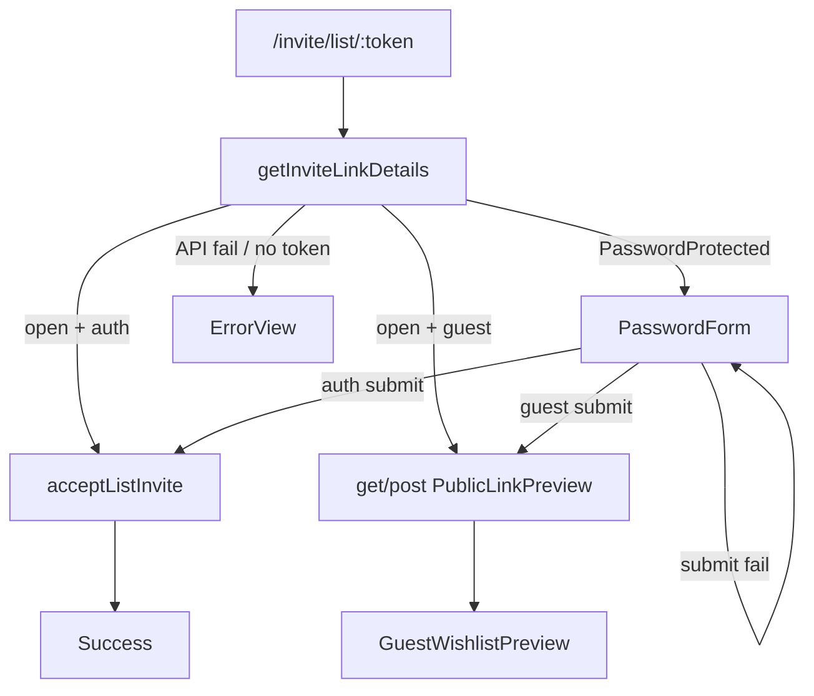

# `pages/invite-accept`

**Token invite** surface for shared wishlists: authenticated users accept the invite; guests get a read-only wishlist preview. Optional password gate sits in front of either path. The URL token is the credential — there is no Public/Protected route wrapper.

Entry is [`invite-accept.component.tsx`](invite-accept.component.tsx) (`InviteAcceptPage`) → `usePage()` → [`page.html.tsx`](page.html.tsx) phase switcher.

## Route(s) + guard

| Path | Element | Guard |
|------|---------|-------|
| `/invite/list/:token` | `InviteAcceptPage` (lazy) | **None** |

Anyone with the link can open the route. Auth only chooses accept vs guest-preview APIs and home labels.

**Shell:** `isFullWidth` (same as wishlist detail) so the guest workspace can use the full content width. **Not** `isAuthPage` — nav/banner remain visible on password / success / error cards as well as the preview.

## Structure

```
invite-accept/
  invite-accept.component.tsx
  page.html.tsx                  ← phase switcher
  page.module.css
  hooks/
    use-page.tsx
  constants/
    fallback-messages.constant.ts
  interfaces/
  utils/
    normalize-preview.util.ts
  components/
    password-form/               ← password-protected gate
    guest-wishlist-preview/      ← read-only wishlist-detail reuse
    success/                     ← invite accepted
    error-view/                  ← fatal load failure
```

## Units

| Folder / file | Export | Role |
|---------------|--------|------|
| [`invite-accept.component.tsx`](#entry) | `InviteAcceptPage` | Hook → template |
| [`hooks/use-page.tsx`](#usepage) | `usePage` | Load / submit / navigate |
| [password-form/](#password-form) | `PasswordForm` | Password gate card |
| [guest-wishlist-preview/](#guest-wishlist-preview) | `GuestWishlistPreview` | Read-only wishlist workspace |
| [success/](#success) | `Success` | Post-accept confirmation |
| [error-view/](#error-view) | `ErrorView` | Fatal error + home CTA |

### Entry

Thin: `usePage()` props into `PageTemplate`.

### `usePage`

**State:** `isLoading`, `isSubmitting`, `error`, `inviteError`, `password`, `isSuccess`, `listId`, `guestPreview`.

**Initial load** (token + auth ready):

1. No token → `INVALID_INVITE_LINK` → ErrorView  
2. `notificationsApi.getInviteLinkDetails(token)`  
   - `PasswordProtected` → stop loading → PasswordForm  
   - Not protected + authenticated → `acceptListInvite` → Success  
   - Not protected + guest → `getPublicLinkPreview` → normalize → GuestWishlistPreview  
   - Failure → ErrorView (`FAILED_RETRIEVE_DETAILS`)

**Password submit:**

- Auth → `acceptListInvite(token, password)` → Success or `inviteError`  
- Guest → `postPublicLinkPreview(token, password)` → preview or `inviteError`

**Nav:** `onGoHome` → `/dashboard` (auth) or `/login` (guest); `onViewWishlist` → `/wishlists/:listId` when `listId` is set. `homeLabel` mirrors that (“Back to Dashboard” / “Log in”).

### Password form

Card: password `Input`, submit disabled when empty/submitting, cancel → `onGoHome`. Label via `getSubmitLabel`: “Opening…” / “Accept Invite” / “View Wishlist”. Field errors from `inviteError`.

### Guest wishlist preview

Largest nested unit. Wraps `ItemsSessionProvider` + `CommentsSessionProvider`, maps preview → guest wishlist, and **reuses** [`wishlist-detail`](../wishlist-detail/README.md) `PageTemplate` + `getPageShellFlags` with guest-safe flags (`isPublicGuest`, no collaborate, mutating `GUEST_ITEM_ACTIONS` throw). Local UI state for view mode, search, selection, comments panel, etc. Preview “home” navigates to `/login`.

### Success

“Invite Accepted!” — primary “View Wishlist” when `listId` exists; secondary goes home via `onGoHome`.

### Error view

`ErrorState` + secondary home button (`homeLabel`). Used for **fatal** load errors only (not password field errors).

## Flow

`page.html.tsx` priority (first match wins): loading → error → guestPreview → success → PasswordForm.



## Composition with features

| Feature / module | Role |
|------------------|------|
| [`auth`](../../../features/auth/README.md) | `useAuth` — branch + labels |
| [`notifications`](../../../features/notifications/README.md) | Invite link details / accept / preview APIs |
| [`wishlists`](../../../features/wishlists/README.md) | Preview types + guest normalize / `toGuestWishlist` helpers |
| [`items`](../../../features/items/README.md) / [`comments`](../../../features/comments/README.md) | Session providers for guest shell |
| [`wishlist-detail`](../wishlist-detail/README.md) | Reused `PageTemplate` + shell flags |

APIs (via `notificationsApi`): `GET/POST …/invites/link/:token` (details, accept, preview).

## Allowed / forbidden

- **May import:** auth, notifications, wishlists guest helpers, items/comments providers, wishlist-detail page template utilities, `shared/ui`
- **Must not:** turn guest preview into a writable workspace; do not wrap this route in Public/Protected (token is the gate)
- Keep fallback copy and preview normalization in page `constants/` / `utils/`

## Related

- [↑ pages](../README.md)
- [components/content](../../components/README.md#content) — unguarded lazy route
- [wishlist-detail](../wishlist-detail/README.md) — guest preview host
- [features/notifications](../../../features/notifications/README.md)
- [features/wishlists](../../../features/wishlists/README.md)
- [features/auth](../../../features/auth/README.md)
