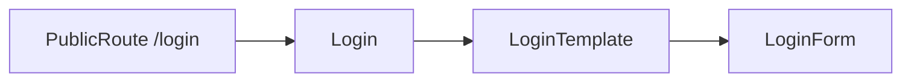

# `pages/login`

Sign-in screen for unauthenticated users. Thin layout wrapper: the page owns only a full-width container; credential UI, session side effects, and validation live in [`LoginForm`](../../../features/auth/README.md) from `features/auth`.

## Route / guard

| Path | Guard | Shell |
|------|-------|-------|
| `/login` | [`PublicRoute`](../../routes/) | `isAuthPage` — no nav/banner; full-bleed auth main |

Declared in [`content.html.tsx`](../../components/content/content.html.tsx) (lazy). `PublicRoute` redirects **authenticated** users to `postAuthPath(user)` (dashboard / welcome / change-password as appropriate). Unauthenticated users see this page.

`AppContent` sets `isAuthPage` when `pathname === '/login'`, so [`AppShell`](../../layout/README.md) skips navigation and uses auth-main styles.

## Structure

```
login/
  login.component.tsx    ← default export `Login`
  login.html.tsx         ← `LoginTemplate`
  login.module.css
  README.md
```

No nested `components/`, hooks, or interfaces — auth thin-wrapper pattern from [pages README](../README.md).

## Units

| File | Export | Role |
|------|--------|------|
| `login.component.tsx` | `Login` (default) | Entry; renders template only |
| `login.html.tsx` | `LoginTemplate` | Markup: `.container` + `LoginForm` |
| `login.module.css` | — | `.container { width: 100% }` |

## Composition



- **Imports:** `LoginForm` from `features/auth` (barrel)
- **Owns:** layout chrome for the form (width stretch)
- **Does not own:** credentials, passkeys, redirects after login, registration-mode checks — those are inside `LoginForm` / auth provider

## Allowed / forbidden

- **May import:** `features/auth` form barrel exports, `shared/ui` if the shell needs chrome
- **Must not:** reimplement login fields/API calls here; deep-import auth form internals; add wishlist/settings domain logic
- Keep this folder thin — extend `features/auth` forms, not the page

## Related

- [↑ pages](../README.md)
- [features/auth](../../../features/auth/README.md) — `LoginForm`, `useAuth`, `postAuthPath`
- [components/content](../../components/README.md#content) — lazy route table
- [layout](../../layout/README.md) — `isAuthPage` shell behavior
- [register](../register/README.md) — sibling public auth page
