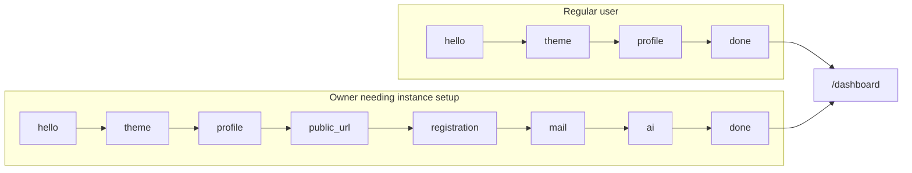

# `pages/onboarding`

Post-auth **welcome wizard** on `/welcome`: profile and theme for every new user; owners who still need instance setup also configure public URL, registration policy, mail, and AI. The page owns step composition, panel transitions, and persist helpers; domain PATCH/GET go through `features/auth`.

Entry is [`onboarding.component.tsx`](onboarding.component.tsx) (`Onboarding`) → `usePage()` → [`page.html.tsx`](page.html.tsx) (sidebar timeline + header / step panel / footer).

## Route(s) + guard

| Path | Element | Guard |
|------|---------|-------|
| `/welcome` | `Onboarding` (lazy) | `ProtectedRoute` with `allowOnboarding` |

**With `allowOnboarding`:** authenticated users who are **not** onboarded (`IsOnboarded === false`) may enter; already onboarded → `/dashboard`; `ForcePasswordChange` → `/change-password`; unauthenticated → `/login`.

**Inverse (default protected routes):** not onboarded → redirect **to** `/welcome`. `postAuthPath()` also sends incomplete onboarding users here (after forced password change when needed).

**Shell:** `isAuthPage` — treated like login/register (minimal chrome; no main nav). Distinct from first-boot [`setup`](../setup/README.md), which mounts outside Content entirely.

## Structure

```
onboarding/
  onboarding.component.tsx
  page.html.tsx
  page.module.css
  hooks/
    use-page.tsx
  constants/
    user-steps.constant.ts
    owner-steps.constant.ts
    step-copy.constant.ts
    registration-options.constant.ts
    skip-allowed.constant.ts
    panel-leave-ms.constant.ts
    fallback-messages.constant.ts
    smtp-transport-options.constant.tsx
  interfaces/
  utils/
    build-steps.util.ts
    build-persist-payload.util.ts
    is-owner-step.util.ts
    is-skip-allowed.util.ts
    get-step-copy.util.ts
    get-primary-cta-label.util.ts
    to-theme-options.util.ts
    apply-glow-pointer.util.ts
  components/
    header/
    footer/
    timeline/
    step-panel/                ← + stagger-item
    glow-card/
    steps/
      hello/
      theme/
      profile/
      public-url/              ← owner
      registration/            ← owner
      mail/                    ← owner
      ai/                      ← owner
      done/
```

## Units

| Folder / file | Export | Role |
|---------------|--------|------|
| [`onboarding.component.tsx`](#entry) | `Onboarding` | Hook → `PageTemplate` |
| [`hooks/use-page.tsx`](#usepage) | `usePage` | Steps, persist, skip, panel phase |
| [header/](#header) | `Header` | Title/subtitle + mobile progress dots |
| [footer/](#footer) | `Footer` | Back / Skip / primary CTA |
| [timeline/](#timeline) | `Timeline` | Vertical progress (excludes `done`) |
| [step-panel/](#step-panel) | `StepPanel`, `StaggerItem` | Leave/enter animations |
| [glow-card/](#glow-card) | `GlowCard` | Pointer-follow selectable cards |
| [steps/\*](#steps) | `Hello`, `Theme`, … | Per-step forms / copy |

### Entry

Thin: `usePage()` into the decorative shell (BrandMark + timeline sidebar; main column for header, optional error, step panel, footer).

### `usePage`

- Loads `authApi.getOnboardingState()`; `requiresOwnerOnboarding = state.RequiresOwnerOnboarding && user.IsOwner`
- `steps = buildSteps(requiresOwnerOnboarding)` — always starts at index 0 (`hello`); server step progress is not restored in the UI
- Seeds form from `user` + defaults (public URL `http://localhost:3000`, SMTP local/587/`noreply@giftistry.local`, AI off)
- Theme options from `loadThemePreviews(getStandardThemes(), …)` → `toThemeOptions`
- **Next:** persist current step (if any) → special owner complete on leaving `ai` → advance; on `done` → `CompleteUser` + `refreshUser` + `/dashboard`
- **Skip:** owner steps → `CompleteOwner` + `SkipOwner` (skips remaining owner setup); user steps → advance only, no PATCH
- **Back:** decrement index (blocked while `panelPhase === 'leaving'`)
- Theme field change also calls `setTheme()` live

### Header / Footer / Timeline

- Header: copy from `getStepCopy(visibleStepId)`; hello uses enlarged Gift title layout
- Footer: Back when `step > 0` and not done; Skip when `canSkip`; CTA via `getPrimaryCtaLabel` (“Let's go” / “Continue” / “Enter Dashboard”); disabled while submitting or leaving
- Timeline: all steps except `done`; on done, all marks complete

### Step panel + stagger

When logical `stepId` ≠ `visibleStepId`: `panelPhase = 'leaving'` for `PANEL_LEAVE_MS` (250ms), then swap visible id and return to `active`. `StaggerItem` children animate enter/leave via `PanelPhaseContext` (respects `prefers-reduced-motion`).

### Glow card

Button or `div` with radial gradient following pointer (`applyGlowPointer` → `--mouse-x` / `--mouse-y`). Used by theme, registration, and AI rows.

### Steps

| Step ID | Audience | UI | Persist on Continue |
|---------|----------|-----|---------------------|
| `hello` | All | Intro bullets (owner gets extra server-settings line) | none |
| `theme` | All | GlowCard theme grid | profile + theme fields |
| `profile` | All | Name + optional bio | profile + theme fields |
| `public_url` | Owner | Public app URL | `PublicAppUrl` |
| `registration` | Owner | invite_only / open / disabled cards | `RegistrationMode` |
| `mail` | Owner | Local/remote SMTP + host/port/from | SMTP fields |
| `ai` | Owner | AI assistants + web search switches | deferred → `buildOwnerCompletePayload` + `CompleteOwner` |
| `done` | All | Enjoy copy + tour mention | `CompleteUser` then dashboard |

## Owner vs user flow



`USER_STEPS` = hello → theme → profile. `OWNER_STEPS` = public_url → registration → mail → ai. `done` always last.

Skip on an owner step PATCHes `CompleteOwner` + `SkipOwner` and jumps toward `done`; skip on user steps only advances the index.

## Composition with features

| Layer | Role |
|-------|------|
| [`auth`](../../../features/auth/README.md) | `useAuth`, `getOnboardingState`, `patchOnboarding` |
| Theme provider + `core/theme` | Live preview + standard theme previews |
| `shared/ui` | BrandMark, Button, Input, SelectMenu, Switch, Badge |

Tour is mentioned on the done step but runs elsewhere after dashboard entry — this page does not import `features/tour`.

## Allowed / forbidden

- **May import:** `features/auth`, app theme provider, `core/theme`, `shared/ui`, `react-router-dom`
- **Must not:** call system setup APIs here (that is [`pages/setup`](../setup/README.md)); do not treat this as a Content-free boot gate
- Keep step lists, copy, skip sets, and persist payload builders in page `constants/` / `utils/`

## Related

- [↑ pages](../README.md)
- [components/content](../../components/README.md#content) — `/welcome` route
- [pages/setup](../setup/README.md) — first-boot install (before users exist)
- [features/auth](../../../features/auth/README.md) — onboarding GET/PATCH
- [features/tour](../../../features/tour/README.md) — post-dashboard walkthrough (referenced in done copy)
