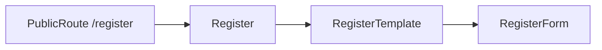

# `pages/register`

Account registration screen. Thin layout wrapper: the page centers a viewport-height flex container; form fields, invite/open-mode gating, and submit live in [`RegisterForm`](../../../features/auth/README.md) from `features/auth`.

## Route / guard

| Path | Guard | Shell |
|------|-------|-------|
| `/register` | [`PublicRoute`](../../routes/) | `isAuthPage` — no nav/banner; full-bleed auth main |

Declared in [`content.html.tsx`](../../components/content/content.html.tsx) (lazy). Same public-guard behavior as login: authenticated users are sent to `postAuthPath(user)`.

Nav “Get Started” / register CTAs appear only when `registrationMode === 'open'` (see [`AppNavigation`](../../layout/README.md)); the route itself remains registered regardless.

`AppContent` treats `/register` as `isAuthPage`.

## Structure

```
register/
  register.component.tsx    ← default export `Register`
  register.html.tsx         ← `RegisterTemplate`
  register.module.css
  README.md
```

No nested `components/`, hooks, or interfaces — auth thin-wrapper pattern from [pages README](../README.md).

## Units

| File | Export | Role |
|------|--------|------|
| `register.component.tsx` | `Register` (default) | Entry; renders template only |
| `register.html.tsx` | `RegisterTemplate` | Markup: `.container` + `RegisterForm` |
| `register.module.css` | — | Full-viewport flex center (`min-height: 100dvh`) |

## Composition



- **Imports:** `RegisterForm` from `features/auth` (barrel)
- **Owns:** centered auth layout (flex align/justify)
- **Does not own:** registration API, invite tokens, open/closed mode messages — those are inside `RegisterForm` / auth + system config

CSS differs from login: register centers the form vertically/horizontally; login only sets `width: 100%` and lets the form handle its own layout.

## Allowed / forbidden

- **May import:** `features/auth` form barrel exports, `shared/ui` if the shell needs chrome
- **Must not:** reimplement registration fields/API here; deep-import auth form internals; duplicate site registration-mode policy (that belongs in auth/system features)
- Keep this folder thin — extend `features/auth` forms, not the page

## Related

- [↑ pages](../README.md)
- [features/auth](../../../features/auth/README.md) — `RegisterForm`, `useAuth`, `postAuthPath`
- [components/content](../../components/README.md#content) — lazy route table
- [layout](../../layout/README.md) — `isAuthPage` + register CTA visibility
- [login](../login/README.md) — sibling public auth page
