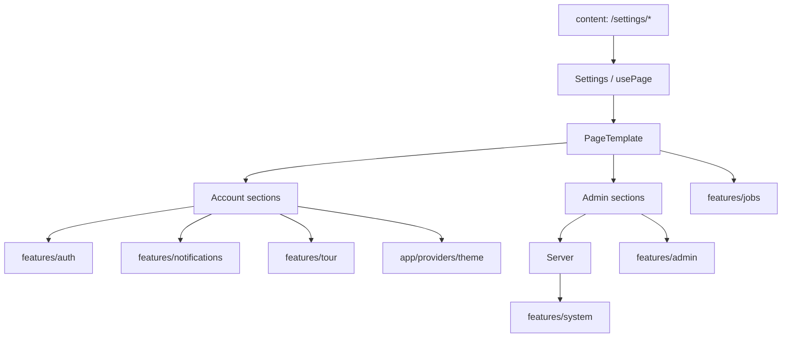

# `pages/settings`

Authenticated **settings shell**: left sidebar navigation, nested section routes under `/settings/*`, and an optional right-hand background-processes rail. Account sections are available to every signed-in user; Administration links and routes require `IsAdmin`, and Server requires `IsOwner`.

The page owns layout, route composition, sidebar visibility, and view-model mapping. Domain APIs and controllers live in `features/admin`, `features/system`, `features/auth`, `features/notifications`, `features/jobs`, and `features/tour`.

Entry is [`settings.component.tsx`](settings.component.tsx) (`Settings`) → [`usePage()`](hooks/use-page.tsx) → [`page.html.tsx`](page.html.tsx) (`PageTemplate`: Sidebar + nested `Routes` + conditional `ProcessesRail`).

## Route map

Outer mount (in [`components/content`](../../components/README.md#content)):

| Path | Element | Outer guard | Shell |
|------|---------|-------------|-------|
| `/settings/*` | `Settings` (lazy) | `ProtectedRoute` | `isSettingsPage` — `AppShell` uses `settings-main` (no `mainInner` wrapper) |

Nested routes are declared inside `usePage` (relative to `/settings`):

| Nested path | Full URL | Access | Section |
|-------------|----------|--------|---------|
| `index` | `/settings` | Account | Redirect → `/settings/account` |
| `account` | `/settings/account` | Account (any auth user) | Profile + tutorial |
| `security` | `/settings/security` | Account | Password / 2FA / passkeys |
| `notifications` | `/settings/notifications` | Account | Notification preference toggles |
| `theming` | `/settings/theming` | Account | Preset + custom themes |
| `admin` | `/settings/admin` | **Admin** (`AdminRoute`) | Overview |
| `admin/users` | `/settings/admin/users` | **Admin** | User list + create |
| `admin/users/:userId` | `/settings/admin/users/:userId` | **Admin** | User detail |
| `admin/site` | `/settings/admin/site` | **Admin** | Site policy |
| `admin/moderation` | `/settings/admin/moderation` | **Admin** | Reports + comments |
| `admin/audit` | `/settings/admin/audit` | **Admin** | Audit log |
| `admin/server` | `/settings/admin/server` | **Owner** (`OwnerRoute`) | Server configuration |
| `server` | `/settings/server` | — | Legacy redirect → `/settings/admin/server` |
| `*` | any other | Account | Redirect → `/settings/account` |

**Access rules:**

- **Account** — any authenticated user who passes `ProtectedRoute` (loading → force password change → onboard → login).
- **Admin** — `user.IsAdmin`. Non-admins hitting an admin path are redirected to `/settings/account` (`AdminRoute`). Sidebar Administration group is hidden when not admin.
- **Owner** — `user.IsOwner`. Non-owners hitting Server redirect to `/settings/admin` (if admin) or `/settings/account` (`OwnerRoute`). Server nav item only renders when `isOwner`.

Each nested section is **lazy-loaded** under a shared `Suspense` fallback (`Loading`).

## Structure

Top-level tree (omit deep AI pack/workspace files):

```
settings/
  settings.component.tsx          ← entry (Settings)
  page.html.tsx                   ← PageTemplate shell
  page.module.css
  hooks/
    use-page.tsx                  ← nested Routes + rail scope
  constants/
    mobile-layout-query.constant.ts
  interfaces/
  utils/
    processes-rail-scope-for-path.util.ts
    prefers-collapsed-mobile-panel.util.ts
  components/
    sidebar/                      ← Account + Administration nav
    processes-rail/               ← background jobs panel (scoped)
  sections/
    account/
      account/                    ← ProfileCard + Tutorial
      security/                   ← password / 2FA / passkeys
      notifications/
      theming/
    administration/
      components/                 ← shared admin chrome (gate, pagination, settings rows)
      overview/
      users/                      ← list + components/detail/
      site/
      moderation/
      audit/
      server/                     ← PublicUrl, OAuth, DB, SMTP, Push, Scrape, AI, DangerZone
      shared.module.css
      segmented-control.module.css
```

## Units

| Folder / file | Export | Role |
|---------------|--------|------|
| [`settings.component.tsx`](#entry) | `Settings` | Hook → `PageTemplate` |
| [`hooks/use-page.tsx`](#usepage) | `usePage` | Nested routes, admin/owner flags, processes rail scope |
| [sidebar/](#sidebar) | `Sidebar` | Collapsible settings nav |
| [processes-rail/](#processes-rail) | `ProcessesRail` | Background jobs for account/admin overview only |
| [account/](#account-sections) | — | Per-user preference screens |
| [administration/](#administration-sections) | — | Admin/owner instance screens |

### Entry

Thin: `usePage()` props into `PageTemplate`.

### `usePage`

Builds the nested `<Routes>` tree, reads `user.IsAdmin` / `user.IsOwner` for the sidebar, and derives `processesRailScope` from the pathname (`mine` on `/settings/account`, `admin` on `/settings/admin`, otherwise `null`). Passes `showToast` into sections that mutate. `toasts` on the result is currently an empty array (sections use the shared toast provider).

### Sidebar

Collapsible left rail (`prefersCollapsedMobilePanel` initial state on narrow viewports). Groups:

- **Account** — Account, Security, Notifications (`TOUR_TARGETS.settingsNotifications`), Theming
- **Administration** (admin only) — Overview, Users, Site Policy, Moderation, Audit Log, and **Server** (owner only)

Uses `shared/ui` `Sidebar` / `SidebarItem`. Mobile edge toggle expands/collapses the panel (`inert` when collapsed).

### Processes rail

Right-hand panel wrapping `features/jobs` `BackgroundProcessesPanel` + `useBackgroundJobs(scope)`:

| Path | Scope | Panel title |
|------|-------|-------------|
| `/settings/account` | `mine` | Background processes |
| `/settings/admin` | `admin` | Background processes (instance) |
| Other settings paths | — | Rail hidden |

Cancel / suspend / resume errors call `onProcessesError` → toast.

---

## Account sections

| Folder | Path | Purpose |
|--------|------|---------|
| [`account/`](sections/account/account/) | `/settings/account` | Hosts `ProfileCard` (auth) and `Tutorial` (tour chapter replay / restart) |
| [`security/`](sections/account/security/) | `/settings/security` | Password change, TOTP 2FA flow, passkey register/delete via `useSecuritySettings` |
| [`notifications/`](sections/account/notifications/) | `/settings/notifications` | Preference switches (`EmailAlerts`, `FriendRequests`, `JobCompletions`, push, etc.) via `useNotificationPreferences` |
| [`theming/`](sections/account/theming/) | `/settings/theming` | Preset catalog + custom theme editor (colors, shadows, fonts, radius) via `app/providers/theme` + `core/theme` |

**Security nested UI:** `password-section/`, `two-factor-section/` (embeds passkeys), `passkeys-section/`.

**Account tutorial:** lists `TOUR_CHAPTERS` (hides `importAi` when `!canShowAi`); restart all / replay sample / start chapter; stays on settings for `notifications` and `theming` chapters, otherwise navigates to `/dashboard`.

---

## Administration sections

Shared chrome under [`administration/components/`](sections/administration/components/): `SettingGroup`, `SettingItem`, `SearchInput`, `PaginationControls`, `SensitiveGate` (acknowledge-to-unlock overlay used by Moderation and Audit).

| Folder | Path | Purpose |
|--------|------|---------|
| [`overview/`](sections/administration/overview/) | `/settings/admin` | Instance stats (users, lists, open reports), maintenance badge, recent audit snippet, quick links |
| [`users/`](sections/administration/users/) | `/settings/admin/users` | Searchable paginated user table, create-user modal; rows link to detail |
| [`users/.../detail/`](sections/administration/users/components/detail/) | `/settings/admin/users/:userId` | Tabs: Profile, Permissions, Security, Activity; owner-of-owner read-only guards |
| [`site/`](sections/administration/site/) | `/settings/admin/site` | Registration mode, domains, invites, lockout, maintenance, default user policy toggles |
| [`moderation/`](sections/administration/moderation/) | `/settings/admin/moderation` | Paginated reports (resolve/dismiss) + comments (delete); behind `SensitiveGate` |
| [`audit/`](sections/administration/audit/) | `/settings/admin/audit` | Filterable / exportable audit log; behind `SensitiveGate` |
| [`server/`](sections/administration/server/) | `/settings/admin/server` | Homelab server config form (`useSystemSettingsController`); owner only |

### Server subsections

`server/hooks/use-page.tsx` is a thin alias for `useSystemSettingsController`. Template composes:

| Unit | Purpose |
|------|---------|
| `public-url/` | Browser-facing public app URL (email, CORS, WebAuthn) |
| `oauth/` | OIDC SSO enablement, issuer, client credentials, auto-register |
| `db-section/` | PostgreSQL local vs remote connection |
| `smtp-section/` | Local Mailpit vs remote SMTP |
| `push-section/` | ntfy, Web Push (VAPID), FCM |
| `scrape-section/` | Fetch/Playwright timeouts and Grab-info concurrency |
| `ai-section/` | AI enablement, feature toggles, timeouts, provider connection panels, model pickers, prompts/packs workspace |
| `danger-zone/` | Allow first-run setup toggle; permanent delete server |

Do not document every file under `ai-section/components/prompts-packs-workspace/` here — that subtree is a large nested workspace owned by system settings UI.

## Composition with features



| Feature / module | Role |
|------------------|------|
| [`auth`](../../../features/auth/README.md) | `useAuth` flags; `ProfileCard`; `useSecuritySettings`; tutorial / tour chapter status |
| [`notifications`](../../../features/notifications/README.md) | `useNotificationPreferences` |
| [`tour`](../../../features/tour/README.md) | Sidebar tour target; Account `Tutorial` chapter controls |
| [`admin`](../../../features/admin/README.md) | `useOverview`, `useUsers`, `useUserDetail`, `useSitePolicy`, `useModeration`, `useAuditLog` |
| [`system`](../../../features/system/README.md) | `useSystemSettingsController` for Server (+ AI packs/models types) |
| [`jobs`](../../../features/jobs/README.md) | `useBackgroundJobs` + `BackgroundProcessesPanel` in processes rail |
| `app/providers/theme` + `core/theme` | Theming presets, custom themes, live CSS application |
| `app/routes` | Nested `AdminRoute` / `OwnerRoute` |

## Allowed / forbidden

- **May import:** `features/admin`, `features/system`, `features/auth`, `features/notifications`, `features/jobs`, `features/tour`, `app/routes`, `app/providers/theme`, `core/theme`, `shared/ui`, `shared/utils`, `shared/providers/toast`
- **Must not:** put admin/system API clients or controllers in the page tree; duplicate rail/sidebar chrome in sections; expose Server UI without `OwnerRoute`; show Administration nav without `IsAdmin`
- Keep section markup under `sections/`; keep shared admin row/gate/pagination under `administration/components/`
- Nested SoC: short local names inside each section folder (no redundant `settings-` prefix on new units)

## Related

- [↑ pages](../README.md)
- [components/content](../../components/README.md#content) — lazy `/settings/*` + `ProtectedRoute`
- [layout](../../layout/README.md) — `isSettingsPage` / `settings-main`
- [routes](../../routes/) — `AdminRoute`, `OwnerRoute`, `ProtectedRoute`
- [features/admin](../../../features/admin/README.md)
- [features/system](../../../features/system/README.md)
- [features/auth](../../../features/auth/README.md)
- [features/notifications](../../../features/notifications/README.md)
- [features/jobs](../../../features/jobs/README.md)
- [features/tour](../../../features/tour/README.md)
