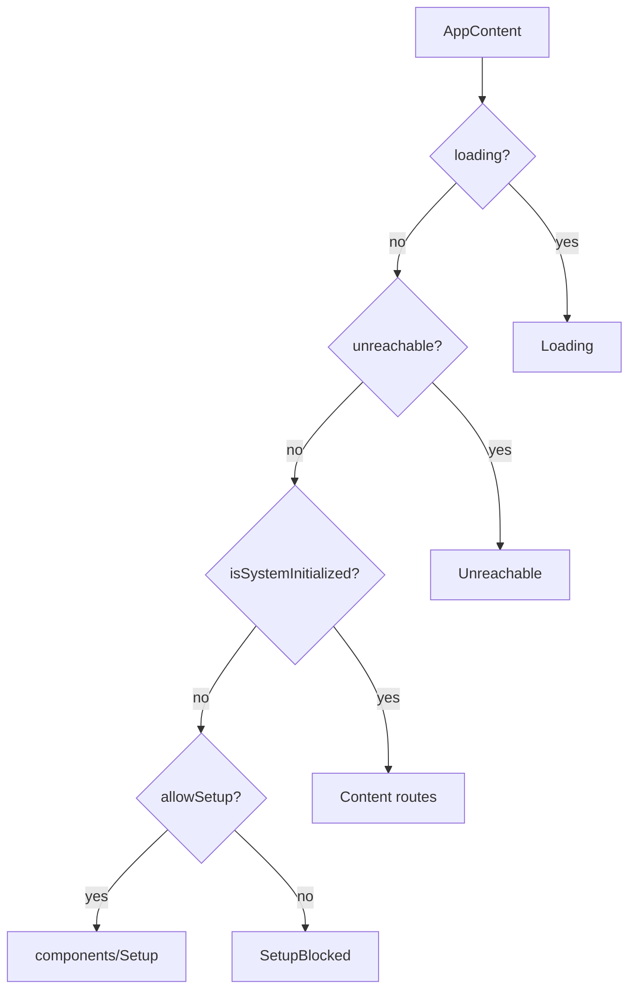
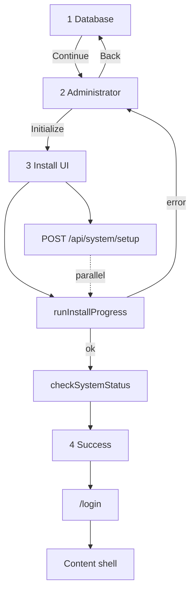

# `pages/setup`

**First-boot install wizard** for an uninitialized Giftistry instance: choose database, create the primary admin, run install, then hand off to login. This page is **not** on the main Content route table — the boot gate mounts it through [`components/setup`](../../components/README.md#setup) when `!isSystemInitialized && allowSetup`.

Entry is [`setup.component.tsx`](setup.component.tsx) (`Setup`) → `usePage()` → [`page.html.tsx`](page.html.tsx) (sidebar timeline + step body + footer). No `AppShell` / main navigation during setup.

## Route(s) + guard

| Path | Element | Guard |
|------|---------|-------|
| `/setup` | `Setup` (lazy via components/setup) | Boot gate only |

Boot gate (`AppContent`):



`components/setup` forces every path to `/setup` and Suspense-falls back to `Loading`. Optional query: `?setup_token=` → sent as `SetupToken` on `runSetup`.

When uninitialized and setup is disabled → [`SetupBlocked`](../../components/README.md#setup-blocked) (static; no page mount).

## Structure

```
setup/
  setup.component.tsx
  page.html.tsx
  page.module.css
  hooks/
    use-page.tsx
  constants/
    install-tasks.constant.ts
    field-error-map.constant.ts
  interfaces/
  utils/
    validate-step.util.ts
    run-install-progress.util.ts
    get-install-label-modifier.util.ts
    sleep.util.ts
  components/
    timeline/                  ← 3-step sidebar progress
    database-step/             ← local vs remote Postgres
    admin-step/                ← primary user form
    install-step/              ← animated task log
    success-step/              ← static complete copy
    footer/                    ← Continue / Initialize / Go to Login
```

## Units

| Folder / file | Export | Role |
|---------------|--------|------|
| [`setup.component.tsx`](#entry) | `Setup` | Hook → `PageTemplate` |
| [`hooks/use-page.tsx`](#usepage) | `usePage` | Step machine, validation, `runSetup`, progress |
| [timeline/](#timeline) | `Timeline` | Sidebar steps 1–3 |
| [database-step/](#database-step) | `DatabaseStep` | Storage configuration |
| [admin-step/](#admin-step) | `AdminStep` | Administrator account |
| [install-step/](#install-step) | `InstallStep` | Install task rows |
| [success-step/](#success-step) | `SuccessStep` | Completion message |
| [footer/](#footer) | `Footer` | Nav CTAs by step |

### Entry

Thin pass-through of `usePage()` into the shell (brand + timeline sidebar; main column for step + footer; mobile “Step X of 3”).

### `usePage`

Internal `step` **1–4** (success is step 4; timeline only lists 1–3).

| Step | UI | Footer |
|------|-----|--------|
| 1 | Database | Continue |
| 2 | Admin | Back + Initialize System |
| 3 | Install | Hidden (`showFooter = false`) |
| 4 | Success | Go to Login |

**Continue / Initialize:**

1. `validateStep(step, fields)` — remote URL must start with `postgres`; admin username via `validateUsername`, password ≥8 with letter+number, confirm match  
2. Step 1 → step 2  
3. Step 2 → step 3, `systemApi.runSetup({ Giftistry: { Setup: { DbType, DbUrl?, SetupToken?, Admin } } })` in parallel with `runInstallProgress`  
4. On success: `checkSystemStatus()`, toast, step 4  
5. On error: revert to step 2, map `ApiError.details` through `FIELD_ERROR_MAP`, reset tasks, toast

`handleFinish` / leftover next-on-4 → `navigate('/login')`.

### Timeline

`STEPS`: Database / Administrator / Installation. On step 4 all three show completed (none active).

### Database step

Radio cards: `local` (recommended) vs `remote`. Remote reveals Connection URL; errors on `dbUrl`.

### Admin step

First/last name, username (`@` affordance), password + confirm with show/hide. Field errors plus optional `errors.setup` banner.

### Install step

Maps `installTasks` to rows with pending / spinning / check icons. Copy warns not to close the window. Progress animation is **cosmetic** until the last task awaits the real API (`runInstallProgress`).

**Tasks** (`INITIAL_INSTALL_TASKS`): connect DB → schema migrations → register admin → write config.

### Success step

Static “Installation Complete” — login with the admin account (footer owns navigation).

### Footer

Hidden on install. Back only on step 2. Primary: Continue → Initialize System (Zap) → Go to Login.

## Wizard flow



After success, `isSystemInitialized` flips true so the next app render leaves the setup shell for `Content`. User signs in with the admin created in step 2.

## Composition with features

| Layer | Role |
|-------|------|
| [`auth`](../../../features/auth/README.md) | `useAuth` → `checkSystemStatus`; boot gate reads `isSystemInitialized` / `allowSetup` |
| [`system`](../../../features/system/README.md) | `systemApi.runSetup` |
| `shared` | `validateUsername`, toast, `BrandMark` |
| `core/api` | `ApiError`, `formatApiErrorMessage`, `mapValidationErrorsToFields` |

## Allowed / forbidden

- **May import:** `features/auth`, `features/system`, shared validation/toast/ui, `react-router-dom`
- **Must not:** register this page under Content routes; do not add AppShell nav chrome here
- Keep install task labels, field-error map, and progress timing in page `constants/` / `utils/`

## Related

- [↑ pages](../README.md)
- [components/setup](../../components/README.md#setup) — boot-gate mount + `/setup` router
- [components/setup-blocked](../../components/README.md#setup-blocked) — setup disabled
- [features/system](../../../features/system/README.md)
- [features/auth](../../../features/auth/README.md)
- [pages/onboarding](../onboarding/README.md) — post-login owner/user wizard (separate)
