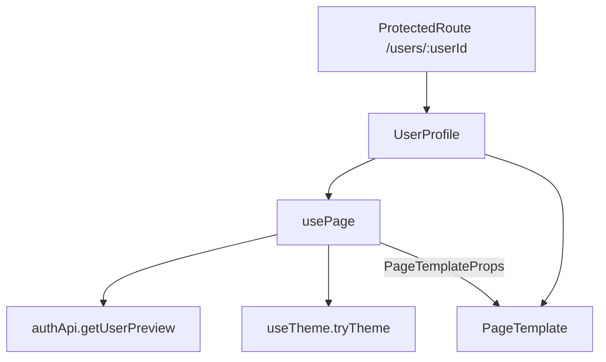

# `pages/user-profile`

Read-only profile for **another user** (or the current user viewed as public layout). Loads preview data by `:userId`, shows avatar / status / bio / list stats, and optionally lets the viewer try that user’s theme. Not the account editor — settings live under [`pages/settings`](../settings/README.md).

## Route / guard

| Path | Guard | Shell |
|------|-------|-------|
| `/users/:userId` | [`ProtectedRoute`](../../routes/) (default) | Normal shell (nav + main); **not** `isAuthPage` |

Declared in [`content.html.tsx`](../../components/content/content.html.tsx) (lazy). Requires authentication; unauthenticated visitors redirect to `/login`. Also honors force-password-change → `/change-password` and incomplete onboarding → `/welcome`.

### Legacy `/profile/*` (not this page)

`/profile/*` is handled by [`LegacyProfileRedirect`](../../routes/), which maps old profile URLs to **settings** paths (e.g. `/profile` → `/settings/account`, `/profile/security` → `/settings/security`). It does **not** mount `UserProfile`. Viewing people is only `/users/:userId`.

## Structure

```
user-profile/
  user-profile.component.tsx     ← default export `UserProfile`
  page.html.tsx                  ← `PageTemplate`
  page.module.css
  hooks/
    use-page.tsx                 ← route orchestration + derived view model
  interfaces/
    page-template-props.interface.ts
  utils/
    get-joined-label.util.ts
    utils.test.ts
  user-profile.test.tsx
  user-profile.route.test.tsx
  README.md
```

Canonical page shape: entry repeats domain name; shell is `page.*`; hooks/utils use short local names ([pages README](../README.md)). No nested `components/` folder.

## Units

| Path | Export | Role |
|------|--------|------|
| `user-profile.component.tsx` | `UserProfile` | Entry: `usePage()` → `PageTemplate` |
| `page.html.tsx` | `PageTemplate` | Loading / error / hero / stats / try-theme UI |
| `hooks/use-page.tsx` | `usePage` | Fetch preview, derive labels, wire back + try-theme |
| `interfaces/page-template-props.interface.ts` | `PageTemplateProps` | Template contract |
| `utils/get-joined-label.util.ts` | `getJoinedLabel` | Strip leading `"Joined "` from date helpers |

### `usePage`

Orchestrates the route:

1. Reads `userId` from `useParams`
2. Calls `authApi.getUserPreview(userId)` (cancel-safe `useEffect`)
3. Derives display fields from `ApiUser` + shared helpers
4. Returns `PageTemplateProps`

| Field | Source |
|-------|--------|
| `user` / `isLoading` / `error` | Preview fetch state |
| `isDisabled` | `user.IsDisabled` |
| `displayName` | `getDisplayName` (`shared/utils`) |
| `userInitials` | `getUserInitials` / `getFallbackInitials` (`features/auth`) |
| `joinedLabel` | `getJoinedDate` → `getJoinedLabel` |
| `statusText` / `isOnline` | `resolveOnlineStatus(LastOnline)` |
| `onBack` | `navigate(-1)` |
| `onTryTheme` | `useTheme().tryTheme(themeId, username)` |

### `PageTemplate`

Render branches:

1. **Loading** — `LoadingState` full height (“Loading profile…”)
2. **Error** — back button + `ErrorState`
3. **Missing user** — back + “User not found.”
4. **Disabled account** — avatar/name + “This account is unavailable.” (no stats / theme)
5. **Active** — hero (avatar, status dot, bio, joined), stats grid (active / archived / mutuals / optional birthday), theme row with **Try theme**

Uses `shared/ui` (`Button`, `LoadingState`, `ErrorState`, `UserAvatar`) and `formatBirthday` for the birthday cell.

## Composition



- **Features:** `features/auth` — `authApi`, `ApiUser`, initials/joined helpers
- **Providers:** `app/providers/theme` — temporary theme try
- **Shared:** `shared/ui`, `getDisplayName`, `resolveOnlineStatus`, `formatBirthday`
- **Does not own:** friend actions, wishlist grids, account editing, admin user management (`/settings/admin/users/:userId`)

## Allowed / forbidden

- **May import:** `features/auth` barrel, `app/providers/theme`, `shared/ui` / `shared/utils`
- **Must not:** embed settings account editors; deep-import other features’ internals; treat `/profile/*` as this page’s route; put reusable preview cards here — prefer `UserPreviewCard` in auth for compact embeds
- Keep fetch + derived labels in `usePage`; keep markup in `page.html.tsx`

## Related

- [↑ pages](../README.md)
- [features/auth](../../../features/auth/README.md) — `authApi.getUserPreview`, initials helpers, `UserPreviewCard`
- [components/content](../../components/README.md#content) — `/users/:userId` + legacy `/profile/*`
- [settings](../settings/README.md) — own account / admin user management
- [layout](../../layout/README.md) — authenticated shell around this page
- [providers/theme](../../providers/README.md) — `tryTheme`
