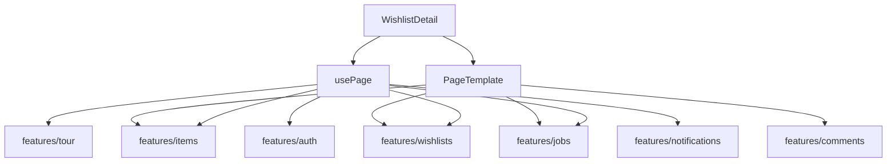

# `pages/wishlist-detail`

Authenticated **single-wishlist workspace**: header chrome (title, date, settings, share/export/archive), item list with view modes, add/edit/view drawers, comments (drawer or grid inspector), link/relate association rails, import jobs, and mobile FABs. The page owns route chrome, shell flags, association/tagging state, and composition; domain packages own cards, forms, share panel, jobs, and comment UI.

Entry is [`wishlist-detail.component.tsx`](wishlist-detail.component.tsx) (`WishlistDetail`) → `usePage()` → [`page.html.tsx`](page.html.tsx) (`PageTemplate`). Nested units use short local names (`header/`, `items/`, `drawer/`, …) and `page.*` for shell markup/styles.

There is **no** `use-page-actions` hook — mobile FABs are registered by [`mobile-actions/`](#mobile-actions) via `useRegisterActions`.

## Route(s) + guard

| Path | Element | Guard |
|------|---------|-------|
| `/wishlists/:listId` | `WishlistDetail` (lazy) | `ProtectedRoute` (default) |

Declared in [`components/content`](../../components/README.md#content). Default `ProtectedRoute`: loading → force password change → onboard to `/welcome` → unauthenticated to `/login` → else render.

**Shell:** `isFullWidth` — `AppContent` sets `isFullWidth` when the path includes `/wishlists/` (same as invite guest preview). Content `max-width: 100%`; nav/banner stay visible (`isAuthPage` false).

**Guest reuse:** [`invite-accept`](../invite-accept/README.md) hosts a read-only path that reuses `PageTemplate` + `getPageShellFlags` with `isPublicGuest` — not this protected route.

## Structure

```
wishlist-detail/
  wishlist-detail.component.tsx   ← entry (providers + MobileActions + PageTemplate)
  page.html.tsx                   ← loading / error / workspace + overlays
  page.module.css                 ← page / workspace / inspector / highlight-lock
  hooks/
    use-page.tsx                  ← orchestrates all hooks → template props
    use-list-data.ts              ← load list, items, jobs; demo list branch
    use-list-settings.ts          ← title/date/toggles → wishlistsApi.update
    use-list-lifecycle.ts         ← archive / restore / delete / duplicate
    use-item-session.ts           ← add/edit/view/import/auto-add/substitutions
    use-item-associations.ts      ← link/relate ids + modes + compatibility
    use-comment-tag-peek.ts       ← peek/highlight when tapping tagged items
  constants/
    overlay-breakpoint.constant.ts
    comment-tag-peek.constant.ts
    category-group.constant.ts
    settings-panel-layout.constant.ts
    …
  interfaces/
  utils/
    get-page-shell-flags.util.ts
    group-items.util.ts
    …
  components/
    workspace/                    ← header + import + job + controls + items + inspector
    overlays/                     ← add drawer, comments drawer, apply bar, share, lock
    header/                       ← title/date, actions, confirm banner, settings popover
    controls/                     ← view mode + search + add widget slot
    items/                        ← grouped ItemCards / empty / loading
    inspector/                    ← grid-mode selected item + inline comments
    drawer/
      add-item/                   ← add/edit/view form drawer + association-rails/
      comments/                   ← list-mode comments drawer
    add-widget/                   ← manual / auto-add URL control
    apply-bar/                    ← finish linking/relating/tagging
    settings-panel/               ← AI / web search / enrich / rollover / group funds
    share-modal/                  ← desktop Modal + SharePanel
    mobile-actions/               ← FAB registration (null render)
    confirm-panel/                ← yes/no used inside mobile FAB panels
    archived-banner/              ← archived status strip
```

## Units

| Folder / file | Export | Role |
|---------------|--------|------|
| [`wishlist-detail.component.tsx`](#entry) | `WishlistDetail` | Session providers + mobile FABs + template |
| [`page.html.tsx`](#pagetemplate) | `PageTemplate` | Loading / error / archived + Workspace + Overlays |
| [`hooks/use-page.tsx`](#usepage) | `usePage` | Compose hooks, UI state, shell flags, mobileActions |
| [`hooks/use-list-data.ts`](#uselistdata) | `useListData` | Route list load, demo fixtures, jobs, reloads |
| [`hooks/use-list-settings.ts`](#uselistsettings) | `useListSettings` | Patch title, date, list feature toggles |
| [`hooks/use-list-lifecycle.ts`](#uselistlifecycle) | `useListLifecycle` | Confirm + deactivate / activate / delete / duplicate |
| [`hooks/use-item-session.ts`](#useitemsession) | `useItemSession` | Add/edit/view/import/auto-add/substitution openers |
| [`hooks/use-item-associations.ts`](#useitemassociations) | `useItemAssociations` | Linked/related selection + exclusive modes |
| [`hooks/use-comment-tag-peek.ts`](#usecommenttagpeek) | `useCommentTagPeek` | Close comments → scroll/highlight → reopen |
| [workspace/](#workspace) | `Workspace` | Main column composition |
| [overlays/](#overlays) | `Overlays` | Drawers, apply bar, share modal, highlight lock |
| [header/](#header) | `Header` | Back, title/date edit, export, share, settings, archive |
| [controls/](#controls) | `Controls` | View-mode menu + search + add widget |
| [items/](#items) | `Items` | Groups of `ItemCard` / skeletons / empty |
| [inspector/](#inspector) | `Inspector` | Grid selection + `ItemShowcase` + comments |
| [drawer/add-item/](#drawer-add-item) | `AddItem` | Form drawer + association rails |
| [drawer/comments/](#drawer-comments) | `Comments` | List-mode comments drawer |
| [add-widget/](#add-widget) | `AddWidget` | Manual add / URL auto-enrich |
| [apply-bar/](#apply-bar) | `ApplyBar` | Exit association / tagging modes |
| [settings-panel/](#settings-panel) | `SettingsPanel` | List setting toggles (header + FAB) |
| [share-modal/](#share-modal) | `ShareModal` | Desktop share `Modal` |
| [mobile-actions/](#mobile-actions) | `MobileActions` | Registers floating actions |
| [confirm-panel/](#confirm-panel) | `ConfirmPanel` | Compact yes/no for FAB panels |
| [archived-banner/](#archived-banner) | `ArchivedBanner` | “Archived” status strip |

### Entry

Wraps the page in `ItemsSessionProvider` + `CommentsSessionProvider` (required by item cards, import strip, comment section). Splits `usePage()` into `mobileActions` (for `MobileActions`) and the rest into `PageTemplate`.

### `PageTemplate`

Priority:

1. `isWishlistLoading` → `LoadingState` (“Loading list…”)
2. Demo route (`isDemoListId`) with no wishlist yet → `null` (avoid 404 flash while tour tears down)
3. `wishlistError` or missing wishlist → `ErrorState` + Back to Dashboard / Log in
4. Else: optional [`ArchivedBanner`](#archived-banner), then `page__layout` with [`Workspace`](#workspace) + [`Overlays`](#overlays)

While `isHighlightInteractionLocked`, the layout is `inert` / `aria-busy`; overlays also portal a full-viewport `page__highlight-lock`.

### `usePage`

Orchestrates hooks and page-local UI:

| Concern | Behavior |
|---------|----------|
| Auth / roles | `isOwner`, `canCollaborate` (owner or `Role === 'collaborator'`), `canSuggest`, `isExpired` / `isArchived` / `isLocked`, `shouldOpenItemViewer` |
| Data | `useListData` → wishlist, items, priorities, shares, jobs |
| Lifecycle / settings | `useListLifecycle`, `useListSettings` |
| Item session | `useItemSession` (+ associations ref for prime/clear/reset) |
| Associations | `useItemAssociations` — exclusive link vs relate modes |
| View / search | `viewMode` (localStorage `ITEM_VIEW_MODE_STORAGE_KEY`), search, collapsed groups, `groupItems` |
| Mutual exclusion | Selected item ↔ comments ↔ add/edit/view — opening one clears the others |
| Overlay breakpoint | `OVERLAY_BREAKPOINT` (`75rem`): below → add/comments drawers overlay list (`doesAddSidebarOverlayList`) |
| Shell flags | `getPageShellFlags` → `canAutoAdd`, drawer collapse, `showApplyBar`, `isInspectorOpen`, … |
| Comment peek | `useCommentTagPeek` |
| Mobile | Builds `mobileActions` bag for FAB host |

`onGoHome` → `/dashboard`. `isPublicGuest` is always `false` on this route (guest path is invite-accept).

### `useListData`

Loads `:listId` from the route.

**Live lists:** `wishlistsApi.getWishlist` + `listPriorities` + `listShares` + `useItemController().fetchItems`. Id mismatch after fetch → `replace` navigate to `/wishlists/${wl.Id}`. Debounced `onListChanged` from `useWishlistJob` (300ms) → full reload on `list.updated`, else soft item reload. While a job is active, soft-reloads items about every 4s. On terminal job status: reload strategy from `resolveListReloadOnJobTerminal`, toast via `formatJobTerminalSummary` / `claimImportJobTerminalToast`, and `markJobNotificationHandled` for enrich/summarize kinds.

**Demo / tour** (`isDemoListId(listId)` — id `tour-demo`):

- Skips API load; uses `useTourDemoOptional()` fixtures (`demo.wishlist`, `demo.items`)
- No priorities, groups, or active job; loading/error forced quiet
- If demo list id but tour demo **not** active → `navigate('/dashboard', { replace: true })`
- While demo is leaving, keeps last synced sample so detail never flashes a 404 empty state

### `useListSettings`

`patchWishlist` → `wishlistsApi.updateWishlist` for title, expiration date, `aiEnabled`, `webSearchEnabled`, `manualJobBackground`, `autoRollover`, `allowGroupFunds`. Date change on an archived list toasts “Restore the list to unlock it.” `canUseWebSearchOnList` = auth `canShowWebSearch` ∧ list AI ∧ list web search.

### `useListLifecycle`

`confirmAction`: `'deactivate' | 'activate' | 'delete' | 'duplicate' | null`. Confirm handlers call wishlists API then navigate to `/dashboard` (except duplicate — stays and toasts success). Busy flags: `isDeactivating` / `isActivating` / `isDeleting` / `isDuplicating`.

### `useItemSession`

Owns add / auto-add / import strip / edit / view / claimer substitution nonces. Opening editor or viewer primes associations via `associationsRef`. `openAddDrawer` resets associations and notifies tour (`tour:add-drawer-opened`). Auto-add requires `canSuggest` ∧ `canShowAi` ∧ `wishlist.AiEnabled`; start calls `onAutoAddStarted` (toast + soft reload + `refreshJob`).

### `useItemAssociations`

Linked vs related id lists; modes are exclusive. Audience context filters compatibility (`canLinkItemsByAudience`, `itemSupportsLinkedItems`). Linking multi-count / suggestion blocks toast feature messages. `primeForItem` / `clear` / `resetForAdd` used by the item session.

### `useCommentTagPeek`

On tagged-item click: optionally closes the comments sheet (mobile peek), scrolls/highlights the card (`peekHighlightItemCard`), then reopens. Locks pointer interaction (`isHighlightInteractionLocked`) for the duration. Timings in `comment-tag-peek.constant.ts`; respects `prefers-reduced-motion`.

### Workspace

Builds [`AddWidget`](#add-widget) when `canSuggest`, packs `itemsProps`, renders `WorkspaceTemplate`:

- [`Header`](#header)
- `ImportStrip` (`mode="existing-list"`) when collaborator and not locked (not for public guest)
- `JobProgressBox` for `wishlist-import` jobs in queued/running/failed/cancelled
- **Grid view:** CSS workspace grid + optional [`Inspector`](#inspector) column when `isInspectorOpen`
- **Other views:** stacked controls + items (comments live in overlays drawer)

### Overlays

Always (except public guest without viewing item): [`AddItem`](#drawer-add-item) when `isItemFormSessionActive`. List-mode (non-grid) comments drawer. [`ApplyBar`](#apply-bar) when linking/relating or collapsing comments while tagging. Desktop [`ShareModal`](#share-modal) when not mobile FAB. Highlight lock portal when peeking.

### Header

Back link, inline title/date edit (owner), owner badge for non-owners, comments / share / import / export / duplicate / archive-restore-delete, confirm banner for lifecycle actions, popover [`SettingsPanel`](#settings-panel). Export uses shared wishlist-export helpers (CSV/XLSX/TXT/JSON/PDF). Tour targets on several action pills.

### Controls

View-mode dropdown (`getSelectableViewModes` — kanban gated by `supportsKanbanViewMode`) + `SearchInput` + slot for add widget.

### Items

Maps each visible item to `ItemCard` props (or enrich skeleton). Handles select (grid inspector vs viewer), tagging/linking/relating clicks, substitution actions. Tour: `TOUR_TARGETS.demoItems` + `highlightedItemId` from demo provider.

### Inspector

Grid-only side column: `ItemShowcase` for `selectedItem`, or inline comments when `isCommentsOpen` (and no selection). Category header from `getCategoryMeta`.

### Drawer: add-item

Hosts item form (add / edit / view) inside `Drawer`; nested substitution chrome; [`association-rails/`](#association-rails) for linked/related chips while linking/relating. Collapses when `collapseDrawerWhileLinking` so the list is tappable for tagging.

### Association rails

Nested under add-item. Shows linked/related mini-drawers beside the form; supports remove chips and navigate-to-tagged via `onItemTaggedClick`.

### Drawer: comments

List/kanban path: right `Drawer` (mobile sheet) wrapping `CommentSection` + tagging mini-drawer + deleted-comments toggle. Collapses while tagging on narrow viewports (`collapseDrawerWhileTagging`).

### Add widget

Idle: expand menu for Manual vs Auto (when `canAutoAdd`). Auto mode: URL form → `jobsApi.startItemEnrich` (`create-from-url`). Tour step `beginner-add` can force the menu open on mobile.

### Apply bar

Fixed “Apply” control that clears linking/relating/comment-tagging modes after the user finishes selecting items on the list.

### Settings panel

Toggle rows: group funding, rollover, AI reviews, web search, background enrich — visibility gated by `canShowAi` / `canShowWebSearch` / `readOnly` (non-owner or archived). Used in header popover and mobile FAB panel.

### Share modal

Desktop: `Modal` titled “Share Wishlist” hosting `SharePanel`. Mobile owner share uses `ShareFabPanel` inside the FAB instead.

### Mobile actions

Null-render host. Registers FABs: share (owner), duplicate, import (if collaborator unlocked), export children, comments, archive/restore/delete (owner), settings, and non-owner “view owner” avatar → `/users/:userId`. Confirm destructive actions via [`ConfirmPanel`](#confirm-panel).

### Confirm panel

Compact Yes/No used only inside FAB panel content (tone: primary / warning / danger).

### Archived banner

Static “Archived” status strip above the workspace when `isArchived`.

## Demo / tour interaction

| Mechanism | Behavior |
|-----------|----------|
| Route id `tour-demo` | `isDemoListId` — no wishlist/items/job API |
| `useTourDemoOptional` | Supplies fixture wishlist + items while demo active |
| Inactive demo session | Redirect to `/dashboard` |
| `AddWidget` / FABs / items | Tour targets (`importFab`, `commentsFab`, `shareFab`, `settingsFab`, `demoItems`, …) |
| `openAddDrawer` | Emits `tour:add-drawer-opened` |
| Beginner add step | Forces add-widget menu expanded on mobile |

Tour navigation into `/wishlists/tour-demo` is owned by `features/tour`; this page only consumes fixtures and targets.

## Composition with features



| Feature / module | Role |
|------------------|------|
| [`wishlists`](../../../features/wishlists/README.md) | List CRUD/metadata, shares, `SharePanel` / `ShareFabPanel`, archive helpers |
| [`items`](../../../features/items/README.md) | Controller, cards, showcase, import strip/menu, view modes, form drawer content |
| [`comments`](../../../features/comments/README.md) | `CommentSection`, deleted toggle, session provider |
| [`jobs`](../../../features/jobs/README.md) | `useWishlistJob`, progress box, enrich start, terminal toasts |
| [`notifications`](../../../features/notifications/README.md) | `markJobNotificationHandled` for enrich/summarize jobs |
| [`tour`](../../../features/tour/README.md) | Demo list id, fixtures, targets, add-drawer event |
| [`auth`](../../../features/auth/README.md) | User, `canShowAi` / `canShowWebSearch` |
| `app/providers/mobile-page-actions` | FAB registration host |

Page owns association rails, tagging peek, shell flags, and route chrome; features own reusable composites and APIs.

## Allowed / forbidden

- **May import:** `features/wishlists`, `features/items`, `features/comments`, `features/jobs`, `features/notifications`, `features/tour`, `features/auth`, `shared/ui`, `shared/hooks`, `shared/utils` (export/date), `app/providers/mobile-page-actions`
- **Must not:** own item/wishlist API clients beyond orchestration; duplicate card/form/share UI that belongs in features; turn guest invite preview into a second writable copy of this page (reuse template flags instead)
- Keep shell-flag math, grouping, and peek timings in page `utils/` / `constants/`
- Do not add a parallel `use-page-actions` — extend [`mobile-actions/`](#mobile-actions)

## Related

- [↑ pages](../README.md)
- [components/content](../../components/README.md#content) — lazy `/wishlists/:listId` + Protected
- [layout/](../../layout/README.md) — `isFullWidth` shell
- [invite-accept](../invite-accept/README.md) — guest reuse of `PageTemplate`
- [dashboard](../dashboard/README.md) — list entry / post-archive landing
- [features/wishlists](../../../features/wishlists/README.md)
- [features/items](../../../features/items/README.md)
- [features/comments](../../../features/comments/README.md)
- [features/jobs](../../../features/jobs/README.md)
- [features/tour](../../../features/tour/README.md)
