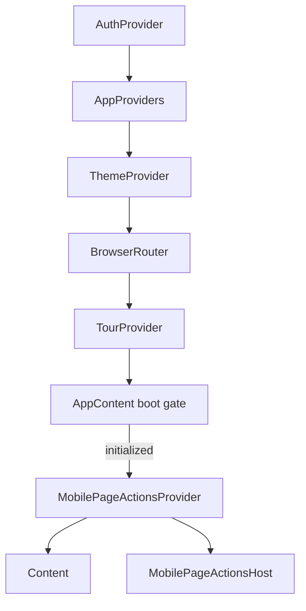
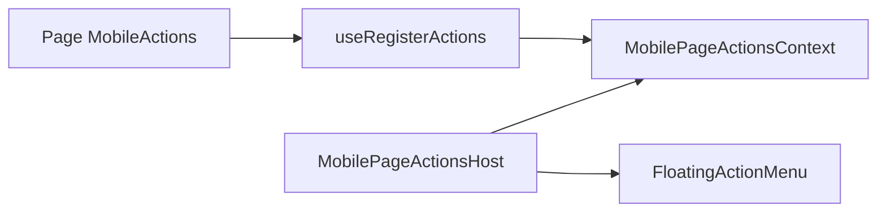

# `app/providers`

App-scoped React context providers for **cross-route chrome state** that is not owned by a single feature domain.

| Provider | Owns |
|----------|------|
| [theme/](#theme) | Active theme + appearance, unlocks, custom themes, stylesheet loading |
| [mobile-page-actions/](#mobile-page-actions) | Page-registered mobile FABs + host menu |

Feature-session providers (`TourProvider`, `FriendsProvider`, `NotificationsProvider`, auth, etc.) live under `features/<domain>/`, not here. Shared toast/socket helpers live under `shared/providers/`.

## Where they mount

From [`app.component.tsx`](../app.component.tsx):



- **`ThemeProvider`** — inside `AppProviders`, under `AuthProvider` (needs `AuthContext` for profile theme sync and holiday unlocks). Available on setup/login as well as the main shell.
- **`MobilePageActionsProvider` + `Host`** — only when the system is initialized (alongside `Content`). Pages call `useRegisterActions`; the host renders the floating menu.

## Structure

```
providers/
  README.md
  theme/
    index.ts                 ← ThemeProvider, useTheme, types
    provider.tsx
    context.tsx
    constants/storage-keys.constant.ts
    interfaces/
    utils/
      update-theme-stylesheet.util.ts
      map-api-theme-to-profile.util.ts
      resolve-unlocked-holiday-themes.util.ts
    context.test.tsx
  mobile-page-actions/
    index.ts                 ← provider, hooks, Host
    provider.tsx
    context.tsx
    hooks/use-register-actions.ts
    interfaces/context.interface.ts
    components/host/         ← FloatingActionMenu chrome
    provider.test.tsx
```

---

## `theme`

Barrel: [`theme/index.ts`](theme/index.ts) — `ThemeProvider`, `useTheme`, `Theme`, `Appearance`, `CustomThemeProfile`, `ThemeContextType`.

### Role

Single source of truth for visual theme:

- **Theme ID** — preset catalog id or `custom-*`
- **Appearance** — `light` | `dark` | `system` (resolved via `core/theme/resolve-appearance`)
- **Unlocks** — standard ids always; holiday themes unlocked by account age + calendar month
- **Custom themes** — local list + API sync (`/api/themes/custom`)
- **Temporary try** — `tryTheme` for previewing another user’s theme (user-profile)
- **DOM** — loads CSS from `{apiUrl}/api/themes/{theme}/{appearance}/css`, sets `data-theme` / `data-appearance` on `<html>`

Consumers: layout theme menus / profile theming, settings theming section, onboarding theme step, user-profile try-theme.

### Context API (`ThemeContextType`)

| Field | Purpose |
|-------|---------|
| `theme` / `setTheme` | Active id; persists to localStorage; syncs to user profile when logged in |
| `appearance` / `setAppearance` / `toggleAppearance` | Cycles light → dark → system |
| `unlockedThemes` / `isThemeUnlocked` | Gate locked holiday/preset options in UI |
| `temporaryTheme` / `tryTheme` | Non-preset preview from another profile |
| `customThemes` / `saveCustomTheme` / `deleteCustomTheme` | CRUD + optional API sync |

`useTheme()` throws if used outside `ThemeProvider`.

### Persistence (`giftistry-*` keys)

| Constant | Key |
|----------|-----|
| `THEME_STORAGE_KEY` | `giftistry-theme` |
| `APPEARANCE_STORAGE_KEY` | `giftistry-appearance` |
| `UNLOCKED_THEMES_STORAGE_KEY` | `giftistry-unlocked-themes` |
| `CUSTOM_THEMES_STORAGE_KEY` | `giftistry-custom-themes` |
| `CUSTOM_THEME_STORAGE_KEY` | `giftistry-custom-theme` (active profile blob) |
| `USE_CUSTOM_THEME_STORAGE_KEY` | `giftistry-use-custom-theme` |

### Stylesheet swap

[`updateThemeStylesheet`](theme/utils/update-theme-stylesheet.util.ts) loads the next sheet in the background, then swaps `#theme-stylesheet`. Callers set `data-*` **after** a successful load (except first paint) so selectors never point at a missing sheet (avoids a blank frame).

Custom themes apply CSS variables via `core/theme/apply-custom-theme` when the active id matches a stored profile.

### Units

| Path | Role |
|------|------|
| `provider.tsx` | State, effects, API sync, context value |
| `context.tsx` | `ThemeContext` + `useTheme` |
| `utils/update-theme-stylesheet.util.ts` | Link swap against theme CSS API |
| `utils/map-api-theme-to-profile.util.ts` | API ↔ `CustomThemeProfile` |
| `utils/resolve-unlocked-holiday-themes.util.ts` | Holiday unlock from `user.CreatedAt` + month |

---

## `mobile-page-actions`

Barrel: [`mobile-page-actions/index.ts`](mobile-page-actions/index.ts) — `MobilePageActionsProvider`, `useMobilePageActions`, `useRegisterActions`, `MobilePageActionsHost`.

### Role

Lets a **page** publish a list of `FloatingAction`s for the mobile FAB stack without prop-drilling through layout. Typical consumers: dashboard create/import FABs, wishlist-detail mobile actions.

### Flow



1. Page mounts a child that calls `useRegisterActions(actions)`.
2. Provider stores `pageActions`.
3. `Host` (sibling of `Content`) reads actions; if user is logged in and list non-empty, renders `FloatingActionMenu`.
4. On unmount, `useRegisterActions` clears actions so the next route starts clean.

### Context API

| Field | Purpose |
|-------|---------|
| `pageActions` | Current `FloatingAction[]` |
| `setPageActions` | Replace the list |
| `clearPageActions` | Empty the list |

### Host

[`components/host`](mobile-page-actions/components/host/host.component.tsx):

- Returns `null` when no user or no actions
- Sets `closedTourTarget` to `TOUR_TARGETS.createWishlistFab` when an action id `create` is present
- Aria label: `Page actions`

### Units

| Path | Role |
|------|------|
| `provider.tsx` | Holds `pageActions` state |
| `context.tsx` | Context + `useMobilePageActions` |
| `hooks/use-register-actions.ts` | Register for component lifetime; clear on unmount |
| `components/host/` | SoC trio wrapping `shared/ui` `FloatingActionMenu` |

---

## Allowed / forbidden

- **May import:** `core` (theme/API/env), `shared/ui`, `features/auth` (theme sync / host user gate), `features/tour` targets for FAB tour hooks
- **Must not:** own feature domain sessions (friends, notifications, tour) — those stay in `features/*/providers`
- Prefer barrels (`app/providers/theme`, `app/providers/mobile-page-actions`) over deep paths

## Related

- [↑ app](../README.md)
- [layout/](../layout/README.md) — consumes `useTheme` in nav menus
- [components/](../components/README.md) — `Content` sits beside `MobilePageActionsHost`
- [core/theme](../../core/) — catalog, appearance resolve, custom apply
- [docs/architecture.md](../../../docs/architecture.md)
