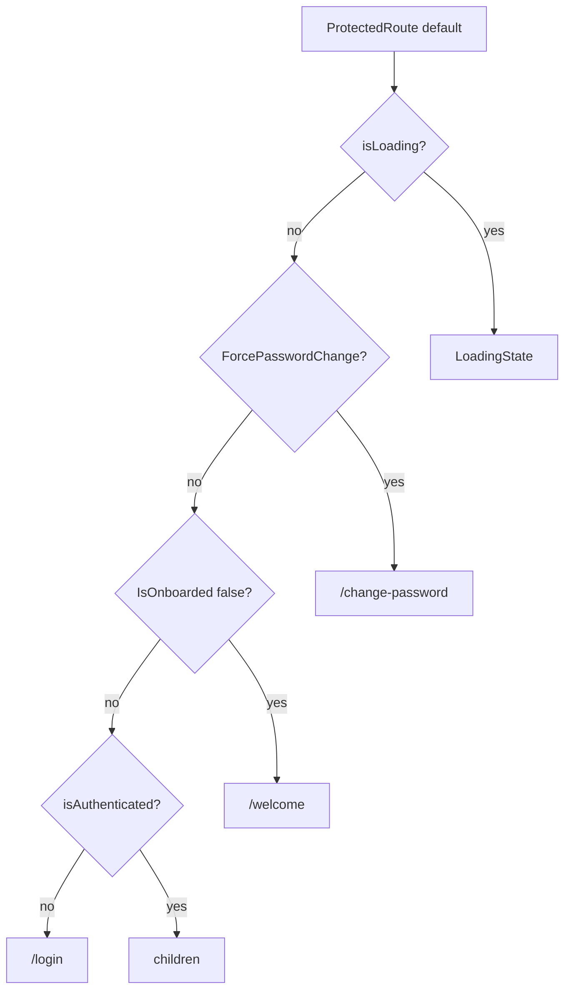

# `app/routes`

Route **guards** and one legacy redirect — not the route table itself. Path → page wiring lives in [`components/content`](../components/README.md#content). Nested settings paths wrap sections with `AdminRoute` / `OwnerRoute` from [`pages/settings`](../pages/settings/README.md).

Barrel: [`index.ts`](index.ts).

| Export | Role |
|--------|------|
| `ProtectedRoute` | Require auth; enforce password-change / onboarding gates |
| `PublicRoute` | Guests only; signed-in users go to `postAuthPath` |
| `AdminRoute` | Require `user.IsAdmin` |
| `OwnerRoute` | Require `user.IsOwner` |
| `LegacyProfileRedirect` | Map `/profile/*` → `/settings/*` |

## Structure

```
routes/
  index.ts
  protected/                 ← ProtectedRoute + shared ProtectedTemplate
  public/                    ← PublicRoute (reuses ProtectedTemplate)
  admin/                     ← AdminRoute
  owner/                     ← OwnerRoute
  legacy-profile-redirect/   ← /profile/* → /settings/*
```

Each guard is a SoC pair: `*.component.tsx` (auth logic) → `*.html.tsx` (loading / Navigate / children).

## Auth funnel (`postAuthPath`)

After login (and for several redirects), destination order is defined in [`features/auth` `postAuthPath`](../../features/auth/utils/post-auth-path.util.ts):

1. `ForcePasswordChange` → `/change-password`
2. `IsOnboarded === false` → `/welcome`
3. else → `/dashboard`

Guards below implement the same priority when deciding whether to show a page or bounce.



---

## `ProtectedRoute`

**Props:** `children`, `allowOnboarding?` (default false), `allowPasswordChange?` (default false).

Used around most authenticated pages in Content. Modes:

### Default (`allowOnboarding` / `allowPasswordChange` false)

| Condition | Result |
|-----------|--------|
| Loading | Full-height `LoadingState` |
| Authenticated + force password change | Redirect `/change-password` |
| Authenticated + not onboarded | Redirect `/welcome` |
| Authenticated + onboarded | Render children |
| Not authenticated | Redirect `/login` |

### `allowPasswordChange` (e.g. `/change-password`)

| Condition | Result |
|-----------|--------|
| Not authenticated | `/login` |
| Authenticated but **not** forced to change password | `postAuthPath(user)` (leave this page) |
| Authenticated + `ForcePasswordChange` | Render children |

### `allowOnboarding` (e.g. `/welcome`)

| Condition | Result |
|-----------|--------|
| Not authenticated | `/login` |
| Force password change | `/change-password` (password gate wins) |
| Already onboarded | `/dashboard` |
| Authenticated + not onboarded | Render children |

**Template:** [`ProtectedTemplate`](protected/protected.html.tsx) — shared by `PublicRoute`. When `allowAuthenticated` is true, the Navigate/children polarity flips (used for guest-only pages).

---

## `PublicRoute`

Guest-only wrapper for `/login` and `/register`.

- Loading → `LoadingState`
- Authenticated → `Navigate` to `postAuthPath(user)`
- Unauthenticated → children

Implemented by calling `ProtectedTemplate` with `allowAuthenticated={true}`.

---

## `AdminRoute`

Used inside settings nested routes for Administration sections.

| Condition | Result |
|-----------|--------|
| Loading | `LoadingState` |
| `!user.IsAdmin` | `/settings/account` |
| Admin | children |

Does **not** re-check authenticated session — expect an outer `ProtectedRoute` (settings shell).

---

## `OwnerRoute`

Used for `/settings/admin/server`.

| Condition | Result |
|-----------|--------|
| Loading | `LoadingState` |
| Not owner, but admin | `/settings/admin` |
| Not owner, not admin | `/settings/account` |
| Owner | children |

---

## `LegacyProfileRedirect`

Element for `/profile/*` in Content. Maps old profile URLs to settings, preserving `search` and `hash`.

[`legacyProfilePath`](legacy-profile-redirect/utils/legacy-profile-path.util.ts):

| Input | Output |
|-------|--------|
| `/profile`, `/profile/`, `/profile/account` | `/settings/account` |
| `/profile/settings…` | `/settings…` (or account if bare) |
| `/profile/server`, `/settings/server` | `/settings/admin/server` |
| `/profile/<rest>` | `/settings/<rest>` |
| anything else | `/settings/account` |

---

## Where used

| Guard | Mounted by |
|-------|------------|
| `ProtectedRoute` / `PublicRoute` / `LegacyProfileRedirect` | [`content.html.tsx`](../components/content/content.html.tsx) |
| `AdminRoute` / `OwnerRoute` | [`pages/settings` `use-page`](../pages/settings/hooks/use-page.tsx) nested Routes |

Invite accept (`/invite/list/:token`) has **no** guard — token access is intentional.

## Allowed / forbidden

- **May import:** `features/auth` (`useAuth`, `postAuthPath`), `shared/ui` (`LoadingState`), `react-router-dom`
- **Must not:** declare page components or the main path table (that is Content); keep role checks thin — no settings UI here

## Related

- [↑ app](../README.md)
- [components/](../components/README.md) — Content route table
- [pages/](../pages/README.md) — screens behind these guards
- [pages/settings](../pages/settings/README.md) — nested Admin/Owner routes
- [features/auth](../../features/auth/README.md) — session + `postAuthPath`
- [docs/architecture.md](../../../docs/architecture.md)
