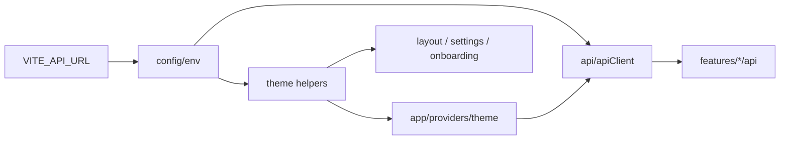

# `core/`

Non-UI infrastructure shared across the SPA: **HTTP transport**, **runtime env**, and **theme catalog / CSS helpers**.

Anything that needs React, routes, or domain UI belongs in `app/`, `features/`, or `shared/` — not here. `core` is the innermost layer: it may only depend on packages and other `core/` modules.

## Allowed / forbidden

| | |
|--|--|
| **May import** | npm packages; other `core/` modules |
| **Must not import** | `app/`, `features/`, `shared/` (including shared UI) |
| **Must not contain** | React components, hooks, pages, providers |

Feature `api/` folders and `app/providers/theme` **call into** core; they do not live under it.

## Children

| Path | Role | Detail |
|------|------|--------|
| [api/](api/README.md) | `apiClient`, envelopes, `ApiError`, validation message formatting | Bearer token, Giftistry body wrap, GET de-dupe, interceptors |
| [config/](config/README.md) | `env` — Vite-injected runtime config | Today: `apiUrl` from `VITE_API_URL` |
| [theme/](theme/README.md) | Catalog, appearance, previews, custom CSS vars, computed readers | Synced from theming-engine; no React |

```
core/
  api/       ← transport
  config/    ← env.apiUrl
  theme/     ← catalog + CSS helpers
  README.md
```

## How the pieces connect



- **`config`** supplies `env.apiUrl` to the HTTP client and to theme CSS/preview fetches.
- **`api`** is the only shared `fetch` wrapper; domain modules build typed endpoints on top.
- **`theme`** owns preset metadata and DOM/CSS helpers; **selection state** (active theme, localStorage, profile sync, stylesheet `<link>`) stays in [`app/providers/theme`](../app/providers/README.md).

## Quick reference

### Config

[`config/env.ts`](config/env.ts):

```ts
export const env = {
  apiUrl: import.meta.env.VITE_API_URL ?? 'http://localhost:3001',
} as const;
```

Defaults to local API (`:3001`). Set `VITE_API_URL` for LAN / production frontends. Keep secrets out of the client bundle — see [docs/development.md](../../docs/development.md).

### API

Import from `core/api/client`:

- `apiClient.get|post|put|patch|delete`
- Optional Giftistry wrap namespace on mutating calls
- `ApiError`, `addResponseInterceptor`
- Token key: `giftistry-token` (`AUTH_TOKEN_STORAGE_KEY`)

Full behavior: [api/README.md](api/README.md).

### Theme

- Catalog: auto-generated `THEME_CATALOG` via `bun run sync:theme-catalog`
- Helpers: standard/holiday pickers, unlock rules, `resolveAppearance`, `loadThemePreviews`, `applyCustomTheme` / `clearCustomTheme`, computed color readers for the editor

Full behavior: [theme/README.md](theme/README.md).

## When to add code here

Put it in `core/` if it is:

1. Transport or env shared by multiple features, or
2. Theme engine metadata / CSS var utilities with no UI

Prefer `features/<domain>/` for endpoint wrappers and domain types, and `shared/` for reusable UI/utils that are not infrastructure.

## Related

- [↑ src](../README.md)
- [app/providers](../app/providers/README.md) — theme runtime provider
- [features/](../features/README.md) — domain API wrappers
- [docs/architecture.md](../../docs/architecture.md)
- [docs/development.md](../../docs/development.md)
