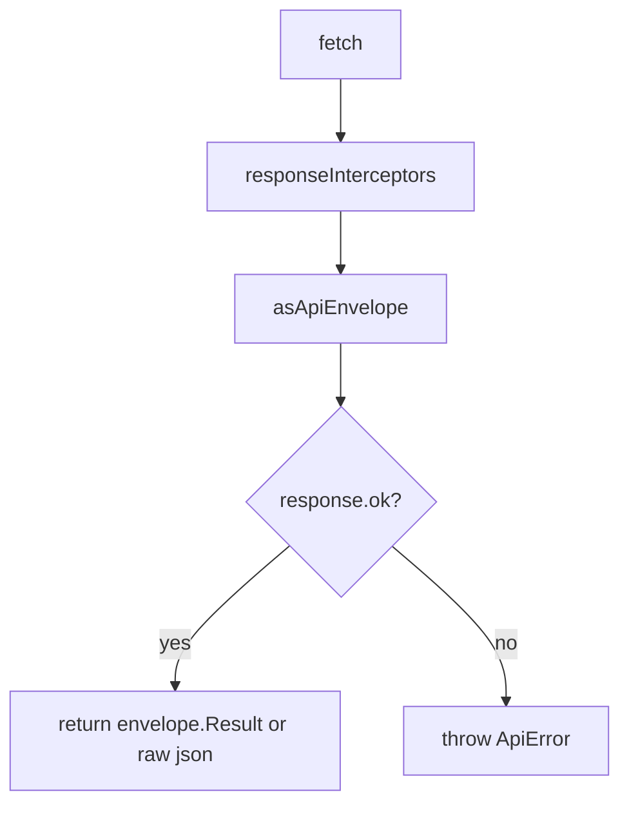

# `core/api`

HTTP transport for the SPA: shared `fetch` client, Giftistry response envelopes, `ApiError`, and user-facing validation message formatting.

Feature packages wrap domain endpoints in `features/<domain>/api/` using this client. **No React UI** here — only network + error shaping.

## Structure

```
api/
  client.ts                          ← apiClient, interceptors, GET de-dupe
  api-error.ts                       ← ApiError class
  constants/
    token-storage-key.constant.ts    ← AUTH_TOKEN_STORAGE_KEY
    field-labels.constant.ts         ← FIELD_LABELS for validation copy
  interfaces/
    api-envelope.interface.ts
    response-interceptor.interface.ts
    validation-error-node.interface.ts
  utils/
    as-api-envelope.util.ts
    format-api-error-message.util.ts (+ tests)
  README.md
```

## `apiClient`

Exported from [`client.ts`](client.ts). Base URL is `env.apiUrl` from [`core/config`](../config/README.md).

| Method | Signature notes |
|--------|-----------------|
| `get<T>(path, options?)` | In-flight **GET de-dupe** by `token:path` |
| `post` / `put` / `patch` / `delete` | Optional `wrapNamespace` for Giftistry body wrapping |
| `addResponseInterceptor(fn)` | Runs on every response; returns unsubscribe |

### Request behavior

1. Reads Bearer token from `localStorage` (`AUTH_TOKEN_STORAGE_KEY` = `giftistry-token`).
2. Sets `Accept: application/json`; JSON bodies also get `Content-Type: application/json`.
3. `credentials: 'include'` (cookies for passkey challenge, etc.).
4. Object bodies (not `FormData`) may be wrapped when `wrapNamespace` is set:

```json
{ "Giftistry": { "<Namespace>": { /* body */ } } }
```

Example: `apiClient.post('/api/...', payload, 'Auth')` → `{ Giftistry: { Auth: payload } }`.

5. `FormData` / `Blob` / raw strings pass through without JSON wrapping.

### Response behavior



- Non-OK: message from `Result.Message` or `Message`, formatted via `formatApiErrorMessage`; code from `Meta.Code` (default `API_ERROR`).
- OK: returns `envelope.Result` when present, else the raw JSON.
- Network / non-`ApiError` failures → `ApiError` with status `500`, code `NETWORK_ERROR`.

### GET de-dupe

Concurrent identical GETs (same path + current token) share one promise until it settles. Mutations are never de-duped.

### Interceptors

`ResponseInterceptor = (response, json) => void | Promise<void>`. Failures inside an interceptor are logged and do not fail the request. Register from auth/bootstrap (e.g. 401 handling) via `apiClient.addResponseInterceptor`.

---

## Envelope

[`ApiEnvelope`](interfaces/api-envelope.interface.ts):

```ts
{ Result?: unknown; Message?: unknown; Meta?: { Code?: string } }
```

[`asApiEnvelope`](utils/as-api-envelope.util.ts) narrows unknown JSON safely (non-objects → `{}`).

---

## `ApiError`

[`api-error.ts`](api-error.ts) — extends `Error`:

| Field | Meaning |
|-------|---------|
| `message` | User-facing string (already formatted) |
| `status` | HTTP status (or 500 for network) |
| `code` | API `Meta.Code` or `NETWORK_ERROR` / `API_ERROR` |
| `details` | Original message payload (string, validation tree, etc.) |

Re-exported from `client.ts` for `instanceof` checks in features.

---

## Error message formatting

[`formatApiErrorMessage`](utils/format-api-error-message.util.ts) turns TypeBox-style validation trees into short copy:

- Uses [`FIELD_LABELS`](constants/field-labels.constant.ts) for known segments (`Password`, `PublicAppUrl`, …).
- Understands min/max length and “expected string” → “is required”.
- Joins multiple leaf messages with spaces when the payload is an object.

[`mapValidationErrorsToFields`](utils/format-api-error-message.util.ts) maps validation path segments → form field keys via a caller-supplied `fieldMap` (setup / admin forms).

---

## Constants

| Export | Value / role |
|--------|----------------|
| `AUTH_TOKEN_STORAGE_KEY` | `giftistry-token` — Bearer + GET de-dupe key |
| `FIELD_LABELS` | Path segment → display label for validation |

---

## Usage pattern

```ts
// features/<domain>/api/*.ts
import { apiClient } from 'core/api/client';

export const wishlistsApi = {
  get: (id: string) => apiClient.get<Wishlist>(`/api/wishlists/${id}`),
  create: (body: CreateBody) => apiClient.post<Wishlist>('/api/wishlists', body, 'Wishlist'),
};
```

Pages and hooks should call feature APIs, not `apiClient` directly (except rare app-level cases like theme provider custom themes).

## Allowed / forbidden

- **May import:** `core/config` (and other `core/` only)
- **Must not import:** `app/`, `features/`, `shared/`
- No React components or hooks

## Related

- [↑ core](../README.md)
- [config/](../config/README.md) — `env.apiUrl`
- [features/](../../features/README.md) — domain `api/` wrappers
- [docs/architecture.md](../../../docs/architecture.md)
