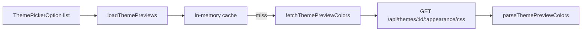

# `core/theme`

Non-UI theme infrastructure: **preset catalog**, **appearance resolution**, **preview color loading**, **custom theme CSS vars**, and **computed-style readers** for the theme editor.

Runtime selection (localStorage, API sync, stylesheet link swap) lives in [`app/providers/theme`](../../app/providers/README.md). This package supplies pure helpers and constants those providers (and settings/onboarding UI) call.

No React components here.

## Structure

```
theme/
  constants/
    theme-catalog.constant.ts      ← AUTO-GENERATED — do not edit
    appearances.constant.ts
    theme-color-vars.constant.ts
    theme-colors-fallback.constant.ts
    advanced-token-css-vars.constant.ts
    advanced-tokens-fallback.constant.ts
    custom-theme-vars.constant.ts
  interfaces/                      ← catalog, colors, previews, picker options
  utils/
    theme-catalog.util.ts          ← filter / picker / unlock rules
    read-computed-theme-colors.util.ts
    read-computed-advanced-tokens.util.ts
  apply-custom-theme.ts            ← set / clear inline CSS vars
  resolve-appearance.util.ts
  load-theme-previews.util.ts      ← cached swatch colors
  fetch-theme-preview-colors.util.ts
  parse-theme-preview-colors.util.ts
  color-conversion.util.ts         ← hex ↔ rgb helpers
  README.md
```

## Catalog sync

[`THEME_CATALOG`](constants/theme-catalog.constant.ts) is generated by [`scripts/sync-theme-catalog.ts`](../../../scripts/sync-theme-catalog.ts) from sibling `theming-engine/dist/js/theme-catalog.json`.

- Runs on `predev` / `prebuild` via `bun run sync:theme-catalog`
- Also exported: `THEME_IDS`, `STANDARD_THEME_IDS`, `HOLIDAY_THEME_IDS`
- **Do not hand-edit** the constant file — change the engine catalog and re-sync

Each entry: `id`, `label`, `category` (`standard` | `holiday`), optional `unlockMonth` / `unlockLastDay` (0-based month, inclusive last day).

---

## Catalog helpers

[`utils/theme-catalog.util.ts`](utils/theme-catalog.util.ts):

| Function | Purpose |
|----------|---------|
| `getStandardThemes` / `getHolidayThemes` / `getAllPresetThemes` | `{ value, label }` picker options |
| `getStandardThemeEntries` / `getHolidayThemeEntries` | Full catalog rows |
| `isPresetThemeId` | True if id is in `THEME_IDS` |
| `getThemeLabel` | Label or raw id fallback |
| `getHolidayUnlockRules` | `{ theme, month, lastDay }[]` for unlock logic |

Used by nav theme menu, profile theming, settings theming, onboarding, and `ThemeProvider` unlock checks.

---

## Appearance

[`APPEARANCES`](constants/appearances.constant.ts) — Light / Dark / System option list (icons mapped by each UI).

[`resolveAppearance`](resolve-appearance.util.ts) maps `'system'` → `'light' | 'dark'` via `prefers-color-scheme` (defaults to `dark` when `window` is unavailable).

Consumers: theme provider stylesheet URL, preview loaders, emoji picker, bootstrap first paint.

---

## Preview colors (swatches)

Used for color chips without mounting every theme stylesheet.



| Util | Role |
|------|------|
| `loadThemePreviews(themes, appearance)` | Parallel load; returns `{ id, label, primary, bg }`; gray fallback on failure |
| `fetchThemePreviewColors` | Fetches CSS text from API |
| `parseThemePreviewColors` | Reads `--theme-primary`/`--primary` and `--theme-bg`/`--bg` |
| `clearThemePreviewCache` / `themePreviewCacheKey` | Cache control / key shape `id:appearance` |

---

## Custom theme application

[`applyCustomTheme`](apply-custom-theme.ts) / `clearCustomTheme`:

- Writes core colors onto `document.documentElement` (`--primary`, `--bg`, `--surface`, …)
- Optional advanced: shadows, fonts, radius
- `clearCustomTheme` removes every var in [`CUSTOM_THEME_VARS`](constants/custom-theme-vars.constant.ts)

Color helpers: [`hexToRgbComma`](color-conversion.util.ts) / `rgbToHex` (also re-exported as deprecated `hexToRgb`).

---

## Computed readers (theme editor)

Settings theming seeds the custom-theme form from the **currently loaded** stylesheet:

| Util | Reads |
|------|--------|
| `readComputedThemeColors` | Primary/bg/surface/border/text/text-muted via [`THEME_COLOR_VARS`](constants/theme-color-vars.constant.ts); prefers `--*` then `--theme-*`; hex-normalized |
| `readComputedAdvancedTokens` | Shadows / font / radius via [`ADVANCED_TOKEN_CSS_VARS`](constants/advanced-token-css-vars.constant.ts) |

Fallbacks: `THEME_COLORS_FALLBACK`, `ADVANCED_TOKENS_FALLBACK` when DOM or vars are missing.

---

## How this relates to `app/providers/theme`

| Concern | Where |
|---------|--------|
| Catalog + unlock rules + previews + apply vars | **`core/theme`** (this package) |
| Active theme state, localStorage, user profile sync, `#theme-stylesheet` link | **`app/providers/theme`** |
| Theme menus / swatches UI | **`app/layout`**, **`pages/settings`**, onboarding |

Provider stylesheet load uses the same CSS URL pattern as `fetchThemePreviewColors`:  
`{apiUrl}/api/themes/{theme}/{appearance}/css`.

---

## Allowed / forbidden

- **May import:** `core/config` (preview fetch), packages only otherwise
- **Must not import:** `app/`, `features/`, `shared/`
- No React; keep catalog generation in `scripts/`, not here

## Related

- [↑ core](../README.md)
- [config/](../config/README.md) — `env.apiUrl` for CSS/preview fetches
- [app/providers](../../app/providers/README.md) — runtime theme provider
- [scripts/](../../../scripts/README.md) — `sync:theme-catalog`
- [docs/architecture.md](../../../docs/architecture.md)
