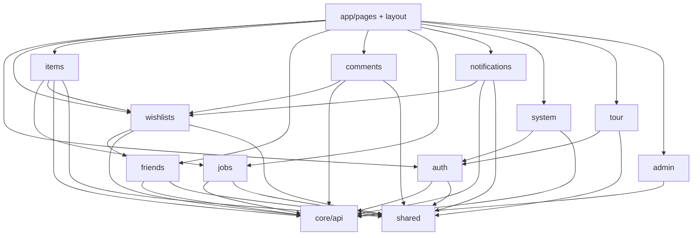

# `features/`

Domain packages: API wrappers, hooks/providers, domain UI, and types. Each folder is one feature with a public barrel (`index.ts`). Pages under `app/` compose these packages; they do not own domain logic.

`features/` sits between `app/` (routes/chrome) and `core`/`shared` (transport + primitives). Prefer barrel imports from outside a package.

## Allowed / forbidden

| | |
|--|--|
| **May import** | `core`, `shared`, other **feature barrels** (`features/auth`, …) |
| **Must not import** | `app/` (pages, layout, routes, app providers) |
| **Prefer** | `import { X } from 'features/auth'` over deep paths into another feature’s internals |
| **Inside a feature** | Relative imports within that feature’s tree are fine |

If a shared primitive needs a domain type or feature hook, **move the unit** into that feature (or inject a callback/node from `app` / the feature). Don’t punch a hole from `shared/` upward.

## Domains

| Domain | Owns | Detail |
|--------|------|--------|
| [admin](admin/README.md) | Admin API + hooks | Users, moderation, audit, site policy — page chrome in settings |
| [auth](auth/README.md) | Session, login/register/security UI, preview card | `AuthProvider`; system status fetch; tour progress PATCH |
| [comments](comments/README.md) | Comment threads + realtime | Session mirror; WS in section, not provider |
| [friends](friends/README.md) | Friends list, requests, search, picker | `FriendsProvider`; share tab uses controller |
| [items](items/README.md) | Items, claims, form, views, import UI | Local `useItemController`; enrich/import via jobs |
| [jobs](jobs/README.md) | Background jobs + progress UI | List WS / account poll; wait helper; no jobs provider |
| [notifications](notifications/README.md) | Inbox bell, prefs, push, job toasts | Provider + separate toast host; invite HTTP helpers |
| [system](system/README.md) | Server settings + AI/packs | Controllers only; status type owned here, fetch in auth |
| [tour](tour/README.md) | Product tutorial | Demo + chapters; **incomplete** post-beginner wiring |
| [wishlists](wishlists/README.md) | Lists, create form, share | Dashboard controller; detail fetches directly |

```
features/
  admin/           comments/        items/          notifications/   tour/
  auth/            friends/         jobs/           system/          wishlists/
  README.md
```

## How features connect



Cross-cutting edges worth knowing:

| From → to | Why |
|-----------|-----|
| items → jobs | Import / enrich / summarize start + wait |
| wishlists → friends | Share friends tab |
| comments / items → wishlists | Shares, audience, list types |
| notifications ↔ jobs (via page) | Two claim sets dedupe job toasts |
| system ↔ auth | Settings save refreshes status; auth owns status poll |
| tour → auth | Tutorial progress on `ApiUser.Tour` |
| many → auth | Session mirrors, `UserPreviewCard`, `canShowAi` |

## Patterns

### Barrels

Each domain exposes a stable public API via `features/<domain>/index.ts`. Domain READMEs list the public surface table. Internal hooks/components (e.g. wishlists `useShares`, items presentation atoms) stay unexported unless pages need them.

### Session mirrors vs list state

Several packages mount a thin **session provider** that only re-exports auth (and flags like `canShowAi`) for domain UI:

| Provider | Mount | List / domain state |
|----------|-------|---------------------|
| `AuthProvider` | App root | Session itself |
| `FriendsProvider` | App providers | Friends lists **in** provider |
| `NotificationsProvider` | App (inside user socket) | Inbox **in** provider |
| `CommentsSessionProvider` | Wishlist-detail / guest | Comments in section controller + WS |
| `ItemsSessionProvider` | Wishlist-detail | Items in `useItemController` (page) |
| `WishlistSessionProvider` | Dashboard only | Lists in `useWishlistController` (page) |

**Rule of thumb:** if state is multi-surface and long-lived (friends, notifications, auth), use a provider. If state is page-scoped (item list, wishlist collection on dashboard), use a local controller hook.

### API folders

Domain HTTP lives in `features/<domain>/api/*.api.ts` on top of `core/api/client`. Giftistry wrap namespaces (`'Items'`, `'Lists'`, `'Jobs'`, …) match the backend envelope.

### Page vs feature

| Lives in feature | Lives in `app/` |
|------------------|-----------------|
| Domain API, types, domain components | Route screens, layout chrome |
| Controllers / providers | Composition: which hook + which drawer |
| Shared presentation atoms for that domain | Confirm modals, tabs, search that are route-specific |

Item grids on wishlist-detail compose **items** + page chrome; server settings compose **system** / **admin** hooks + settings page sections.

### SoC trio

Feature UI follows the same [architecture](../../docs/architecture.md) trio as elsewhere: `*.component.tsx` / `*.html.tsx` / `*.module.css` + `interfaces/`. Domain composites (e.g. item mini-drawer, wishlist card) stay in features — not `shared/ui`.

## When to add a feature or export

Add or extend a **feature** when:

1. The unit is domain-specific (wishlist, claim, friend request, job timeline), or
2. Multiple pages need the same domain API / UI

Keep it in **`app/pages`** when it is route composition only.  
Keep it in **`shared`** when it is a domain-agnostic primitive.  
Keep it in **`core`** when it is transport / env / theme engine with no React UI.

Export from the barrel only what outside consumers need. Prefer growing the public surface deliberately over deep imports.

## Related

- [↑ src](../README.md)
- [app/](../app/README.md) — pages compose these packages
- [shared/](../shared/README.md) — primitives features may use
- [core/](../core/README.md) — `apiClient` / env / theme helpers
- [docs/architecture.md](../../docs/architecture.md)
- [docs/ui-conventions.md](../../docs/ui-conventions.md)
