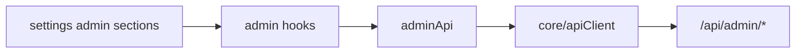

# `features/admin`

Admin **API + hooks** for overview stats, user management, site/registration policy, moderation, and audit log.

Settings **page chrome** (sidebar, section markup, sensitive gates) lives under [`app/pages/settings`](../../app/pages/settings/README.md). This package has **no large UI tree** — pages import hooks and types from the barrel.

Import via `import { … } from 'features/admin'`.

## Public surface

| Kind | Exports |
|------|---------|
| **API** | `adminApi` |
| **Hooks** | `useOverview`, `useUsers`, `useUserDetail`, `useSitePolicy`, `useModeration`, `useAuditLog` |
| **Utils** | `getAuditActionClass` (CSS tone for audit action chips) |
| **Constants** | `DEFAULT_USER_POLICY`, `REGISTRATION_MODE_*` |
| **Types** | Users, policy, site/invite, audit, moderation report/comment types |

## Layout

```
admin/
  index.ts
  api/admin.api.ts
  hooks/
    use-overview.ts
    use-users.ts
    use-user-detail.ts
    use-site-policy.ts
    use-moderation.ts
    use-audit-log.ts
  interfaces/          ← request/response + hook result contracts
  constants/           ← page sizes, defaults, registration mode options
  utils/audit.util.ts  ← action class + CSV export
```

## Where it mounts (settings)

All behind `ProtectedRoute` + nested `AdminRoute` (except Server, which is `OwnerRoute` and uses **`features/system`**, not this package).

| Settings path | Hook / API | Page area |
|---------------|------------|-----------|
| `/settings/admin` | `useOverview` | Overview stats + recent audit |
| `/settings/admin/users` | `useUsers` | Searchable user list + create |
| `/settings/admin/users/:userId` | `useUserDetail` | Profile / policy / password / sessions / ownership |
| `/settings/admin/site` | `useSitePolicy` | Registration mode, defaults, invites |
| `/settings/admin/moderation` | `useModeration` | Open reports + moderated comments |
| `/settings/admin/audit` | `useAuditLog` | Filterable audit + CSV export |



---

## `adminApi`

[`api/admin.api.ts`](api/admin.api.ts) — all calls go through `core/api` `apiClient`. Giftistry wrap namespaces where noted.

### Overview / users

| Method | Endpoint | Notes |
|--------|----------|-------|
| `getOverview` | `GET /api/admin/overview` | Stats + recent audit |
| `listUsers` | `GET /api/admin/users` | Query: search, disabled, locked, admin, page |
| `getUser` | `GET /api/admin/users/:id` | User + activity |
| `createUser` | `POST …` wrap `AdminUser` | Username, email, password, names, flags, policy |
| `updateUser` | `PATCH …` wrap `User` | Profile fields |
| `updateUserPolicy` | `PATCH …/policy` wrap `Policy` | Admin/disabled/hidden/force-password/lockout + capability policy |
| `resetPassword` | `POST …/reset-password` wrap `Password` | Optional force-change |
| `unlockUser` | `POST …/unlock` | Clear lockout |
| `revokeSessions` | `POST …/revoke-sessions` | |
| `deleteUser` | `DELETE …` | |
| `transferOwnership` | `POST /api/system/transfer-ownership` wrap `Ownership` | Owner handoff |

### Site policy / invites

| Method | Endpoint |
|--------|----------|
| `getSitePolicy` / `updateSitePolicy` | `GET` / `PATCH /api/admin/site-policy` (`SitePolicy`) |
| `getRegistrationInvite` | `GET /api/admin/registration-invite` |
| `regenerateRegistrationInvite` | `POST …/regenerate` |
| `deleteRegistrationInvite` | `DELETE …/:id` |

### Audit / moderation

| Method | Endpoint |
|--------|----------|
| `getAuditLog` | `GET /api/admin/audit` — action, page |
| `getModerationComments` | `GET /api/admin/moderation/comments?page=` |
| `deleteModerationComment` | `DELETE …/comments/:id` |
| `getReports` | `GET /api/admin/reports?status=&page=` |
| `resolveReport` | `PATCH …/reports/:id` wrap `Report` |

---

## Hooks

Most take `{ showToast }` (`HookProps`). Errors surface via toast; loading flags returned for templates.

### `useOverview`

Loads overview once. Returns `isLoading`, `stats`, `recentAudit`.

### `useUsers`

List + create modal state. Debounced by search/page effect. Validates username via `shared/utils/validate-username`. New users get `DEFAULT_USER_POLICY`. Exposes pagination (`USERS_PAGE_SIZE`) and `currentUserIsOwner`.

### `useUserDetail`

Full detail for `:userId`: profile form, policy flags + `GiftistryUserPolicy`, password reset, unlock, revoke sessions, delete, transfer ownership. Tabs via `UserDetailKey`.

Guards:

- **Self** can save own profile (username rules apply when changed)
- **Owner target** is read-only for non-owners (`isOwnerReadOnly`)
- Ownership transfer requires current user to be owner

### `useSitePolicy`

Loads site policy; manages comma-separated allowed email domains; registration mode (`open` | `invite_only` | `disabled`); default user policy toggles; invite list load/regenerate/delete/copy when mode is invite-only (`INVITE_TTL_HOURS`, `INVITE_DEFAULT_MAX_USES`, copy feedback timeout).

### `useModeration`

Parallel load of comments + **open** reports with separate pagination (`MODERATION_PAGE_SIZE`). Delete comment (confirm), resolve/dismiss report.

### `useAuditLog`

Filter by action string + page (`AUDIT_PAGE_SIZE`). Refresh, export current page entries as CSV via `exportAuditEntriesCsv`.

---

## Domain concepts

### `GiftistryUserPolicy` / `DEFAULT_USER_POLICY`

Per-user capability flags: create wishlists (and max), comments, AI, public links, image upload, friend requests, custom themes. Used as create default and site-wide default policy seed.

### Registration modes

[`REGISTRATION_MODE_OPTIONS`](constants/registration-mode-options.constant.tsx) / `REGISTRATION_MODE_LABELS` — Open, Invite only, Disabled (for site policy UI).

### Audit styling

`getAuditActionClass(action)` → `'error' | 'primary' | null` for failed/deleted vs created/updated/policy styles in the overview/audit UIs.

---

## Allowed / forbidden

- **May import:** `core`, `shared` (utils/UI types), other feature **barrels** if needed
- **Must not import:** `app/` (pages compose this feature, not the reverse)
- **Don't put here:** settings section JSX, sidebar, sensitive-gate UI, or server/AI/SMTP config → those are `app/pages/settings` + `features/system`

Prefer `import { useUsers } from 'features/admin'` over deep `features/admin/hooks/…` paths outside this package.

## Related

- [↑ features](../README.md)
- [system](../system/README.md) — owner server settings (not admin users/site)
- [pages/settings](../../app/pages/settings/README.md) — Administration sections
- [routes](../../app/routes/README.md) — `AdminRoute` / `OwnerRoute`
- [docs/architecture.md](../../../docs/architecture.md)
