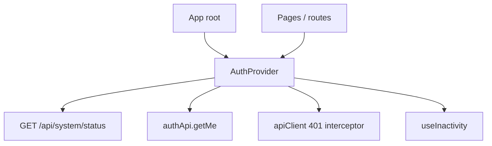

# `features/auth`

Authentication, **session**, account security, profile UI, and the user **preview card**.

Pages under `app/pages` (login, register, change-password, settings account/security) compose these components and hooks. Route guards use `useAuth` + `postAuthPath` from [`app/routes`](../../app/routes/README.md).

Import via `import { … } from 'features/auth'`.

## Public surface

| Kind | Exports |
|------|---------|
| **Components** | `LoginForm`, `RegisterForm`, `ChangePasswordForm`, `ProfileCard`, `InactivityModal`, `UserPreviewCard` (`PreviewCard`) |
| **Provider** | `AuthProvider`, `useAuth`, `AuthContext`, `AUTH_TOKEN_STORAGE_KEY` |
| **API** | `authApi` |
| **Hooks** | `useSecuritySettings` |
| **Utils** | `postAuthPath`, `isSessionUnauthorized`, preview helpers (`getUserInitials`, `getFallbackInitials`, `getJoinedDate`) |
| **Types** | `User` / `ApiUser`, `AuthResponse`, `Passkey`, `TourState`, `TutorialPatchPayload`, `PostAuthPath`, … |

`webAuthnErrorMessage` is used internally by login + security settings (not re-exported on the barrel).

## Layout

```
auth/
  index.ts
  api/auth.api.ts
  providers/                 ← AuthProvider, inactivity, AI capability flags
  hooks/use-security-settings.ts
  utils/                     ← postAuthPath, session 401, WebAuthn errors
  interfaces/
  components/
    login-form/
    register-form/
    change-password-form/
    profile-card/            ← form, avatar, AI prefs, danger zone
    preview-card/            ← UserPreviewCard (domain composite)
    inactivity-modal/
```

## Session architecture



On mount, `AuthProvider`:

1. Registers a response interceptor that clears the token + user when `isSessionUnauthorized` (dead session 401s only — not login/invite failures).
2. Loads `/api/system/status` → `systemStatus`, setup/OAuth/registration/AI/maintenance flags.
3. If a token exists, loads `/api/auth/me` → `user` + AI capabilities.

Token key: `giftistry-token` (`AUTH_TOKEN_STORAGE_KEY`, same as `core/api`).

### `useAuth` / `AuthContextType`

| Area | Fields |
|------|--------|
| Session | `user`, `isAuthenticated`, `isLoading`, `error`, `clearError`, `refreshUser` |
| Auth actions | `login`, `signup`, `logout`, `updateProfile`, `updateAiEnabled`, `updateWebSearchEnabled` |
| System gate | `systemStatus`, `isSystemInitialized`, `allowSetup`, `checkSystemStatus` |
| Site flags | `allowPasswordLogin`, `requireStrongPasswords`, `oauthEnabled`, `registrationMode`, `maintenanceMode` / `maintenanceMessage` |
| AI UX | `globalAiEnabled`, `globalWebSearchEnabled`, `canShowAi*`, `canShowWebSearch*` (via `getAiCapabilityFlags`) |

Boot gate in `app.component` uses `systemStatus` / `allowSetup` / `isSystemInitialized` before rendering Content.

### Inactivity

Default idle timeout **2 hours**, with a **60s** warning countdown (`INACTIVITY_*` constants). Activity events reset the timer. Warning UI via `InactivityHost` + `InactivityModal`. Timeout calls `logout`. Dev override key: `dev-inactivity-timeout`.

---

## `postAuthPath`

[`utils/post-auth-path.util.ts`](utils/post-auth-path.util.ts) — shared landing after login / public-route bounce:

1. `ForcePasswordChange` → `/change-password`
2. `IsOnboarded === false` → `/welcome`
3. else → `/dashboard`

Used by `PublicRoute`, login success, change-password success, and `ProtectedRoute` password-change exit.

---

## `authApi`

[`api/auth.api.ts`](api/auth.api.ts) — Giftistry wrap `Auth` / `Onboarding` / `Tutorial` where noted.

| Area | Methods |
|------|---------|
| Credentials | `login`, `signup`, `logout`, `changePassword` (stores new token if returned) |
| Session / profile | `getMe`, `updateProfile`, `getUserPreview` |
| Passkeys | `passkeyRegisterOptions/Verify`, `passkeyLoginOptions/Verify`, `checkPasskey`, `getPasskeys`, `deletePasskey` |
| 2FA | `verify2faLogin`, `setup2fa`, `enable2fa`, `disable2fa` |
| Account | `disableAccount`, `deleteAccount` |
| Onboarding / tour | `getOnboardingState`, `patchOnboarding`, `patchTutorial` |
| OAuth / invite | `beginOauthLogin` (full page redirect), `validateRegistrationInvite` |

Passkey options `RpId` comes from the backend Public App URL — see giftistry-bun; client maps origin mismatches via `webAuthnErrorMessage`.

---

## Components

### `LoginForm`

Password login, optional OAuth, account switcher (localStorage), passkey login, 2FA ticket step. Uses `useAuth`, `authApi`, `postAuthPath`, `webAuthnErrorMessage`. Simulated biometric modal chrome for passkey UX.

### `RegisterForm`

Respects `registrationMode` (closed/invite messaging), optional invite token validation, field + action subcomponents, submission validation utils.

### `ChangePasswordForm`

Forced/optional password change; on success navigates via `postAuthPath`.

### `ProfileCard`

Settings account section: profile form, avatar editor, AI preferences (gated by capability flags), danger zone (disable/delete + confirm modal).

### `UserPreviewCard`

Domain composite for other users’ public summary (initials, joined date helpers). Used on user-profile / friends — **not** in `shared/ui`.

### `InactivityModal`

Warning dialog driven by provider inactivity host (extend vs let timeout log out).

---

## `useSecuritySettings`

Consumed by settings **Security** section:

- Change password (strong-password rules when `requireStrongPasswords`)
- 2FA setup / enable / disable + recovery codes
- Passkey list, register (`@simplewebauthn/browser`), delete

Toasts via injected `showToast`; refreshes user after successful changes.

---

## Types of note

| Type | Role |
|------|------|
| `ApiUser` | Session user: roles, 2FA, policy, tour, onboard/force-password flags |
| `AuthResponse` | `User?`, `Token?`, `Require2FA?`, `Ticket?` |
| `TourState` / `TutorialPatchPayload` | Product tour chapter progress (used with `features/tour`) |
| `Passkey` | Registered authenticator metadata |

---

## Allowed / forbidden

- **May import:** `core`, `shared`, other feature barrels (e.g. `features/system` status types, `features/admin` policy type on `ApiUser`)
- **Must not import:** `app/`
- Prefer barrel imports outside this package
- Keep route chrome in `app/pages`; keep HTTP client in `core/api`

## Related

- [↑ features](../README.md)
- [tour](../tour/README.md) — tutorial state on user + `patchTutorial`
- [system](../system/README.md) — system status shape applied at boot
- [app/routes](../../app/routes/README.md) — guards + `postAuthPath`
- [pages/login](../../app/pages/login/README.md) · [register](../../app/pages/register/README.md) · [change-password](../../app/pages/change-password/README.md) · [settings](../../app/pages/settings/README.md)
- [docs/architecture.md](../../../docs/architecture.md)
