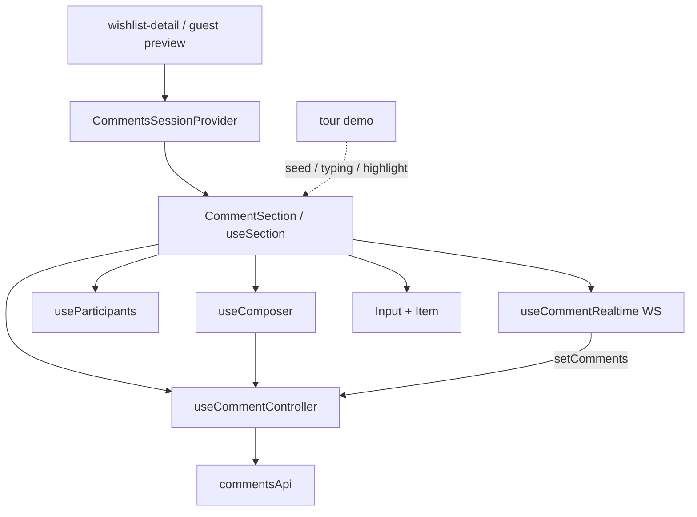

# `features/comments`

Wishlist **comment threads**: REST CRUD, WebSocket presence/typing/live updates, rich composer (mentions, emoji, GIF, upload, visibility), reactions, item tags, and soft-delete.

Pages mount `CommentsSessionProvider` + `CommentSection`; the page owns tagging state and deleted-toggle. Tour **demo** lists skip network and seed from `features/tour`.

Import via `import { … } from 'features/comments'`.

## Public surface

| Kind | Exports |
|------|---------|
| **Components** | `CommentSection`, `DeletedCommentsToggle`, `Tags` |
| **API / hook** | `commentsApi`, `useCommentController` |
| **Provider** | `CommentsSessionProvider`, `useCommentsSession`, `CommentsSessionContextType` |
| **Types** | `Comment` |

## Layout

```
comments/
  index.ts
  api/comments.api.ts
  hooks/use-comment-controller.ts
  providers/session/           ← auth mirror only (not WS)
  constants/
  utils/
  interfaces/
  components/
    section/                   ← CommentSection + orchestration hooks
    input/                     ← composer + toolbar / visibility / mentions
    item/                      ← bubble, reactions, tags, reply, meta
    deleted-comments-toggle/
```

## Architecture



**Important:** `CommentsSessionProvider` only re-exports `{ user, isAuthenticated }` from auth. Presence, typing, and live comment/reaction events live in **`useCommentRealtime`** inside the section — not in the session provider.

---

## `commentsApi`

[`api/comments.api.ts`](api/comments.api.ts) — wrap namespace `Comments` on POSTs.

| Method | Endpoint |
|--------|----------|
| `listComments(listId)` | `GET /api/wishlists/:listId/comments` |
| `addComment(...)` | `POST /api/wishlists/:listId/comments` — content, name, owner visibility, rollover, parent, image, `VisibleToUserIds` |
| `toggleReaction(commentId, reaction)` | `POST /api/comments/:commentId/react` |
| `deleteComment(listId, commentId)` | `DELETE …/comments/:commentId` (client soft-deletes) |

### `Comment`

`Id`, `ListId`, `UserId`, `CommenterName`, `Content`, `IsOwnerVisible`, `VisibleToUserIds?`, `IsRollover`, `IsDeleted?`, `ParentId?`, `ImageUrl?`, `Reactions?`, `CreatedAt?`.

---

## `useCommentController`

Local `comments` / loading / error plus REST:

- `fetchComments`, `addComment` (dedupe via `appendUniqueComment`)
- `toggleReaction` (optimistic reaction merge)
- `deleteComment` (soft-delete locally)
- `setComments` — used by realtime + demo seeding

Does not open WebSockets.

---

## Section orchestration

`CommentSection` → `useSection` → template.

**Props (from page):** list id/owner, `isOwner` / `isExpired` / `isArchived` / `autoRollover`, items, lifted tagging state (main + reply), `showDeletedComments`, tag click handler.

| Hook | Role |
|------|------|
| `useSection` | Wires controller, participants, realtime, composer; demo vs live; `buildVisibleCommentTree`; reply exclusivity; scroll-on-post |
| `useParticipants` | Owner + shares (`wishlistsApi`); fills avatars via `authApi.getUserPreview`; empty on demo |
| `useCommentRealtime` | WS presence / typing / created / deleted / reaction |
| `useComposer` | Draft, anon name, visibility, rollover, image, submit/reply; typing notify; mentions → markdown; tagged item links; no-op posts on demo |

### Realtime (`useCommentRealtime`)

WS: `utils/comment-ws.util.ts` → authenticated `/ws/wishlist/:listId`. Skipped for demo list ids and when logged out.

| Event | Behavior |
|-------|----------|
| `presence` | → `onlineUsers` |
| `typing` | Peer map + TTL; ignores self |
| `comment.created` | Append; owners may skip non-owner-visible when list not expired |
| `comment.deleted` | Soft-delete locally |
| `reaction.toggled` | Merge reactions |

Outbound: `notifyTypingStart` / `notifyTypingStop` (stop delay from presence constants).

### Demo / tour

`isDemoListId(listId)` → skip fetch/WS; comments/typing/highlight from `useTourDemoOptional()`. Tour targets on section; highlight pulse on focused comment.

---

## Visibility modes

Type: `CommentVisibilityMode`

| Mode | Meaning | Payload |
|------|---------|---------|
| `hiddenFromOwner` | Hidden from list owner (non-owner default) | `isOwnerVisible: false` |
| `visibleToAll` | Visible to owner / broadly (owner default) | `isOwnerVisible: true` |
| `visibleToSelected` | Whitelist | `visibleToUserIds` (empty → treat as all) |

Resolved by `resolveCommentVisibilityPayload`. Mentions in selected mode can auto-add users to the audience. Mentions are filtered by mode (`getMentionableParticipants`).

---

## Input (composer)

| Subpart | Role |
|---------|------|
| Typing | Peer typing indicator |
| Warning | Owner warning when posting fully public |
| Meta | Display name + anonymous toggle |
| Editor | Contenteditable; `@` mentions; Enter submit |
| Mention suggestions / preview | Autocomplete + `UserPreviewCard` hover |
| Toolbar | Emoji / GIF / upload + send |
| Attachment / upload error | Image preview and errors (10MB; jpeg/png/gif/webp) |
| Footer | Tag-mode toggle, rollover checkbox, visibility badge |
| Visibility panel | Mode + participant multi-select (popover / mobile sheet) |

---

## Item (bubble)

| Subpart | Role |
|---------|------|
| Meta | Avatar, name, online, owner badge, date |
| Content | Parsed text / mentions; image |
| Tags | Item chips from `item:…` links (public `Tags`; max visible before rail) |
| Reactions / picker | Counts + standard set + emoji picker |
| Reply | Nested mini-composer + child items |
| Delete | Own comments; confirm; soft-deleted placeholder |
| Visibility rail | Eye icons from parsed mode (non-owners) |

---

## Key constants / utils

| Area | Examples |
|------|----------|
| Settings | Anon storage key, anonymous/system names |
| Defaults | Non-owner `hiddenFromOwner`, owner `visibleToAll` |
| Presence | Typing stop delay, peer TTL |
| Attachments | Size/MIME limits |
| Content | User/item markdown link regexes |

Utils include WS URL, presence parse, unique append, visible tree, content parse/demote mentions, visibility resolve/badge/parse, GIF/image → data URL.

---

## Consumers

| Surface | Usage |
|---------|--------|
| Wishlist detail | Provider at page; `CommentSection` in inspector + comments drawer; page owns tags + deleted toggle |
| Invite guest preview | Same provider + section (read/post rules as guest path allows) |
| Tour demo | Demo list ids; seeded comments / typing / highlight from tour demo provider |

`DeletedCommentsToggle` lives in drawer chrome when owners show soft-deleted threads.

---

## Allowed / forbidden

- **May import:** `core`, `shared`, feature barrels (`auth`, `wishlists`, `tour`)
- **Must not import:** `app/`
- Prefer barrel imports outside this package
- Do not put wishlist page chrome or item list UI here — page owns tagging rails and layout

## Related

- [↑ features](../README.md)
- [wishlists](../wishlists/README.md) — shares / participants
- [tour](../tour/README.md) — demo list comments
- [pages/wishlist-detail](../../app/pages/wishlist-detail/README.md)
- [docs/architecture.md](../../../docs/architecture.md)
