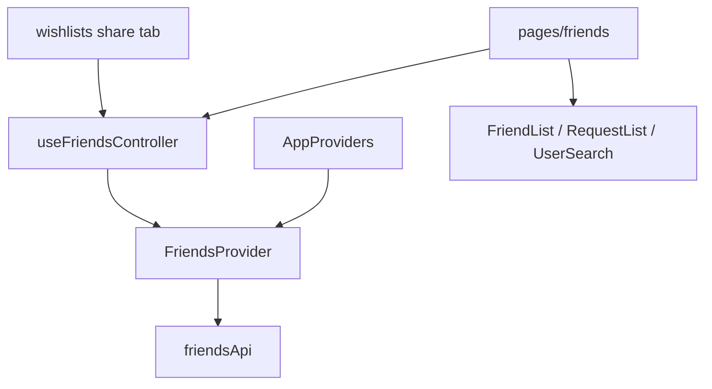

# `features/friends`

Friends **list**, **requests**, **user search**, and a multi-select **picker** for sharing. Domain state lives in `FriendsProvider`; the friends **page** (tabs, sort/filter, remove confirm) is under [`app/pages/friends`](../../app/pages/friends/README.md).

Import via `import { … } from 'features/friends'`.

## Public surface

| Kind | Exports |
|------|---------|
| **Components** | `FriendList`, `FriendRequestList`, `FriendPicker`, `UserSearch` |
| **API / provider** | `friendsApi`, `FriendsProvider`, `useFriendsController`, `FriendsContextType` |
| **Types** | `Friend`, `FriendRequest`, `FriendRequestsResult`, `UserSearchResult` |

## Layout

```
friends/
  index.ts
  api/friends.api.ts
  providers/                 ← FriendsProvider + useFriendsController
  components/
    list/                    ← FriendList (cards)
    request-list/            ← FriendRequestList
    user-search/             ← discover + send request
    picker/                  ← multi-select friends (share UIs)
  interfaces/
  constants/search-debounce-ms.constant.ts
  utils/                     ← initials, birthday-near, preview fallback
```

## Architecture



`FriendsProvider` mounts in [`app.component`](../../app/app.component.tsx) inside `AppProviders` (with auth). It clears local state when logged out; it does **not** auto-fetch on login — the friends page and wishlist share tab call `fetchFriends()`.

---

## `friendsApi`

[`api/friends.api.ts`](api/friends.api.ts)

| Method | Endpoint | Notes |
|--------|----------|-------|
| `listFriends` | `GET /api/friends` | → `Friend[]` |
| `listFriendRequests` | `GET /api/friends/requests` | → `{ Incoming, Outgoing }` |
| `sendRequest` | `POST /api/friends/requests` wrap `Friends` | `{ ReceiverId }` |
| `acceptRequest` | `POST …/requests/:id/accept` | |
| `rejectRequest` | `POST …/requests/:id/decline` | |
| `removeFriend` | `DELETE /api/friends/:friendUserId` | |
| `searchUsers` | `GET /api/users/search?q=` | → `UserSearchResult[]` |

Mutating helpers on the provider always **`fetchFriends()`** afterward to refresh lists.

---

## `FriendsProvider` / `useFriendsController`

### State

| Field | Meaning |
|-------|---------|
| `friends` | Accepted friendships |
| `incomingRequests` / `outgoingRequests` | Pending requests |
| `searchResults` | Last user search hit list |
| `isLoading` / `isSearching` / `error` | UI flags |

### Actions

`fetchFriends`, `searchUsers`, `sendRequest`, `acceptRequest`, `rejectRequest`, `removeFriend`.

`useFriendsController()` throws outside the provider.

---

## Types

### `Friend`

`Id`, `UserId`, `Username`, names, `Email`, `Avatar`, optional `FriendsSince`, `Birthday`, `WishlistCount`, `MutualsCount`, `RecentActivity`, `DaysUntilBirthday`, `LastOnline`.

### `FriendRequest`

`Id`, sender/receiver ids, `Status` (`pending` | `accepted` | `declined` | `cancelled`), timestamps, nested sender/receiver display fields for UI.

### `UserSearchResult`

`Id`, `Username`, optional names/avatar — lightweight discover row.

---

## Components

### `FriendList`

Card grid for current friends:

- Avatar + online status (`resolveOnlineStatus`)
- `UserPreviewCard` on display name
- Birthday badge when `isBirthdayNear` (≤ 30 days via `DaysUntilBirthday`)
- Stats: wishlist count, mutuals; recent activity footer
- Hover/reveal remove; optional `highlightedUserId` scrolls into view (`friend-user-{id}`) — used by tour

Page supplies `friends`, `onRemove`, `removingId`, highlight.

### `FriendRequestList`

Incoming (accept/reject) and outgoing (pending badge) sections. Same preview-card pattern; highlight via `friend-request-{id}`.

### `UserSearch`

Debounced query (`SEARCH_DEBOUNCE_MS` = 300) → `onSearch`. Filters out `existingFriendIds`. Shows pending state for `pendingUserIds`; `onSendRequest` / `sendingId` from page.

### `FriendPicker`

Controlled multi-select checklist over `friends` / `selectedIds` / `onChange`. Empty copy when no friends. Available on the barrel for share/audience UIs; wishlist share currently uses `useFriendsController` with its own friends tab rather than this component.

---

## Utils / constants

| Export | Role |
|--------|------|
| `getFriendInitials` | Avatar fallback letters |
| `isBirthdayNear` | `DaysUntilBirthday <= 30` |
| `toPreviewFallback` | Friend → preview card fallback user |
| `SEARCH_DEBOUNCE_MS` | `300` |

---

## Page vs feature

| Concern | Where |
|---------|--------|
| Tabs (`current` / `requests` / `search`), sort, filter, remove modal | `app/pages/friends` |
| Fetch/mutate friends + presentational lists/search/picker | **this package** |

Page hook calls `useFriendsController()` then passes sliced props into feature components.

---

## Allowed / forbidden

- **May import:** `core`, `shared`, `features/auth` (preview card)
- **Must not import:** `app/`
- Prefer barrel imports outside this package
- Keep route chrome and confirm modals on the page

## Related

- [↑ features](../README.md)
- [auth](../auth/README.md) — `UserPreviewCard`
- [wishlists](../wishlists/README.md) — share tab uses `useFriendsController`
- [pages/friends](../../app/pages/friends/README.md)
- [docs/architecture.md](../../../docs/architecture.md)
