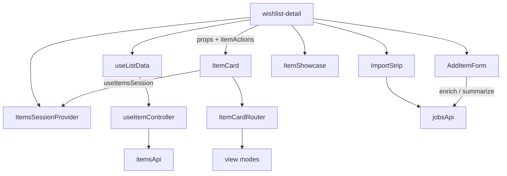

# `features/items`

Wishlist **items**: CRUD, claims, substitutions, linked/related graphs, audience, card view modes, add/edit form, showcase inspector, and import UI. List state lives in `useItemController` (local hook — not a provider). Pages wrap `ItemsSessionProvider` for an auth/AI mirror; enrich/summarize/import jobs go through [`features/jobs`](../jobs/README.md).

Import via `import { … } from 'features/items'`.

## Public surface

| Kind | Exports |
|------|---------|
| **Components** | `ItemCard`, `AddItemForm`, `ItemShowcase`, `LinkedItemSquares`, `MiniDrawer`, `AudiencePicker`, `ItemPhotoGallery`, `ItemCardSkeleton`, `ItemCardRouter`, `CompactCategoryList`, `ImportStrip`, `ImportDropzone`, `ImportMenuPanel` |
| **API / hook** | `itemsApi`, `useItemController`, `ItemActions`, `ClaimItemParams` |
| **Provider** | `ItemsSessionProvider`, `useItemsSession`, `ItemsSessionContextType` |
| **View mode** | constants + `normalizeStoredViewMode`, `resolveEffectiveViewMode`, `getSelectableViewModes`, layout class helpers |
| **Types** | `Item`, `Claim`, `ItemPhoto`, `ItemLink`, `CategoryMeta`, `ItemAudienceUser`, `ItemViewMode`, substitution/extract types |
| **Utils** | `getCategoryMeta`, `getItemPrimaryImageUrl`, import format helpers |

## Layout

```
items/
  index.ts
  api/items.api.ts
  hooks/                     ← useItemController, useImportFlow, …
  providers/session/         ← auth/AI mirror only
  constants/
  interfaces/
  utils/
  components/
    form/                    ← AddItemForm (large SoC tree)
    card/                    ← ItemCard → views/Router
    views/                   ← detailed | compact | grid | kanban | feed
    showcase/                ← inspector pane
    mini-drawer/             ← LinkedSquares host
    linked-squares/
    audience-picker/
    import/                  ← strip | dropzone | menu-panel | ai-panel
    item-presentation/       ← claim, funding, substitution, badges, …
    photo-gallery/
    skeleton/
```

## Architecture



**Important:** `ItemsSessionProvider` only re-exports `{ user, canShowAi }` from auth. Item list state is **local** to `useItemController` (typically owned by page `use-list-data`). Remounting the hook resets the list unless the page keeps it alive.

Unlike friends (`FriendsProvider`), there is no items context for CRUD — cards/forms receive `itemActions` as props.

---

## `itemsApi`

[`api/items.api.ts`](api/items.api.ts) — wrap response `Items` on mutating POSTs/PUTs where noted.

| Method | Endpoint |
|--------|----------|
| `listItems(listId)` | `GET /api/wishlists/:listId/items` → `Item[]` or `{ Items, Groups }` |
| `addItem(...)` | `POST /api/wishlists/:listId/items` |
| `updateItem(...)` | `PUT /api/items/:itemId` |
| `deleteItem(itemId)` | `DELETE /api/items/:itemId` |
| `addItemLink(itemId, url)` | `POST /api/items/:itemId/links` |
| `syncItemLinks(itemId, targetItemIds)` | `POST …/links/sync` |
| `syncItemRelated(itemId, targetItemIds)` | `POST …/related/sync` |
| `claimItem(...)` | `POST /api/items/:itemId/claims` |
| `unclaimItem(itemId, includeLinked?)` | `DELETE …/claims` (+ optional `IncludeLinked`) |
| `getFieldDefinitions(category)` | `GET /api/items/field-definitions?category=` |
| `listSubstitutions(itemId)` | `GET /api/items/:itemId/substitutions` |
| `createOwnerSubstitution` | `POST …/substitutions/owner` |
| `createClaimerSubstitution` | `POST …/substitutions/custom` |
| `updateSubstitution` | `PUT /api/items/:substitutionId/substitution` |
| `deleteSubstitution` | `DELETE …/substitution` |
| `reorderOwnerSubstitutions` | `PATCH …/substitutions/reorder` |
| `getItemReviews` | `GET …/reviews` — client kept; FE does not call until AI reviews ship |

### Jobs (not on `itemsApi`)

| Flow | API | Used by |
|------|-----|---------|
| Enrich / extract metadata | `jobsApi.startItemEnrich` | form `use-enrich` → `ExtractMetadataResult` types live here |
| Summarize notes | `jobsApi.startItemSummarize` | form notes |
| Wishlist import | `jobsApi.startWishlistImport` | `useImportFlow` / ImportStrip |

---

## `useItemController`

Local list state + mutations. Called from the wishlist-detail page (not a provider).

### State

| Field | Meaning |
|-------|---------|
| `items` | Flat item list |
| `itemGroups` | Server groups or `null` (cleared on simple `addItem`) |
| `isLoading` / `error` | Fetch flags (`fetchItems` supports `{ silent: true }`) |

### Actions

`fetchItems`, `addItem`, `addItemLink`, `updateItem`, `deleteItem`, `claimItem`, `claimItems`, `unclaimItem`, `replaceItem`, `removeItem`, substitution CRUD + `refreshSubstitutions` / `patchSubstitutionOptions` / `reorderOwnerSubstitutions`, and bundled **`itemActions`** (subset passed into cards/forms).

Claim/unclaim apply server **projections** across the parent and nested substitution summaries (`patchItemWithClaimProjections`). Claiming one variant can clear the same user's claims on sibling options.

---

## `ItemsSessionProvider` / `useItemsSession`

Auth mirror only: `{ user, canShowAi }` from `useAuth()`. Consumed by cards, showcase, import strip (AI gates). Throws outside the provider.

Page mounts it at wishlist-detail entry (with comments session, etc.).

---

## Types

### `Item`

Core: `Id`, `ListId`, `Name`, `Description`, `Category` (+ optional key/label), priority fields, `IsHiddenIdea`, suggestion fields, `SharedWith`, `Links`, `Claims`, `Photos?`, `Metadata?`.

Claim aggregates: `IsClaimed`, `IsFullyClaimed?`, `IsMultiCount?`, quantity/amount totals, `DesiredQuantity` / `RemainingQuantity`, `FundingTarget?`.

Substitutions: `AllowSubstitutions?`, `SubstitutionOptions?`, `ActiveSubstitutionId?`.

### `Claim` / links / photos

Claim rows drive badges, anonymous toggles, and funding amounts. `ItemLink` is a URL/product link on the item; photo writes go through gallery helpers.

### `ItemActions` / `ClaimItemParams`

Prop surface for cards/forms: update/link/claim/unclaim/delete + optional substitution methods. Claim params include amount, name, anonymous, quantity, selection, `includeLinked`.

---

## View modes

Type: `'detailed' | 'compact' | 'grid' | 'kanban' | 'feed'`.

| Symbol | Behavior |
|--------|----------|
| `ITEM_VIEW_MODE_STORAGE_KEY` | `'giftistry_view_mode'` |
| `DEFAULT_ITEM_VIEW_MODE` | `'detailed'` |
| `KANBAN_VIEW_MODE_MIN_WIDTH_MEDIA_QUERY` | `(min-width: 75rem)` |
| `KANBAN_FALLBACK_VIEW_MODE` | `'detailed'` |
| Legacy map | `{ full: 'detailed' }` |

Page owns persistence and `effectiveViewMode = resolveEffectiveViewMode(mode, supportsKanban)` (kanban → detailed when narrow). `ItemCardRouter` switches presentation from the effective mode. `CompactCategoryList` is the compact category-column layout.

---

## Components

### `ItemCard` → `ItemCardRouter`

Per-item shell: metadata parse, display variant (active substitution), linked/related peers, funding snapshot, claim handlers, tagging selection. Template is `<Router {...props} />` — views own layout chrome (claim drawer/sections, expand panels).

### `AddItemForm`

Large SoC tree: core details, link + AI enrich, categories / custom fields / variations / notes, visibility (`AudiencePicker`), relations (link + related ids). Submit syncs bidirectional links/related via `syncItemLinks` / `syncItemRelated`. Mounted in the page add/edit drawer (`ADD_ITEM_FORM_ID`).

### `ItemShowcase`

Inspector/detail pane for the selected item (grid/inspector path). Mirrors card resolution for a richer single-item layout (photo, title, claim footer, owner actions, relation list).

### `MiniDrawer` / `LinkedItemSquares`

Mini edge drawer resolves `selectedIds` against `items` and renders `LinkedSquares` (category-icon chips, optional remove/click). Domain composite — not `shared/ui`. Full drawer **shell** stays in `shared/ui/drawer`; page association rails and comment tagging use the mini content.

### `AudiencePicker`

Controlled visibility over wishlist `ListShare[]`: search, toggle users, visibility mode. Used by form visibility.

### Import (`ImportStrip` / `Dropzone` / `MenuPanel` / AI panel)

Strip owns `useImportFlow`, dropzone/paste, jobs timeline, confirm. Modes: `existing-list` | `create-list`. Menu panel is the dashboard-style variant. AI panel (grab-info / optimize-categories) gated by `canShowAi`. Upload starts `jobsApi.startWishlistImport`, not `itemsApi`.

### `item-presentation/` (shared pieces)

| Area | Role |
|------|------|
| ClaimForm / ClaimPrompt | Quantity lines, linked-claim option, group-fund amount → `buildClaimMutations` |
| ClaimBadge | Claimer avatar stack (+ anonymous) |
| FundingWidget | `$claimed / $target` progress |
| Substitution\* | Badge, switcher, manager, form, viewer, claim-button |
| Also | badges, quantity, links widget, sharing avatars, tagging overlay/select, action buttons, metadata grid, AI reviews panel |

---

## Claims, substitutions, links, funding

- **Claims** — `POST`/`DELETE …/claims`. Projections update parent + nested substitution claim fields. Optional `includeLinked` claims/unclaims the link group (UI via ClaimForm + linked-peer utils).
- **Substitutions** — alternate options under a parent (`SubstitutionOptions`). Owner vs claimer create paths; card/showcase pick a **display variant** so claim chrome targets the active option. Blocked for suggestions (`itemSupportsSubstitutions`).
- **Linked items** — metadata `LinkedItemIds`; bidirectional sync on form save. Blocked for suggestions, unlimited qty (`0`), or qty > 1. **Related** (`RelatedItemIds`) is a softer association — not a claim group.
- **Group funding** — list-flagged (`allowGroupFunds` from page/wishlist). Target from `FundingTarget` or max link price; contributions are claim amounts. Drives FundingWidget and fully-claimed section logic.

---

## Page vs feature

| Concern | Where |
|---------|--------|
| Route, shell, header, share, archive, search, grouping | `app/pages/wishlist-detail` |
| Fetch wishlist + call `fetchItems`; soft-reload on jobs | page `use-list-data` |
| View-mode storage, kanban support, association/tagging modes | page |
| List chrome / empty states / build `ItemCard` props | page `components/items/` |
| Drawer shells hosting form / comments | page |
| Item CRUD/claim/sub APIs, cards, form, showcase, import UI, presentation atoms | **this package** |
| Background import/enrich/summarize | **`features/jobs`** |

Guest invite preview reuses the same item presentation with read/write rules from the page path.

---

## Allowed / forbidden

- **May import:** `core`, `shared`, feature barrels (`auth`, `wishlists`, `jobs`, `comments`, `tour`)
- **Must not import:** `app/`
- Prefer barrel imports outside this package
- Wishlist create/share UI → `features/wishlists`; full drawer shell → `shared/ui/drawer`

## Related

- [↑ features](../README.md)
- [wishlists](../wishlists/README.md) — list shares / audience
- [jobs](../jobs/README.md) — import, enrich, summarize
- [comments](../comments/README.md) — item tags on comments
- [auth](../auth/README.md) — session / `canShowAi`
- [pages/wishlist-detail](../../app/pages/wishlist-detail/README.md)
- [docs/architecture.md](../../../docs/architecture.md)
