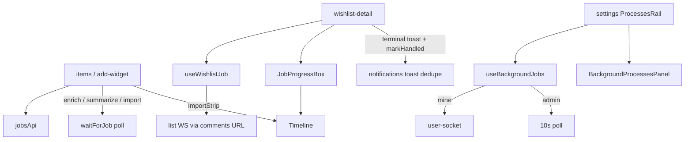

# `features/jobs`

Background **jobs**: start (import / enrich / summarize), poll or live-track progress, cancel/suspend/resume, and presentational progress UI (box, timeline, processes panel). Starters live in items/wishlist-detail; this package owns the API, list/account tracking hooks, wait helper, and job chrome.

Import via `import { … } from 'features/jobs'`.

## Public surface

| Kind | Exports |
|------|---------|
| **Components** | `JobProgressBox`, `Timeline`, `BackgroundProcessesPanel` |
| **API / hooks** | `jobsApi`, `useWishlistJob`, `useBackgroundJobs` |
| **Wait / status** | `waitForJob`, `isTerminalJobStatus`, `DEFAULT_JOB_POLL_INTERVAL_MS`, `TERMINAL_JOB_STATUSES` |
| **Utils** | `mapJobToTimeline`, `buildSeedTimeline`, summary formatters, `claimImportJobTerminalToast`, `getEnrichingItemIds`, `resolveListReloadOnJobTerminal` |
| **Types** | `BackgroundJobView`, `BackgroundJobKind`, `BackgroundJobsScope`, `ListReloadStrategy`, enrich/summarize payloads & results, timeline / import-summary types |

## Layout

```
jobs/
  index.ts
  api/jobs.api.ts
  hooks/                     ← useWishlistJob, useBackgroundJobs, useElapsedSeconds
  constants/job.constants.ts
  interfaces/
  utils/                     ← wait, map timeline, summaries, claim toast, reload
  components/
    progress-box/            ← JobProgressBox
    processes-panel/         ← BackgroundProcessesPanel
    timeline/                ← Track → Step / Node / Connector + stream panel
```

## Architecture



| Concern | Owner |
|---------|--------|
| Start import / enrich / summarize | Callers (`items` import/enrich/summarize, wishlist add-widget) via `jobsApi` |
| Poll one job to terminal | `waitForJob` (HTTP `getJob` every 1.5s) |
| List-scoped live job + enriching item ids | `useWishlistJob` (wishlist comment WS) |
| Account / admin job list | `useBackgroundJobs` (`mine` = user socket; `admin` = 10s poll) |
| Progress chrome on wishlist | `JobProgressBox` (import only) + `Timeline` in ImportStrip |
| Settings processes rail | `BackgroundProcessesPanel` |

There is **no** jobs React provider — hooks are local to the page/rail that mounts them.

---

## `jobsApi`

[`api/jobs.api.ts`](api/jobs.api.ts) — wrap response `Jobs` on mutating POSTs.

| Method | Endpoint | Notes |
|--------|----------|-------|
| `startWishlistImport` | `POST /api/jobs/wishlist-import` | Mode, list/title, file, content/encoding, GrabInfo, AllowAi, OptimizeCategories → `BackgroundJobView` |
| `startItemEnrich` | `POST /api/jobs/item-enrich` | Intent, ListId, Url, ItemId?, WriteBack? → `unwrapJobEnvelope` → `ItemEnrichJobResult` |
| `startItemSummarize` | `POST /api/jobs/item-summarize` | List/item + draft fields → `ItemSummarizeJobResult` |
| `getJob(jobId)` | `GET /api/jobs/:jobId` | |
| `getActiveForList(listId)` | `GET /api/wishlists/:listId/jobs/active` | |
| `listMine` | `GET /api/jobs/mine` | `normalizeJobsPayload` → array |
| `listAdmin` | `GET /api/admin/jobs` | same normalize |
| `cancelJob` / `suspendJob` / `resumeJob` | `POST /api/jobs/:id/{cancel\|suspend\|resume}` | |
| `adminCancelJob` / `adminSuspendJob` / `adminResumeJob` | `POST /api/admin/jobs/:id/…` | |

### Enrich intents

`ItemEnrichIntent`: `create-from-url` | `update-item` | `draft-populate`.  
`WriteBack: false` (draft-populate / non-persisting summarize) → list reload strategy `'none'`.

---

## `useWishlistJob`

List-scoped tracker for wishlist-detail.

### State / returns

| Field | Meaning |
|-------|---------|
| `job` | Latest / active job frame |
| `activeJobs` | Internal map so concurrent streams are not dropped when WS frames arrive for different ids |
| `enrichingItemIds` | Item ids from pending/running streams on `item-enrich` / `wishlist-import` kinds |
| `isActive` | Queued/running primary job **or** any tracked active job |
| `error` / `refresh` / `cancel` | Load error; re-fetch active; cancel current `jobIdRef` |

### Transport

1. `getActiveForList(listId)` on mount / list change  
2. Own WebSocket via `getCommentWsUrl(listId)` (same wishlist socket as comments)  
3. Handles `job.progress` / `job.completed` / `job.failed` and optional `list.changed` → `onListChanged`  
4. Reconnect on close (3s) / connect error (5s)

---

## `useBackgroundJobs`

Account or admin process list. Scope: `'mine' | 'admin'`.

| Field | Meaning |
|-------|---------|
| `jobs` | `BackgroundJobView[]` |
| `isLoading` / `error` | First load + failures |
| `refresh` / `cancel` / `suspend` / `resume` | Admin scope uses `admin*` APIs |

**Transport:** always refresh on mount. **`mine`:** `useUserSocket` upserts on `job.progress` / `job.completed` / `job.failed`. **`admin`:** `setInterval` refresh every 10s (no WS).

---

## `waitForJob` / terminal status

Used by form AI helpers and import flow when the caller needs a terminal result without mounting list hooks.

| Export | Role |
|--------|------|
| `TERMINAL_JOB_STATUSES` | `completed` \| `failed` \| `cancelled` |
| `isTerminalJobStatus` | Membership check |
| `DEFAULT_JOB_POLL_INTERVAL_MS` | `1500` |
| `waitForJob(jobId, { intervalMs?, isCancelled? })` | Loop `getJob` until terminal; `null` if cancelled |

---

## Types

### `BackgroundJobView`

`Id`, `Kind`, `ListId`, `UserId`, `Status`, `Phase`, `ProgressDone` / `ProgressTotal`, `Message`, `Error`, optional `Result`, `ProgressRate`, timestamps, import fields (`GrabInfo`, `Mode`, `FileName`), enrich fields (`Intent`, `WriteBack`), `ItemsSummary`, `ActiveStreams`.

**Kinds:** `wishlist-import` | `item-enrich` | `item-summarize` | open string (backend may add more).  
**Status:** `queued` | `running` | `suspended` | `completed` | `failed` | `cancelled`.  
**Phase:** parsing / creating_list / adding_items / grabbing_info / terminal phases, etc.

### `ListReloadStrategy`

`'full' | 'items' | 'none'` — from `resolveListReloadOnJobTerminal`: enrich/summarize with `WriteBack === false` → `'none'`; other enrich/summarize → `'items'`; else (import) → `'full'`.

---

## Components

### `JobProgressBox`

Maps a `BackgroundJobView` through `mapJobToTimeline`, shows title/message (or terminal import summary), Cancel when queued/running, embedded `Timeline`, optional error. Wishlist-detail workspace uses it for **wishlist-import** jobs.

### `Timeline`

Horizontal **Track** of **Step**s (label/metric + **Node** + **Connector**). When a `grabInfo` step is active and streams exist, shows **stream/panel** (“Active Streams”) of **stream/row** lanes. Also used by items `ImportStrip` (seed timeline before the job exists via `buildSeedTimeline`).

### `BackgroundProcessesPanel`

Presentational job list: title, meta (user vs admin variant), status badge, progress bar, Suspend / Resume / Cancel. Wired by settings `ProcessesRail` + `useBackgroundJobs`.

---

## Key utils

| Export | Role |
|--------|------|
| `mapJobToTimeline` / `buildSeedTimeline` | Phase → import steps + grab streams; pre-job seed |
| `formatImportJobSummary` | Terminal import copy (`Created` / `GrabFailed` / `Warnings`) |
| `formatJobTerminalSummary` | Any-kind terminal toast; soft AI-populate → info |
| `formatItemJobNotificationSummary` | Enrich/summarize copy aligned with backend notifications |
| `claimImportJobTerminalToast` | Module `Set` dedupe `jobId:status` (strip ↔ wishlist-detail) |
| `getEnrichingItemIds` | Item ids from pending/running `ActiveStreams` |
| `resolveListReloadOnJobTerminal` | `'none'` / `'items'` / `'full'` for page soft reload |
| `normalizeJobsPayload` | Peel `Jobs` / `Data` / `Items` / `Result` wrappers → array |
| `unwrapJobEnvelope` | Peel nested `Data` on enrich/summarize start responses |

Also: `with-active-step-captions`, `format-progress-rate`, `format-stream-lane-caption`, `is-ai-populate-failed`.

---

## Consumers

| Surface | Usage |
|---------|--------|
| Items import | `useImportFlow` → `startWishlistImport`; ImportStrip → `Timeline` |
| Items enrich / summarize | form hooks → `start*` + `waitForJob`; abandon util may cancel |
| Wishlist add-from-URL | `startItemEnrich` (`create-from-url`) |
| Wishlist-detail | `useWishlistJob`; soft reload while active; terminal toast + reload strategy; `JobProgressBox`; `enrichingItemIds` → skeletons |
| Notifications | Does **not** import this package; page calls `markJobNotificationHandled` so `useJobToast` skips duplicate enrich/summarize toasts |
| Settings | `ProcessesRail` → `useBackgroundJobs('mine' \| 'admin')` + `BackgroundProcessesPanel` |

---

## Allowed / forbidden

- **May import:** `core`, `shared`, peer barrels (`items` import types, `comments` WS URL)
- **Must not import:** `app/`
- Prefer barrel imports outside this package
- Do not put wishlist page chrome or import dropzone UI here — those stay in items / pages

## Related

- [↑ features](../README.md)
- [items](../items/README.md) — import / enrich / summarize starters
- [notifications](../notifications/README.md) — job toast host + dedupe
- [comments](../comments/README.md) — list WS URL reused for job frames
- [pages/wishlist-detail](../../app/pages/wishlist-detail/README.md)
- [pages/settings](../../app/pages/settings/README.md) — processes rail
- [docs/architecture.md](../../../docs/architecture.md)
