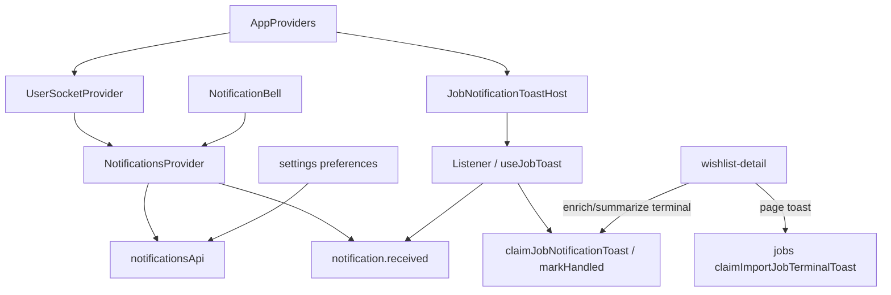

# `features/notifications`

In-app **inbox** (bell), **preferences**, **push** registration, invite-link helpers used by accept flows, and **job completion toasts** over the user socket. Inbox state lives in `NotificationsProvider`; job toasts are a separate auth-gated host that does **not** read provider state.

Import via `import { … } from 'features/notifications'`.

## Public surface

| Kind | Exports |
|------|---------|
| **Components** | `NotificationBell`, `JobNotificationToastHost` |
| **API / hooks / provider** | `notificationsApi`, `NotificationsProvider`, `useNotifications`, `useNotificationPreferences`, `useJobNotificationToast` |
| **Utils** | `mapNotification`, `claimJobNotificationToast`, `markJobNotificationHandled` |
| **Types** | `Notification`, `NotificationType`, `NotificationPreferences`, push register/subscription types |

Extra: [Mobile push contract](./docs/mobile-push-contract.md).

## Layout

```
notifications/
  index.ts
  docs/mobile-push-contract.md
  api/notifications.api.ts
  providers/                 ← NotificationsProvider + useNotifications
  hooks/                     ← useJobToast, usePreferences
  components/
    bell/                    ← NotificationBell (dropdown rows inside)
    toast-host/              ← JobNotificationToastHost → Listener
  interfaces/
  constants/
  utils/
```

## Architecture



| Concern | Owner |
|---------|--------|
| Inbox list + REST mutations | `NotificationsProvider` |
| Live prepend | User socket `notification.received` |
| Preferences | `useNotificationPreferences` (local hook — not provider) |
| Job toasts | `JobNotificationToastHost` → `useJobToast` (same socket event, independent of inbox) |
| Import page toast dedupe | `features/jobs` `claimImportJobTerminalToast` (separate `Set`) |
| Enrich/summarize vs socket toast | page `markJobNotificationHandled` → this package’s claim set |

This package does **not** import `features/jobs`. The two claim sets are independent.

---

## `notificationsApi`

[`api/notifications.api.ts`](api/notifications.api.ts)

| Method | Endpoint | Notes |
|--------|----------|-------|
| `listNotifications` | `GET /api/notifications` | → `mapNotification[]` |
| `markAsRead` | `PATCH /api/notifications/:id/read` | |
| `markAllAsRead` | `POST /api/notifications/read-all` | |
| `clearAll` | `DELETE /api/notifications` | |
| `deleteNotification` | `DELETE /api/notifications/:id` | |
| `getPreferences` | `GET /api/notifications/preferences` | → UI prefs map |
| `updatePreferences` | `PATCH /api/notifications/preferences` | wrap `Notifications`; Marketing ↔ MarketingPromos |
| `registerPush` | `POST /api/notifications/push/register` | wrap `Push` |
| `listPushSubscriptions` | `GET /api/notifications/push/subscriptions` | |
| `deletePushSubscription` | `DELETE …/push/register/:subscriptionId` | |
| `setPrimaryPushSubscription` | `PUT …/push/register/:id/primary` | |
| `acceptListInvite` | `POST /api/invites/link/:token/accept` | optional password |
| `getInviteLinkDetails` | `GET /api/invites/link/:token` | |
| `getPublicLinkPreview` | `GET /api/invites/link/:token/preview` | |
| `postPublicLinkPreview` | `POST …/preview` | `{ Password }` |

Invite helpers are for invite-accept — not the bell.

---

## `NotificationsProvider` / `useNotifications`

Mounted in [`app.component`](../../app/app.component.tsx) inside `UserSocketProvider` (with auth). Clears on logout; fetches on login; refetches on socket **reconnect** after the first connect (not on the initial connect — auth effect already loaded).

### State

| Field | Meaning |
|-------|---------|
| `notifications` | Mapped inbox |
| `isLoading` / `error` | List fetch |
| `unreadCount` | Derived `!IsRead` |

### Actions

`fetchNotifications`, `markAsRead`, `markAllAsRead`, `clearAll`, `deleteNotification`.

On `notification.received`, maps payload and **prepends** if the id is unknown. Mutations hit REST then update local state.

`useNotifications()` throws outside the provider.

---

## Preferences / push

### `useNotificationPreferences`

Local hook for settings account notifications. Loads/saves via API; optimistic toggles + page toast callbacks.

**UI fields:** `EmailAlerts`, `MarketingPromos`, `FriendRequests`, `ListShares`, `ItemClaims`, `Comments`, `JobCompletions`, `PushAlerts`.

### Push

Transports: `'ntfy' | 'webpush' | 'fcm'`. Register / list / delete / set-primary via API. Contract details: [mobile-push-contract.md](./docs/mobile-push-contract.md).

---

## Types

### `Notification`

`Id`, `UserId`, `Type`, `Title`, `Message`, `IsRead`, `CreatedAt`, optional `Metadata?: Record<string, string>`.

### `NotificationType`

`friend_request` | `friend_accepted` | `list_share` | `list_shared` | `list_invite` | `invite_accepted` | `item_claimed` | `item_deleted` | `comment` | `job_completed` | `job_failed` | `system`.

### Metadata keys used in UI

| Key | Use |
|-----|-----|
| `RequestId` / `UserId` | Friends highlight deep links |
| `ListId` | Wishlist navigation |
| `JobId` | Job toast claim / dedupe |
| `SoftFailure` | `'true'` → info tone instead of success |

---

## Components

### `NotificationBell`

Header widget (app navigation when authenticated): toggles dropdown, click-outside close, relative timestamps, mark-all / clear-all / per-item delete. Click marks read then `navigate(getNavigationTarget)`. Badge caps at `9+`. Tour target on the bell.

### `JobNotificationToastHost`

Auth-gated shell next to routes in `App` (not in the header). When authenticated, mounts `Listener` → `useJobToast()` (renders `null`).

---

## Navigation targets

`getNavigationTarget(notification)`:

| Type | Target |
|------|--------|
| `friend_request` | `/friends/requests` (+ optional `highlightRequest`) |
| `friend_accepted` | `/friends/current` (+ optional `highlightUser`) |
| List / item / comment / job types | `/wishlists/:ListId` when `Metadata.ListId` present |
| `system` / unknown | `ListId` fallback or `null` |

---

## Job toast flow

Two independent claim `Set`s avoid duplicate toasts:

1. **This package** — `CLAIMED_JOB_NOTIFICATION_TOASTS`  
   - `claimJobNotificationToast(jobId, status?)` — claim `jobId` and optional `jobId:status`; returns `false` if already claimed  
   - `markJobNotificationHandled(jobId)` — marks `jobId` so later socket claims fail

2. **`features/jobs`** — `claimImportJobTerminalToast(jobId, status)` — dedupes ImportStrip ↔ wishlist-detail **page** toasts; **not** used by `useJobToast`

### `useJobToast`

On `notification.received` → map → if `job_completed` / `job_failed` → `claimJobNotificationToast(JobId, Type)` must succeed → tone from type / `SoftFailure` → message from body or `JOB_TOAST_MESSAGES` fallbacks.

### Wishlist-detail order

For enrich/summarize terminal: page calls `markJobNotificationHandled` **before** its own toast → later socket toast claim fails (no double toast). Import page toasts use only the jobs claim set.

---

## Key utils / constants

| Export / path | Role |
|---------------|------|
| `mapNotification` | Payload → `Notification` (`ReadAt` → `IsRead`) |
| `mapPreferences` | Marketing ↔ MarketingPromos + defaults |
| `isJobNotification` | `job_completed` \| `job_failed` |
| `claimJobNotificationToast` / `markJobNotificationHandled` | Socket vs page dedupe |
| `getNavigationTarget` | Type + metadata → route |
| `formatRelativePast` | Bell timestamps |
| `JOB_TOAST_MESSAGES` | failed / softFailure / completed fallbacks |
| `DEFAULT` preferences | Prefs defaults |

---

## Consumers

| Surface | Usage |
|---------|--------|
| `app.component` | `NotificationsProvider` + `JobNotificationToastHost` |
| App navigation | `NotificationBell` when authenticated |
| Settings account | `useNotificationPreferences` |
| Wishlist-detail | `markJobNotificationHandled` (+ jobs import claim) |
| Invite-accept | invite accept/preview methods on `notificationsApi` |

---

## Allowed / forbidden

- **May import:** `core`, `shared`, feature barrels (`auth`, `tour`, `wishlists`)
- **Must not import:** `app/`, `features/jobs` (page bridges the two claim sets)
- Prefer barrel imports outside this package
- Keep settings prefs chrome and nav shell on the page/layout

## Related

- [↑ features](../README.md)
- [jobs](../jobs/README.md) — page toast claim + terminal summaries
- [auth](../auth/README.md)
- [wishlists](../wishlists/README.md) — public link preview types
- [pages/settings](../../app/pages/settings/README.md)
- [pages/wishlist-detail](../../app/pages/wishlist-detail/README.md)
- [pages/invite-accept](../../app/pages/invite-accept/README.md)
- [docs/architecture.md](../../../docs/architecture.md)
- [Mobile push contract](./docs/mobile-push-contract.md)
