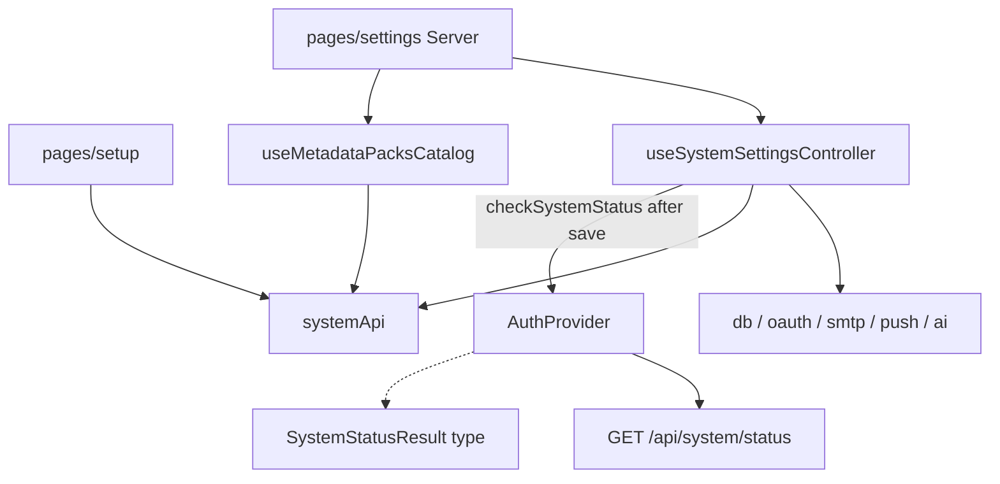

# `features/system`

Server **configuration** transport and form controllers: DB, OAuth, SMTP, push (ntfy / WebPush / FCM), AI slots/prompts/packs, allow-setup, and delete-server. Also first-run **`runSetup`** and the metadata **pack catalog** hook. Settings **page JSX** stays under [`app/pages/settings`](../../app/pages/settings/README.md); **`GET /api/system/status`** is fetched by [`features/auth`](../auth/README.md) (this package only owns the `SystemStatusResult` type).

Import via `import { … } from 'features/system'`.

## Public surface

| Kind | Exports |
|------|---------|
| **API / hooks** | `systemApi`, `useSystemSettingsController`, `useMetadataPacksCatalog` |
| **Utils** | local-AI helpers, pack catalog / merge / validate, populate-hub header parse, models cache write |
| **Constants** | `LOCAL_AI_CUSTOM_MODEL_VALUE`, `CUSTOM_PACK_ID_PREFIX` |
| **Types** | status, settings controller props/result, model options, AI connection/prompts/slots, metadata pack views, custom packs |

No providers and no components in this package.

## Layout

```
system/
  index.ts
  api/system.api.ts
  hooks/
    use-settings-controller.ts   ← public useSystemSettingsController
    use-metadata-packs-catalog.ts
    use-ai-settings.ts            ← internal slices
    use-db-settings.ts
    use-oauth-settings.ts
    use-smtp-settings.ts
    use-push-settings.ts
  interfaces/
  constants/
  utils/
```

## Architecture



| Concern | Owner |
|---------|--------|
| Server settings form state + save / allow-setup / delete | `useSystemSettingsController` |
| Pack catalog fetch | `useMetadataPacksCatalog` |
| REST transport | `systemApi` |
| System status fetch + maintenance gates | **`features/auth`** (+ app shell) |
| Settings / setup page chrome | **`app/pages/...`** |

No app-level system provider — hooks mount when Server / packs workspace / setup pages render. Controllers fetch **once on mount**.

---

## `systemApi`

[`api/system.api.ts`](api/system.api.ts)

| Method | Endpoint | Notes |
|--------|----------|-------|
| `checkAiConnection` | `POST /api/system/ai-check` | wrap `System` → `AiCheckResult` |
| `listModels` | `GET /api/system/models?Provider=&Endpoint=&ApiKey=` | → normalized `ModelOption[]` |
| `listMetadataPacks` | `GET /api/system/metadata-packs` | → `MetadataPacksResult` |
| `getSettings` | `GET /api/system/settings` | → `BackendSettings` |
| `updateSettings` | `POST /api/system/settings` | wrap `System` |
| `runSetup` | `POST /api/system/setup` | `RunSetupPayload` (first-run) |
| `testNtfy` | `POST /api/system/test-ntfy` | → `{ Topic? }` |
| `deleteServer` | `POST /api/system/delete-server` | wrap `Server` → `{ success }` |

**Not here:** `GET /api/system/status` — auth calls `apiClient` directly and maps into auth flags (incl. maintenance).

---

## `useSystemSettingsController`

Composes internal slice hooks (`useDbSettings`, `useOauthSettings`, `useSmtpSettings`, `usePushSettings`, `useAiSettings`). Props: `{ showToast }`. Mounted by the Server settings page.

### Loads / saves

1. Mount → `getSettings` → `applySettingsToState`
2. `handleSave` → `buildSettingsPayload` → `updateSettings` → toast → `checkSystemStatus()` → re-fetch settings
3. `onAllowSetupChange` → confirm if enabling → `updateSettings` with `AllowSetup` override → `checkSystemStatus()`
4. `onDeleteServer` → double confirm → `deleteServer` → clear auth token → `href=/setup`

### Slice groups (form VM)

| Area | Fields / actions |
|------|------------------|
| **DB** | `dbType` / `dbUrl` / `publicAppUrl` |
| **OAuth** | enabled, issuer, client id/secret, auto-register |
| **SMTP** | local/remote + host/port/user/pass/secure/from |
| **Push** | ntfy / WebPush / FCM fields; `onTestNtfy` |
| **AI flags** | enabled, web search, rate limit, import chunking, timeouts, scrape/grab concurrency |
| **AI slots** | fast + intelligent: provider (`openrouter` \| `local`), endpoint, key, model; OpenRouter company filters; local listed/custom modes + cache |
| **AI connection** | per-slot status/message; `onTestAiConnection(slot)` |
| **Prompts** | review / description / populate / category / import; `onResetPrompt`; default prompts view |
| **Packs** | `aiEnabledPackIds`, `aiCustomPacks` changers |
| **Chrome** | password/AI-key visibility; `isLoading` / `isSaving`; allow-setup + delete flags |

---

## `useMetadataPacksCatalog`

Mount-fetch `listMetadataPacks` → `{ catalog, isLoading, error }`. Used by the prompts/packs workspace on Server settings (alongside controller pack id/custom pack state).

---

## Types

### `SystemStatusResult`

Shape only (fetched by auth): `Initialized`, `AllowSetup`, `AllowPasswordLogin`, `RequireStrongPasswords`, `OAuthEnabled`, `AiEnabled`, `AiWebSearchEnabled`, `RegistrationMode` (`open` \| `invite_only` \| `disabled`), `MaintenanceMode`, `MaintenanceMessage`.

### Settings / AI

| Type | Role |
|------|------|
| `BackendSettings` | PascalCase API settings blob |
| `RunSetupPayload` | Nested `Giftistry.Setup` (DbType, DbUrl?, SetupToken?, Admin) |
| `SystemModelOption` | `{ id, name, company, displayName }` |
| `AiModelSlot` | `'fast' \| 'intelligent'` |
| `AiConnectionStatus` | `'idle' \| 'checking' \| 'success' \| 'error'` |
| `LocalAiModelMode` | `'listed' \| 'custom'` |
| `PromptType` | `'review' \| 'description' \| 'populate' \| 'category' \| 'import'` |
| `CustomPackSettings` | Id, Label, Description, Match, Fields, PromptFragment |
| Pack views | `SystemMetadataPackView` / Field / Match / Result; `DirectoryPackRow` |

---

## Pack catalog / local AI utils

| Export | Role |
|--------|------|
| `listDirectoryPacks` / `filterDirectoryPacks` / `findDirectoryPack` | Catalog → directory rows |
| `addMetadataPackId` / `removeMetadataPackId` | Enable tree (ancestors on add; descendants + prune on remove) |
| `mergeWorkspaceCatalog` | Built-ins + custom packs as views |
| `validateCustomPackSettings` | Label / field-key validation → error or null |
| `CUSTOM_PACK_ID_PREFIX` | `'custom.'` |
| `isModelInLocalList` | Local model list membership |
| `LOCAL_AI_CUSTOM_MODEL_VALUE` | `'__custom__'` sentinel |
| `writeLocalAiModelsCache` | Persist local model list by endpoint |
| `parsePopulateHubHeaderLine` | `=== Title ===` header parse for populate hub |

Internal helpers worth knowing: `buildSettingsPayload`, `applySettingsToState`, `normalizeModel`, `ai-prompt-settings`, populate-hub assemble/parse, `to-custom-pack-view`, `built-in-catalog-nodes`.

---

## Page vs feature

| Concern | Where |
|---------|--------|
| Server form sections, model picker, packs workspace UI | `app/pages/settings/.../server` |
| First-run wizard chrome | `app/pages/setup` |
| Status poll, maintenance banner/gates, registration mode flags | `features/auth` + app shell |
| Settings transport, form controller, pack catalog hook, AI/pack utils | **this package** |

Admin feature does **not** own server config — see [admin](../admin/README.md) boundary.

---

## Consumers

| Surface | Usage |
|---------|--------|
| Server settings | `useSystemSettingsController` + pack/local-AI helpers; packs workspace → `useMetadataPacksCatalog` |
| Setup | `systemApi.runSetup` then auth `checkSystemStatus` |
| Auth | imports `SystemStatusResult` type only |

---

## Allowed / forbidden

- **May import:** `core`, `features/auth` (`useAuth` / `checkSystemStatus` in controller)
- **Must not import:** `app/`
- Prefer barrel imports outside this package
- Keep page JSX and maintenance routing out of this package

## Related

- [↑ features](../README.md)
- [auth](../auth/README.md) — status fetch + maintenance / registration flags
- [admin](../admin/README.md) — not server settings
- [notifications](../notifications/README.md) — push registration (user-facing; server push keys configured here)
- [pages/settings](../../app/pages/settings/README.md)
- [pages/setup](../../app/pages/setup/README.md)
- [docs/architecture.md](../../../docs/architecture.md)
