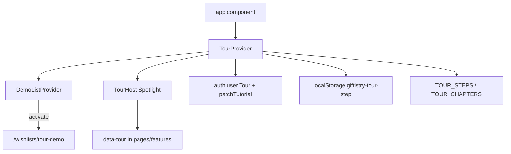

# `features/tour`

Product **tutorial**: sample-list demo → beginner first-list → optional advanced chapters. Progress persists via auth `PATCH /api/auth/tutorial` (`ApiUser.Tour`) plus `localStorage` resume. Spotlight UI is `TourHost`; pages opt in with `data-tour` targets and optional hooks/events.

**Status: incomplete.** Step copy and chapters exist end-to-end, but post-beginner routing/fixture wiring is thin, and some APIs/targets are unused. See [Incomplete](#incomplete).

Import via `import { … } from 'features/tour'`.

## Public surface

| Kind | Exports |
|------|---------|
| **Provider / host** | `TourProvider`, `TourHost`, `useTour`, `useTourOptional` |
| **Demo** | `useTourDemo`, `useTourDemoOptional`, `DEMO_JORDAN_ITEM_ID`, `DEMO_SAM_COMMENT_ID` |
| **Targets / ids** | `TOUR_TARGETS`, `TOUR_DEMO_LIST_ID`, `isDemoListId` |
| **Chapters / progress** | `TOUR_CHAPTERS`, `eligibleChapters`, `chapterStatus`, `normalizeClientTour`, `shouldAutoStartTour`, `firstPendingChapterId`, `nextAdvancedChapterId` |

Not on the barrel: `TOUR_STEPS`, `DemoListProvider`, resume helpers, `runBeforeShow`.

## Layout

```
tour/
  index.ts
  constants/                 ← chapters, steps, targets, storage, welcome copy
  interfaces/
  providers/                 ← TourProvider + useTour (+ beforeShow utils)
  demo/                      ← DemoListProvider + fixtures / beats
  components/host/           ← TourHost (Spotlight overlay)
  utils/                     ← progress, resume, demo-list, advance helpers
```

## Architecture



| Concern | Owner |
|---------|--------|
| Chapter/step machine, auto-start, resume, tutorial PATCH | `TourProvider` |
| Sample wishlist / items / comments / beats | `DemoListProvider` (nested under Tour) |
| Spotlight UI | `TourHost` |
| `data-tour` anchors | Pages / feature HTML (opt-in) |
| Persist chapter status | `features/auth` (`TourState`, `patchTutorial`) |

**No tour REST API** in this package. Pages do not register with a tour API — they stamp targets and optionally call `notifyEvent` / read demo fixtures.

**Mount:** `TourProvider` inside `BrowserRouter` in [`app.component`](../../app/app.component.tsx); `TourHost` when authenticated and not on an auth path.

---

## `TourProvider` / `useTour`

Wraps `DemoListProvider` → inner controller.

### State

| Field | Meaning |
|-------|---------|
| `isActive` | Tour overlay running |
| `activeChapterId` / `activeStepId` | Current position |
| `createdListId` | List created during beginner (for highlight / future nav) |
| `isDemoActive` | Sample-list demo fixtures on |

### Actions

`startChapter`, `next` / `back` / `skipStep` (= next), `completeChapter`, `skipChapter`, `finishTour`, `restartAll`, `notifyEvent`, `setCreatedListId`.

### Lifecycle

- Auto-start after onboarded + `!FirstRunDismissed`, not on auth paths; resume from `localStorage` or `firstPendingChapterId`
- Clears on logout
- Per step: `runBeforeShow` + optional `demo.runBeat` / clear highlight
- Advance via Next, target click, route match, window/CustomEvent, or `notifyEvent`

`useTour()` throws outside the provider; `useTourOptional()` returns `null`.

---

## Chapters & steps

### Chapters (`TOUR_CHAPTERS`)

| Id | Title | Eligibility |
|----|-------|-------------|
| `demo` | Sample list | always |
| `beginner` | Create your list | always |
| `importAi` | Import & auto-add | `canShowAi` |
| `listTools` | List tools | always |
| `shareDeep` | Sharing | always |
| `friendsDeep` | Friends | always |
| `notifications` | Notifications | always |
| `theming` | Theming | always |

`eligibleChapters(ctx)` filters by `when`. Context also has `canAutoAdd` (set like `canShowAi` today; not used in chapter `when` yet).

### Steps (`TOUR_STEPS`, not exported)

~40 steps with desktop/mobile variants, placements, optional `beforeShow`, and demo beats on hands-on demo steps.

**Advance modes:** `next` | `target` | `route` | `event` | `input` (`input` is wired in host/utils but unused by current steps).

**Events used:** `tour:wishlist-created`, `tour:add-drawer-opened`, `tour:item-created`.

**Before-show actions:** `openFab`, `openDrawer`, `openComments`, `closeShare`, `navigateDemo`, `navigateDashboard`, `navigateFriends`, `navigateSettingsNotifications`, `navigateSettingsTheming` — not all are referenced by steps (see Incomplete).

---

## Targets

`TOUR_TARGETS` → `data-tour="…"` values. Wired across dashboard, wishlist-detail, friends tabs, notification bell, settings notifications, nav (hamburger/profile/theme), item form, import dropzone, share panel tabs.

Pages/features opt in by stamping targets; tour host queries `[data-tour=…]`.

---

## Demo mode

| Item | Value |
|------|--------|
| List id | `tour-demo` (`TOUR_DEMO_LIST_ID`) |
| Route | `/wishlists/tour-demo` |
| Users | Jordan / Sam (`tour-demo-user-*`) |
| Seed items | headphones + cookbook |
| Beat item / comment | `DEMO_JORDAN_ITEM_ID`, `DEMO_SAM_COMMENT_ID` |
| Beats | `seed`, `addItem`, `typing`, `comment`, `claim` |

Client-only fixtures. Wishlist-detail / comments skip network when `isDemoListId`. Demo comments use local demo types (not `features/comments` `Comment`).

`useTourDemo` / `useTourDemoOptional` expose fixtures + highlight/typing for consumers.

---

## `TourHost`

Only in-package UI: portals Spotlight (or “Loading sample list…” preparing overlay). Measures targets, pulses on `advanceOn: 'target'`, FAB open helpers, chapter progress bar. No props.

Uses `shared/ui` Spotlight / LoadingState / measure helpers.

---

## Progress utils

| Export | Role |
|--------|------|
| `normalizeClientTour` | Auth tour blob → client shape |
| `chapterStatus` | pending / active / done / skipped |
| `shouldAutoStartTour` | First-run gate |
| `firstPendingChapterId` / `nextAdvancedChapterId` | Continue flow |
| `eligibleChapters` | Filter by AI eligibility |

Resume key: `giftistry-tour-step` (`storage-keys.constant.ts`).

---

## Incomplete

Documented gaps — do not treat advanced chapters as fully polished:

| Gap | Notes |
|-----|-------|
| **`createdListId` not used for nav** | Set/resumed in provider; advanced chapters lack `beforeShow` to `/wishlists/${createdListId}` — targets fail if user isn’t already on that list |
| **`demoBeat: 'claim'` dead** | Implemented in demo provider; no step references it |
| **`advanceOn: 'input'` unused** | Host + util ready; `beginner-title` uses `next` instead |
| **Orphan target `friendsAction`** | In `TOUR_TARGETS` only — no `data-tour` in the app |
| **Unused beforeShow** | `openDrawer`, `navigateSettingsTheming` defined; theming mobile may need profile sheet but doesn’t call them |
| **`canAutoAdd` unused in eligibility** | Always mirrored from `canShowAi`; chapter `when` only checks AI |
| **Shallow advanced guidance** | e.g. beginner friends/share-next are Next-only / center dialogs; import chapter assumes Import UI is already reachable |
| **Migrated step id** | `beginner-create-fab-action` → `beginner-create` handled in `startAtStep` only |

Steps **exist** in constants; the missing work is mostly **routing + fixture wiring** after beginner, plus cleaning dead APIs.

---

## Consumers

| Surface | Usage |
|---------|--------|
| `app.component` | `TourProvider` + `TourHost` |
| Dashboard | Targets, demo card, `createdListId` highlight |
| Wishlist-detail | Demo list data, targets, `tour:add-drawer-opened` |
| Friends | Tab targets |
| Settings Account Tutorial | `TOUR_CHAPTERS`, `startChapter` / `restartAll` |
| App navigation / mobile FABs | hamburger, profile, theme, create FAB targets |
| Comments / items / wishlists / notifications | Demo skip, events, targets |

---

## Allowed / forbidden

- **May import:** `features/auth`, `features/items` / `wishlists` (types), `shared/ui`, `react-router-dom`
- **Must not import:** `app/`
- Prefer barrel imports outside this package
- Keep page chrome and `data-tour` stamps on pages/features — not here

## Related

- [↑ features](../README.md)
- [auth](../auth/README.md) — `TourState` / `patchTutorial`
- [comments](../comments/README.md) — demo list skip + typing/comment targets
- [items](../items/README.md) / [wishlists](../wishlists/README.md) — create/import/share targets
- [notifications](../notifications/README.md) — bell target
- [pages/settings](../../app/pages/settings/README.md) — Account tutorial controls
- [pages/dashboard](../../app/pages/dashboard/README.md) / [wishlist-detail](../../app/pages/wishlist-detail/README.md)
- [docs/architecture.md](../../../docs/architecture.md)
