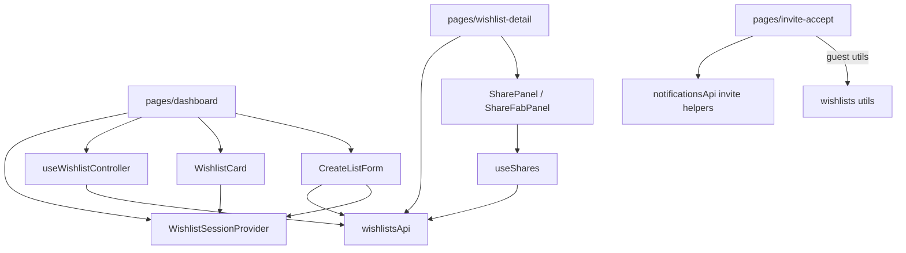

# `features/wishlists`

Wishlist **domain**: list cards, create form, share (friends / link / manage), priorities API, and guest-preview helpers. Multi-list state lives in `useWishlistController` (dashboard); detail and invite pages fetch a single list (or preview) themselves. `WishlistSessionProvider` is an auth/AI mirror mounted on the **dashboard** only.

Import via `import { … } from 'features/wishlists'`.

## Public surface

| Kind | Exports |
|------|---------|
| **Components** | `WishlistCard`, `CreateListForm`, `ShareManagement`, `ShareFabPanel`, `SharePanel` |
| **API / hooks / providers** | `wishlistsApi`, `useWishlistController`, `WishlistSessionProvider`, `useWishlistSession`, `WishlistSessionContextType` |
| **Types** | `Wishlist`, `Priority`, `ListShare`, `PublicLinkPreview`, `PublicLinkPreviewWishlist`, `LinkInvite` |
| **Utils** | expiry / archive / lock / archive-bucket, date converters, guest preview helpers |

Not on the barrel: `useShares`, category/role constants, FriendsTab / LinkTab / DemotionCaution / CategoryIcon.

## Layout

```
wishlists/
  index.ts
  api/wishlists.api.ts
  hooks/
    use-wishlist-controller.ts   ← multi-list (dashboard)
    use-shares.ts                ← per-list shares (internal)
  providers/session/             ← auth / AI / web-search mirror
  components/
    card/                        ← WishlistCard
    create-form/                 ← CreateListForm
    share/
      panel/                     ← SharePanel (+ friends / link tabs)
      fab-panel/                 ← ShareFabPanel (mobile)
      management/                ← ShareManagement (+ demotion caution)
  interfaces/
  constants/
  utils/
```

## Architecture



| Concern | Owner |
|---------|--------|
| Multi-list fetch / counts / activate-deactivate | `useWishlistController` (local — **not** a global CRUD provider) |
| Dashboard tabs, search, create modal, grid | `app/pages/dashboard` |
| Single-list fetch, settings, archive/delete/duplicate | `app/pages/wishlist-detail` → `wishlistsApi` directly |
| Share UI + per-list share list | SharePanel / FabPanel / Management + internal `useShares` |
| Card / create form session | `WishlistSessionProvider` (**dashboard only**) |
| Invite accept / guest preview HTTP | `features/notifications`; types + guest utils **here** |

Unlike friends (`FriendsProvider`), there is no app-wide wishlists CRUD context.

---

## `wishlistsApi`

[`api/wishlists.api.ts`](api/wishlists.api.ts)

| Method | Endpoint | Notes |
|--------|----------|-------|
| `listWishlists` | `GET /api/wishlists?bucket=&q=` | → `{ Wishlists, Counts }` or legacy `Wishlist[]` |
| `getWishlist` | `GET /api/wishlists/:listId` | |
| `createWishlist` | `POST /api/wishlists` wrap `Lists` | Title, ExpiresAt, AllowGroupFunds, Category, RevealSuggestions, AiEnabled, WebSearchEnabled, ManualJobBackground, AutoRollover |
| `updateWishlist` | `PUT /api/wishlists/:listId` wrap `Lists` | same body shape |
| `deactivateWishlist` / `activateWishlist` | `PUT …/:listId/{deactivate\|activate}` | |
| `duplicateWishlist` | `POST …/:listId/duplicate` wrap `Lists` | |
| `deleteWishlist` | `DELETE /api/wishlists/:listId` | |
| `listShares` | `GET …/:listId/shares` | → `ListShare[]` |
| `updateShare` | `PATCH …/shares/:shareId` wrap `Lists` | `{ Role }` viewer \| collaborator |
| `removeShare` | `DELETE …/shares/:shareId` | |
| `bulkShareWithFriends` | `POST …/shares/bulk` wrap `Lists` | `{ FriendIds, Role }` |
| `generateShareLink` | `POST …/link-invites` wrap `Invites` | → `{ Invite, Token }` |
| `listLinkInvites` / `revokeLinkInvite` | `GET` / `DELETE …/link-invites` | |
| `listPriorities` | `GET /api/priorities?wishlistId=` | optional filter |
| `createPriority` / `deletePriority` | `POST` / `DELETE /api/priorities` | |

Controller wires list/create/activate/deactivate. Create form, detail hooks, and share UIs call the rest directly.

---

## `useWishlistController`

Multi-list hook for the dashboard. No auto-fetch — page calls `fetchWishlists` on tab/search change.

### State

| Field | Meaning |
|-------|---------|
| `wishlists` | Normalized list |
| `counts` | `{ My, Shared, Archive }` |
| `isLoading` / `error` | Fetch status |

### Actions

`fetchWishlists({ bucket, q })`, `createWishlist` (subset of fields; dashboard prefers `CreateListForm` + reload), `deactivateWishlist`, `activateWishlist`.

---

## `WishlistSessionProvider` / `useWishlistSession`

Auth mirror: `{ user, canShowAi, canShowWebSearch }`. Mounted on **dashboard** (with items session). Required by `WishlistCard` and `CreateListForm`. Wishlist-detail does **not** wrap it — share panels don’t need it.

---

## `useShares` (internal)

Per-list shares: mount/`listId` → `listShares`. Returns `{ shares, isLoading, error, setError, loadShares }`. Used by SharePanel, FabPanel, ShareManagement.

---

## Types

### `Wishlist`

`Id`, `UserId`, `Title`, `ExpiresAt`, `AllowGroupFunds`, `IsActive`, optional `Category`, AI/web/job flags (`AiEnabled`, `WebSearchEnabled`, `ManualJobBackground`, `AutoRollover`, `RevealSuggestions`), owner display fields, `Role?: 'owner' | 'collaborator' | 'viewer'`, `ShareToken`, embedded `Shares?`.

### Shares / invites / priorities

| Type | Role |
|------|------|
| `ListShare` | Share row; role `viewer` \| `collaborator` (+ identity fields) |
| `LinkInvite` | Token invite: role, expiry, max uses, password flag, revoked |
| `Priority` | `Id`, `UserId`, `Label`, `Weight` |
| `PublicLinkPreview` | `{ Wishlist, Items, Groups }` guest payload |
| `PublicLinkPreviewWishlist` | Slim list for guest |

List `Role` includes `owner`; share roles are only `viewer` | `collaborator`.

---

## Components

### `WishlistCard`

Dashboard tile → `/wishlists/:id`. Ownership from session; category pill + icon; expiry styling; optional paginated shares sidebar; `tourTarget` for tour.

### `CreateListForm`

Title, expiry, group funds, category (+ custom), advanced AI/web-search/auto-rollover (gated by session). Calls `createWishlist` with `ManualJobBackground: true`; notifies tour (`tour:wishlist-created` / `setCreatedListId`). Hosted in dashboard create modal.

### `SharePanel`

Desktop tabbed UI: **friends** / **link** / **manage**. Owns tab state + `useShares`. Wishlist-detail share modal.

### `ShareFabPanel`

Mobile FAB variant: tabs Link / Invite / Access; compact children; can hide tabs during demotion caution.

### `ShareManagement`

Existing shares: role change / remove; confirms collaborator→viewer demotion (`DemotionCaution`). Classic/compact variants.

### Friends / Link tabs (internal)

- **FriendsTab** — `useFriendsController`; filter already-shared; `bulkShareWithFriends`
- **LinkTab** — generate/revoke invites; optional expiry + password; copy `/invite/list/:token`

---

## Utils / constants

| Export | Role |
|--------|------|
| `isWishlistExpired` | Past `ExpiresAt` |
| `isWishlistArchived` | `IsActive === false` |
| `isWishlistLocked` | expired \|\| archived → read-only mutations |
| `isWishlistInArchiveBucket` | inactive \|\| expired (dashboard Archived tab) |
| `dateInputToExpiresAtIso` / `expiresAtIsoToDateInput` | Local date ↔ ISO |
| `toGuestWishlist` | Preview → `Wishlist` (viewer, AI off) |
| `normalizeGuestPreviewItem` / `groupGuestPreviewItems` | Guest item safety + grouping |

Internal: `CATEGORY_OPTIONS`, `SHARE_ROLE_OPTIONS`, demotion warning + `shouldConfirmCollaboratorToViewer`.

---

## Page vs feature

| Concern | Where |
|---------|--------|
| Buckets, search, create modal, grid chrome | `app/pages/dashboard` |
| List collection state | **this package** (`useWishlistController`) |
| Card + create form + share UI | **this package** |
| Detail route, drawers, item grid, settings, lifecycle confirms | `app/pages/wishlist-detail` |
| Single-list + priorities fetch | page → `wishlistsApi` |
| Invite token / password / guest workspace | `app/pages/invite-accept` + `notificationsApi` |
| Guest preview types + helpers | **this package** |
| Nav wishlist search | `app/layout/.../wishlist-search` |

Item grids and drawers compose **items** + page chrome — see [wishlist-detail](../../app/pages/wishlist-detail/README.md).

---

## Allowed / forbidden

- **May import:** `core`, `shared`, feature barrels (`auth`, `friends`, `tour`, `items` for guest types)
- **Must not import:** `app/`
- Prefer barrel imports outside this package
- Keep dashboard/detail chrome and invite accept flow on pages

## Related

- [↑ features](../README.md)
- [friends](../friends/README.md) — share friends tab
- [items](../items/README.md) — detail item grid / audience `ListShare`
- [notifications](../notifications/README.md) — invite accept / preview HTTP
- [tour](../tour/README.md) — create/share targets
- [auth](../auth/README.md)
- [pages/dashboard](../../app/pages/dashboard/README.md)
- [pages/wishlist-detail](../../app/pages/wishlist-detail/README.md)
- [pages/invite-accept](../../app/pages/invite-accept/README.md)
- [docs/architecture.md](../../../docs/architecture.md)
