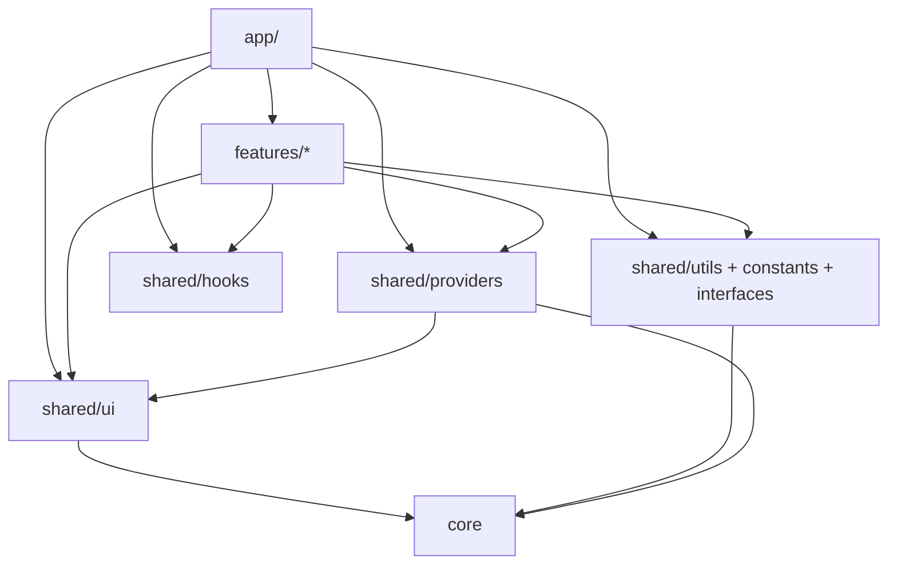

# `shared/`

Cross-cutting **primitives and helpers**: UI atoms, pure utils, const tables, shared TypeScript contracts, React providers (toast / user socket), and a few media-query hooks. No domain packages and no route composition.

`shared/` sits beside `features/` above `core/`. Features and `app/` may import it; it must not reach up into either.

## Allowed / forbidden

| | |
|--|--|
| **May import** | `core`, other `shared/` modules |
| **Must not import** | `features/`, `app/` |
| **Must not contain** | Domain UI composites, feature session providers, page chrome, API clients |

If something needs a domain type or feature hook, **move it** into that feature (or inject a callback/node from `app` / the feature). Don’t punch a hole upward.

Split contracts cleanly:

| Concern | Folder |
|---------|--------|
| Runtime helpers (functions) | `utils/` |
| Const tables / magic values | `constants/` |
| TypeScript contracts | `interfaces/` |
| SoC UI primitives | `ui/` |
| App-wide React providers | `providers/` |
| Domain-agnostic hooks | `hooks/` |

Utils import types from `interfaces/` and values from `constants/` — not the other way around for exported shapes/tables.

## Children

| Path | Role | Detail |
|------|------|--------|
| [ui/](ui/README.md) | Shared UI primitives (SoC trios) | Button, Drawer, Modal, Spotlight, form controls, chrome, feedback |
| [utils/](utils/README.md) | Pure functions only | Dates, display name, avatar, money, metadata parse/export, … |
| [constants/](constants/README.md) | Shared const tables | Username policy, predefined form keys, FAB breakpoint, badge emoji |
| [interfaces/](interfaces/README.md) | Shared TS contracts | Item description metadata, display-name fields, export context, … |
| [providers/](providers/README.md) | Toast + user socket | Not feature-session providers (`features/*/providers`) |
| `hooks/` | Media-query hooks | `useIsMobileFab`, `useSupportsKanbanViewMode` |

```
shared/
  ui/            ← primitives (barrel: shared/ui)
  utils/         ← pure helpers
  constants/     ← tables / magic values
  interfaces/    ← *.interface.ts / *.type.ts
  providers/     ← ToastProvider, UserSocketProvider
  hooks/         ← matchMedia helpers
  README.md
```

## How it fits



| Layer | Uses shared for |
|-------|-----------------|
| `app/` | Layout chrome primitives, toast, socket, utils |
| `features/` | Domain UI composition on top of `ui/`; socket events; metadata/date helpers |
| `shared/providers` | Renders `ui/Toast`; opens user WS via `core` env |
| `core/` | Does **not** import shared |

---

## `ui/`

Domain-agnostic SoC components. Full surface and patterns: [ui/README.md](ui/README.md).

Highlights: overlays (`Modal`, `Drawer`, `Spotlight`), form controls, menus/FAB, chrome (`Sidebar`, `TabBar`, `TopBar`), feedback states, media (`UserAvatar`, `ImageCropper`).

Domain composites (preview card, item mini-drawer, wishlist card) stay in **features** — Drawer only accepts a `miniDrawer` slot.

---

## `providers/`

Cross-cutting React providers. Export from `shared/providers` (see [`providers/index.ts`](providers/index.ts)).

| Provider | Role |
|----------|------|
| **`ToastProvider` / `useToast`** | Queue + host; `showToast(message, type)`; renders presentational `ui/Toast` |
| **`UserSocketProvider` / `useUserSocket`** | Authenticated user WebSocket; `addEventListener` / `removeEventListener` by event `Type`; reconnect |

**Not here:** `AuthProvider`, `FriendsProvider`, `NotificationsProvider`, items/comments/wishlist session mirrors — those live under `features/<domain>/providers`.

Mounted from the app shell (inside auth / alongside feature providers as needed).

---

## `utils/` / `constants/` / `interfaces/`

Cross-cutting data helpers without React UI.

**Utils (examples):** `format-date`, `get-display-name` / initials, avatar color helpers, `validate-username`, money compare, `parse-item-description` / custom-fields / metadata display, wishlist export (csv/xlsx/…), `api-case`, URL/site name helpers, online-status resolve.

**Constants (examples):** username policy, core predefined form↔storage key maps, metadata badge emoji, `MOBILE_FAB_MEDIA_QUERY`.

**Interfaces (examples):** `ItemDescriptionMetadata`, `DisplayNameFields`, `PublicUserSummary`, wishlist export context, username validation result, relative-past format options.

Rules for those folders are spelled out in their READMEs — no exported types in utils; no functions in constants.

---

## `hooks/`

Small domain-agnostic React hooks (no feature session logic):

| Hook | Role |
|------|------|
| `useIsMobileFab` | `matchMedia` for mobile FAB breakpoint (`MOBILE_FAB_MEDIA_QUERY`) |
| `useSupportsKanbanViewMode` | `matchMedia` for kanban min-width (used by wishlist item view-mode UI) |

Prefer feature hooks for anything that owns domain state or API calls.

---

## Patterns

### Feature session vs shared providers

| Kind | Where |
|------|--------|
| Toast queue, user-wide socket | **`shared/providers`** |
| Auth / friends / notifications inbox / domain session mirrors | **`features/*/providers`** |

### UI vs providers

| Concern | Where |
|---------|--------|
| Toast **row** presentation | `shared/ui/toast` |
| Toast **queue / host** | `shared/providers/toast` |
| Spotlight / Drawer **shells** | `shared/ui` |
| Tour step machine / demo fixtures | `features/tour` |

### Placement checklist

| Kind of code | Put it in |
|--------------|-----------|
| Button, modal, drawer shell | `shared/ui` |
| User preview card, wishlist card, comment section | `features/<domain>` |
| Pure date/money/metadata helper | `shared/utils` (+ types/constants as needed) |
| `AuthProvider`, `useItemController` | `features/<domain>` |
| Theme catalog / `apiClient` | `core/` |
| Route page composition | `app/pages` |

---

## When to add code here

Put it in `shared/` if it is:

1. Reusable across features/pages, and
2. Free of feature barrels and `app/` imports

Prefer a **feature** when removing domain knowledge would hollow out the API. Prefer **`core`** for transport/env/theme-engine with no React UI. Prefer **`app`** for route-only chrome.

## Related

- [↑ src](../README.md)
- [features/](../features/README.md) — domain packages that compose shared
- [core/](../core/README.md) — transport / env / theme helpers
- [app/](../app/README.md) — shell that mounts providers
- [docs/architecture.md](../../docs/architecture.md)
- [docs/ui-conventions.md](../../docs/ui-conventions.md)
