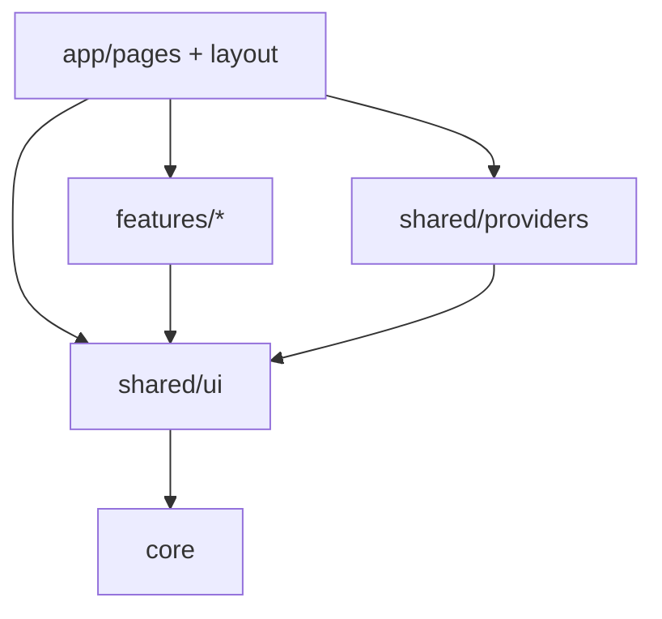

# `shared/ui`

Reusable **UI primitives** — buttons, overlays, form controls, chrome shells, feedback states. Domain-agnostic only. Each unit is a SoC trio under its own folder; the public API is [`index.ts`](./index.ts).

Import via `import { Button, Drawer, … } from 'shared/ui'` (or the project’s path alias to this barrel).

## Allowed / forbidden

| | |
|--|--|
| **May import** | `core`, other `shared/` modules |
| **Must not import** | `features/`, `app/` |
| **Must not contain** | Domain types, feature hooks, API clients, page chrome |

If a primitive needs a domain type or feature hook, **move it** into that feature (or inject a slot/callback from above). Don’t punch a hole upward.

## Rules

- Logic in `*.component.tsx`; markup in `*.html.tsx`; styles in `*.module.css`
- No hooks / class-string builders / business rules in templates
- Public types: export from `interfaces/` via the barrel — **not** from the component file
- CSS Modules + BEM + theme tokens (`var(--primary)`, rem scale) — see [ui-conventions](../../../docs/ui-conventions.md)
- Domain composites (preview card, mini-drawer, linked squares, wishlist card) live in **features**, not here

## Layout

```
ui/
  index.ts
  button/  icon-button/  brand-mark/
  input/  search-input/  switch/  number-selector/
  calendar/  date-field/  select-menu/
  dropdown-menu/  menu-item/  floating-action-menu/
  modal/  drawer/  enter-panel/  spotlight/
  sidebar/  top-bar/  tab-bar/  tab-item/
  card/  chip/  badge/  ai-status-badge/  divider/  collapsible-strip/
  loading-state/  error-state/  empty-state/  toast/
  user-avatar/  image-cropper/
```

Typical unit:

```
foo/
  foo.component.tsx
  foo.html.tsx
  foo.module.css
  interfaces/
  utils/ | constants/   ← optional
```

Nested only where needed: `sidebar/item/`, `badge/icons/`. There is **no** `drawer/mini/` — item mini content is `features/items` (`MiniDrawer`); the drawer shell accepts a `miniDrawer` **slot**.

## How it fits



Toast **presentation** (`Toast`) lives here; the toast **queue / host** is [`shared/providers/toast`](../providers/README.md).

---

## Public surface

| Kind | Exports |
|------|---------|
| **Actions** | `Button`, `IconButton`, `BrandMark` |
| **Inputs** | `Input`, `SearchInput`, `Switch`, `NumberSelector`, `Calendar`, `DateField`, `SelectMenu` (+ `SelectMenuOption`) |
| **Menus** | `DropdownMenu`, `MenuItem`, `FloatingActionMenu` (+ action / panel helper types) |
| **Overlays** | `Modal`, `Drawer`, `Spotlight` (+ measure helpers `measureElement`, `measureElements`, `padRect`) |
| **Motion** | `EnterPanel` (+ `EnterAnimation`) |
| **Chrome** | `Sidebar`, `SidebarItem`, `TopBar`, `TabBar` (+ `TabDefinition`), `TabItem` |
| **Surfaces** | `Card`, `Chip`, `Badge` (+ `AiSparklesIcon` / `AiDisabledIcon`), `AiStatusBadge`, `Divider`, `CollapsibleStrip` |
| **Feedback** | `LoadingState`, `ErrorState`, `EmptyState`, `Toast` (+ `ToastType`) |
| **Media** | `UserAvatar`, `ImageCropper` |

---

## Notable units

| Export | Role |
|--------|------|
| **Spotlight** | Tour overlay: cutout + card; modes welcome / step / interstitial; portals to `document.body`; measure helpers for targets |
| **Drawer** | Controlled slide-out (`isOpen` / `onClose`); `variant` default\|overlay; mobile `rail`\|`sheet`; optional `miniDrawer` / footer / header slots |
| **Modal** | Controlled dialog; Escape + backdrop; body scroll lock; `role="dialog"` |
| **EnterPanel** | Mount-only enter animation (`dropdown`, `accordion`, `fade`, `scale`, slides, mini-left/right) |
| **Toast** | Presentational toast row — use with `useToast` / `ToastProvider` |
| **SelectMenu** | Controlled listbox; portal; Escape restores focus; `compact`\|`field` |
| **DateField** / **Calendar** | Controlled date + portal calendar / month grid |
| **FloatingActionMenu** | FAB dock; controlled **or** uncontrolled `open`; panel helpers; optional tour target |
| **DropdownMenu** / **MenuItem** | Controlled open shell (`role="menu"`) + row primitive |
| **Sidebar** / **SidebarItem** | Persistent nav rail (settings, etc.) — distinct from Drawer overlay |
| **TabBar** / **TabItem** / **TopBar** | Tabs from definitions; left/center/right chrome slots |
| **CollapsibleStrip** | Expandable section with optional status tone |
| **Badge** / **AiStatusBadge** | Tone badges; AI on/off with optional toggle |
| **NumberSelector** / **Switch** / **Input** / **SearchInput** | Form steppers, toggles, text fields |
| **UserAvatar** / **ImageCropper** / **BrandMark** | Avatar (image/initials), crop → base64, logo |
| **LoadingState** / **ErrorState** / **EmptyState** / **Card** / **Chip** / **Divider** | Async/empty feedback and surface atoms |

---

## Patterns

### Controlled vs uncontrolled

Most overlays and fields are **controlled** (`isOpen` / `value` / `checked` + change handlers). Exceptions:

- **FloatingActionMenu** — omit `open` for internal dock state; pass `open` + `onOpenChange` to control
- **Spotlight** — parent-driven (`targetRect`, callbacks); not a simple open boolean
- **EnterPanel** — presentational; animation on mount only

### Portals

`createPortal` → `document.body`: Spotlight, SelectMenu, DateField calendar. Modal/Drawer are in-tree overlays (body overflow lock / sheet attrs).

### Accessibility (coded highlights)

- Dialogs: Modal, DateField calendar — `role="dialog"`, `aria-modal`
- SelectMenu: `listbox` / `option` / `aria-selected`; trigger `aria-expanded`
- Calendar: `role="grid"` / `gridcell`; month `aria-live`
- LoadingState: `role="status"` `aria-live="polite"`
- Spotlight: progress valuemin/max/now; labelled steps
- IconButton / Switch / Drawer close: `aria-label` patterns

---

## What belongs where

| Kind of UI | Lives in |
|------------|----------|
| Button, drawer **shell**, badge, input, modal | **here** |
| User preview card, item mini-drawer, linked squares, wishlist card, comment section | `features/<domain>/` |
| Route screens, page composition | `app/pages/` |
| Toast queue / user socket | `shared/providers/` |
| HTTP / env / theme catalog | `core/` |

Drawer only accepts domain mini UI as a **slot** (`miniDrawer?: ReactNode`). The real `MiniDrawer` / `LinkedItemSquares` stay in `features/items`.

---

## When to add a primitive

Put it in `shared/ui` if it is:

1. Reusable across features/pages, and
2. Free of domain types and feature hooks

Prefer a feature composite when removing domain knowledge would make the API a bag of opaque slots. Prefer `app/` when the unit is route-specific chrome.

Export new public symbols from [`index.ts`](./index.ts) with types from `interfaces/`.

## Related

- [↑ shared](../README.md)
- [providers](../providers/README.md) — ToastProvider / user socket
- [features](../../features/README.md) — domain packages that compose these
- [docs/architecture.md](../../../docs/architecture.md)
- [docs/ui-conventions.md](../../../docs/ui-conventions.md)
